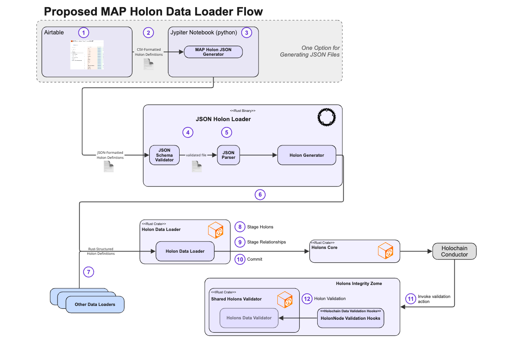

# MAP _Holon Data Loader_ Design Specification (v1.1)

---

## 📘 Summary

The _Holon Data Loader_ converts holon data presented in JSON files into Holons and HolonRelationships that are staged and committed to a single MAP Space using existing MAP APIs.

Because all MAP types (e.g., `PropertyType`, `HolonType`, `RelationshipType`) are themselves holons, the loader supports importing **TypeDescriptors** just like any other data — eliminating the need for a separate type-specific loader.

Input files are syntactically validated against a JSON Schema to ensure they represent well-formed holons, properties, and relationships.

Validation of imported holons against their TypeDescriptors is triggered by standard Holochain validation callbacks. These callbacks, implemented in the `holons_integrity_zome`, invoke shared validation functions that are **Holochain-independent**, enabling reuse across runtime and tooling contexts.

---

## 🔄 What’s Changed in v1.1

- **Unified `$ref` Model**
    - Replaced mixed and ambiguous reference semantics with a clean, identity-based model
    - Removed distinction between staged vs saved references in syntax

- **Eliminated `temp_key`**
    - All references now use stable keys or IDs
    - Simplifies authoring and loader implementation

- **Introduced Staged-First Resolution**
    - Key-based references now resolve:
        1. Against holons in the current import
        2. Then against persisted holons
    - Enables order-independent and circular references

- **Simplified `$ref` Syntax**
    - Default form is now just `key`
    - Optional `Type:key` retained for disambiguation only
    - `#` prefix retained for backward compatibility but made semantically inert

- **Clarified External Reference Model**
    - Explicit separation of:
        - `@ProxyName:key` (human-readable)
        - `ext:<ProxyId>:<LocalId>` (fully explicit)
    - Reinforces membrane and proxy-based boundaries

- **Moved Authoring Details to Authoring Guide**
    - JSON structure, `$ref` usage examples, and formatting rules relocated
    - Design spec now focuses on architecture and semantics

- **Explicit `$ref` Resolution Semantics**
    - Defined deterministic resolution order
    - Clarified behavior for key-based vs ID-based references
    - Established staged precedence over persisted holons

---

## 🧠 Design Principles

| Principle                   | Description                                                                 |
|----------------------------|-----------------------------------------------------------------------------|
| Holonic Uniformity         | Everything — including types — is a holon                                   |
| Two-Pass Resolution        | Prevents ordering constraints and supports circular references              |
| Identity-Based Referencing | References resolve by logical identity (key) or explicit identity (ID)      |
| Descriptor Integrity       | TypeDescriptors must conform to Meta-Descriptors                            |
| Import Scope               | One import targets one HolonSpace                                           |
| Staged-First Resolution    | References prefer holons in the current import                              |
| Minimal Syntax             | Concise reference model with limited, consistent prefixes                   |

---

## 🔗 `$ref` Model (Design-Level Specification)

All holon-to-holon references are expressed using a `$ref` string. The `$ref` system is **identity-based**, not lifecycle-based — meaning it does not encode whether a holon is staged or persisted.

### 🧠 Conceptual Model

A `$ref` identifies a holon via one of:

- **Logical identity** → key (optionally type-qualified)
- **Explicit identity** → HolonId
- **External identity** → proxy + key or proxy ID + local ID

The loader resolves references using a **staged-first strategy**, making imports deterministic and order-independent.

---

## ✅ Supported `$ref` Forms

### 1. Local Reference by Key (Primary Form)

Allowed variants:

- `future-primal`
- `#future-primal`
- `BookType:future-primal`
- `#BookType:future-primal`

**Design Semantics:**

- Identifies a holon by logical key
- Type qualification is optional and used for disambiguation
- `#` prefix is retained for backward compatibility but is **semantically inert**

---

### 2. Local Reference by ID

```
id:<HolonId>
```

**Design Semantics:**

- Direct reference to a persisted holon
- Bypasses key-based resolution
- Never resolves to staged holons

---

### 3. External Reference by Proxy Name

```
@ProxyName:key
@ProxyName:Type:key
```

**Design Semantics:**

- References a holon in another HolonSpace
- Proxy name resolves to a configured outbound proxy
- Key resolution occurs within that external space

---

### 4. External Reference by Proxy ID

```
ext:<ProxyId>:<LocalId>
```

**Design Semantics:**

- Fully explicit external reference
- No key or type resolution required
- Typically system-generated

---

## 🔍 Resolution Semantics

### Key-Based References

For any reference of the form:

- `key`
- `#key`
- `Type:key`
- `#Type:key`

Resolution proceeds as follows:

1. Check staged holons (current import)
2. If not found, check saved holons (DHT)
3. If not found, fail resolution

### ID-Based References

- `id:` resolves directly to persisted holons
- No staged lookup is performed

### External References

- Resolve proxy (by name or ID)
- Then resolve holon within the external space

---

## ⚠️ Critical Design Guarantees

- `$ref` syntax does **not encode lifecycle state** (staged vs saved)
- `#` prefix **MUST NOT alter resolution behavior**
- There is **no separate namespace** for staged holons
- Key-based references are **deterministic** due to staged-first resolution
- If a key exists in both staged and saved holons:
    - **Staged holon takes precedence**

---

## 🧩 Design Implications of the `$ref` Model

### 1. Elimination of `temp_key`

- No transient identifier namespace is required
- Keys serve as stable identifiers across both staged and saved contexts
- Simplifies authoring and reduces cognitive overhead

---

### 2. Order Independence

Because references resolve against staged holons:

- Holons may reference others defined later in the file
- Circular references are naturally supported
- Import ordering is no longer significant

---

### 3. Unified Identity Model

There is no distinction in syntax between:

- referencing a holon being created
- referencing an existing holon

This enables:

- seamless merging of imports with existing data
- consistent mental model for authors and tooling

---

### 4. Controlled Explicitness

- Key-based references are concise and preferred
- ID-based references provide precision when required
- External references are explicitly marked

This balances readability and correctness.

---

### 5. Proxy-Mediated Externality

External references require explicit proxy configuration:

- Prevents accidental cross-space leakage
- Enforces membrane boundaries
- Aligns with MAP trust-channel design

---

## 🧩 Process Overview



---

## 🧭 Step-by-Step Flow

1. Define holons (e.g., Airtable)
2. Export CSV
3. Convert to JSON
4. Validate against JSON Schema
5. Parse into `HolonImportSpec`
6. Invoke Holon Data Loader
7. Stage holons (Pass 1)
8. Resolve relationships (Pass 2)
9. Commit to DHT
10. Trigger validation
11. Run shared validation logic

---

## 💾 Staging and Commit Process

### Pass 1: Stage Holons
- Create in-memory holon representations
- Populate properties only
- Register keys for resolution
- Queue relationships for Pass 2

---

### Pass 2: Resolve and Stage Relationships
- Resolve all `$ref` targets
- Rewrite inverse relationships to declared form
- Inline embedded keyless holons
- Populate relationship links

---

### Commit
- Persist holons via `holons_core`
- Write nodes and SmartLinks
- Trigger validation callbacks

---

## 🔁 Declared vs Inverse Relationships

- Only **Declared Relationships** are persisted
- Inverse relationships are:
    - inferred
    - automatically maintained
    - not directly written

### Authoring Support

The loader allows inverse-style authoring and rewrites it into declared form during staging.

---

## 📌 Keyed vs Keyless Holons

| Feature                              | Keyed Holons | Keyless Holons |
|-------------------------------------|--------------|----------------|
| Has `key`                           | Yes          | No             |
| Can be referenced via `$ref`        | Yes          | No             |
| Must be embedded                    | Optional     | Required       |
| Can be relationship target          | Yes          | No             |

Keyless holons:
- exist only within parent context
- must not be referenced independently

---

## 🔍 Validation Lifecycle

### 1. Pre-Load (Schema Validation)
- JSON Schema ensures structural correctness
- Cascading validation across Meta, Core, and Domain schemas

---

### 2. Loader-Level Validation
- `$ref` targets must resolve
- No references to keyless holons
- Key uniqueness enforced
- Relationship consistency enforced

---

### 3. Post-Commit (Runtime Validation)
- Triggered by Holochain conductor
- Uses shared validation logic
- Enforces:
    - type rules
    - cardinality
    - constraints
    - referential integrity

---

## 🔮 Future Enhancements

- Schema validation for `$ref` expressions
- Streaming imports
- Reference diagnostics
- Preview (dry-run) mode
- Symbolic cross-space resolution via Dance requests

---

## 📎 Summary

The Holon Data Loader provides:

- A unified import mechanism for types and instances
- Deterministic, order-independent loading via two-pass resolution
- A simplified, identity-based `$ref` model
- Strong validation across schema, loader, and runtime layers
- Seamless integration with MAP’s holonic and agent-centric architecture

The `$ref` model is central to this design, enabling a clean separation between **identity**, **resolution**, and **persistence**, while maintaining simplicity for authors and robustness for the system.