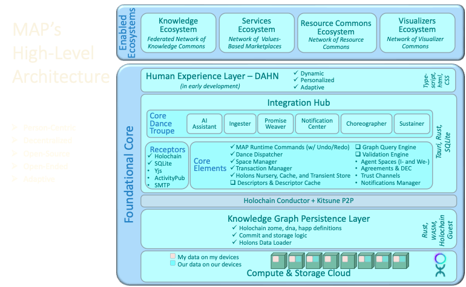

# MAP Architecture Specification (v0.1)

The design work captured in this specification grew out of an apparent contradiction uncovered while developing the MAP Validation Architecture. Holochain achieves its strong data integrity guarantees by requiring every peer to independently execute the same immutable Integrity Zome logic, whose WASM digest is fixed in the DNA. At the same time, the MAP is intentionally built around a self-describing, open-ended ontology in which new holon types, relationships, properties, and behaviors can be introduced without modifying the underlying data model. Our original validation architecture described *what* needed to be validated, but it did not adequately explain *how* peer validation could remain deterministic when the semantics being validated were themselves intended to evolve through descriptors rather than through changes to the Integrity Zome.

Resolving this tension required broadening the discussion beyond validation alone into the overall architecture of descriptors, compiled semantic surfaces, trust mediation, and component responsibilities. The challenge was compounded by another foundational MAP principle: applications and their domain ontologies are subordinate to agent relationships. AgentSpaces are long-lived social and organizational contexts, not application containers. New holon types must therefore be introducible into an existing AgentSpace without requiring the creation of a new Holochain DNA or DHT, while still preserving Holochain's promise that every peer independently validates shared state before accepting it. The architecture presented here reconciles these goals by separating semantic definition from evaluation authority, introducing canonical compiled descriptor surfaces, distinguishing definitional identity from routable identity, and carefully partitioning responsibility across the MAP's architectural components.

## Architecture Diagram




## 1. Purpose

This is an initial framing of a comprehensive architectural specification of the MAP. This version is **not** intended to be the complete MAP Architecture Specification. Rather, it establishes the architectural slice that emerged from the design work around:

- descriptor-driven semantics
- peer validation
- EffectiveDescriptors
- descriptor identity
- compiled descriptor surfaces
- TrustChannels
- role-based access
- one-home-space data stewardship
- component responsibilities

The intent is to define stable architectural responsibilities before implementation proceeds further.

This document captures the current architectural design of the MAP with respect to descriptors, compiled descriptor surfaces, validation, trust mediation, and responsibility partitioning across the major MAP components.

---

# 2. Foundational Principles

## 2.1 One Home Space

Every Holon has exactly one Home Space.

That space is the sole steward of the Holon's authoritative state.

Outside its Home Space a Holon is accessed only through HolonReferences mediated by TrustChannels.

MAP intentionally avoids replication of stewarded state.

---

## 2.2 Access by Reference

Inter-space interaction occurs through references rather than replicated objects.

For foreign holons:

```
ExternalId
    =
OutboundProxyId
+
RemoteObjectId
```

ExternalIds are:

- path-sensitive
- steward-sensitive
- TrustChannel-mediated
- authority-aware

The ExternalId exists to locate and dereference stewarded state.

It is **not** intended to establish semantic equivalence.

---

## 2.3 Disposable Object Caching

The ReferenceLayer may locally cache foreign holons.

This cache exists solely as an implementation optimization.

Cached foreign holons:

- are disposable
- may be evicted at any time
- never become authoritative
- never violate the One Home Space principle

---

## 2.4 Compiled Surfaces are an Exception

Compiled descriptor surfaces represent an intentional exception to the "no replicated state" rule.

Unlike stewarded holons, compiled descriptor surfaces are:

- deterministic
- content-addressed
- reproducible
- disposable
- non-authoritative

They represent compiled semantic artifacts rather than stewarded business state.

Their local persistence improves runtime efficiency without violating MAP's stewardship model.

---

# 3. Identity Regimes

MAP intentionally separates several notions of identity.

## 3.1 Routable Identity

Used for locating stewarded holons.

```
ExternalId
```

Properties:

- path-sensitive
- authority-sensitive
- routing-oriented

---

## 3.2 Definitional Identity

Used for recognizing equivalent definitions.

```
DefinitionHash =
hash(canonical_definitional_surface)
```

Properties:

- path-independent
- content-addressed
- cache-friendly
- semantically stable

DefinitionHash intentionally ignores:

- routing
- provenance
- TrustChannels
- ExternalIds
- local database identities

---

## 3.3 Storage Identity

MAP currently uses `ActionHash` as the primary local identifier for committed holons. For example, `SmartLink` source and target references identify holons by their `ActionHash`.

`EntryHash` identifies the content of a stored entry. For ordinary `HolonNode` entries, the `EntryHash` should not be treated as full semantic or definitional equivalence, because important meaning may be carried by associated `SmartLink`s rather than by the entry body itself.

However, compiled descriptor artifacts such as `EffectiveDescriptor`s are intentionally different. An `EffectiveDescriptor` materializes the flattened definitional surface, including inherited and definitional relationship semantics, into a canonical entry representation. Therefore, the `EntryHash` of an `EffectiveDescriptor` may be used as a content-based identifier for definitional equivalence of that compiled surface.

In short:

- `ActionHash` identifies a committed holon record/version.
- `EntryHash` identifies entry content.
- `EntryHash(HolonNode)` is not generally sufficient for semantic equivalence.
- `EntryHash(EffectiveDescriptor)` may be sufficient for definitional equivalence if the EffectiveDescriptor entry contains the canonical flattened definitional surface.
- `DefinitionHash` remains useful as a path-insensitive hash of an authored descriptor’s canonical definitional surface, especially before or outside DHT storage.

---

## 3.4 Semantic Version

Descriptor evolution is represented through semantic versioning.

Any descriptor edit that changes its compiled semantic surface produces:

- a new semantic version
- a new DefinitionHash
- a new EffectiveDescriptor

---

# 4. Descriptor Architecture

## 4.1 Descriptor Graph

The Descriptor Graph is MAP's semantic source of truth.

It contains:

- TypeDescriptors
- PropertyDescriptors
- RelationshipDescriptors
- ValueDescriptors
- KeyRules
- inheritance
- validation semantics
- affordances
- metadata

The Descriptor Graph is optimized for:

- authoring
- governance
- inheritance
- visualization
- documentation
- evolution

It is intentionally richer than the runtime representation.

---

## 4.2 Descriptor Ownership

Descriptors own semantics.

They define:

- type meaning
- value semantics
- relationship semantics
- validation semantics
- affordance semantics

Descriptors do **not** define where those semantics are enforced.

---

## 4.3 Relationship Classification

Relationships are conceptually classified into:

- definitional
- operational
- contextual
- provenance / routing

Only definitional relationships participate in:

- DefinitionHash
- EffectiveDescriptor generation

---

# 5. EffectiveDescriptors

## 5.1 Purpose

EffectiveDescriptors are the canonical runtime representation of descriptor semantics.

They are produced by compiling the Descriptor Graph.

Compilation performs operations such as:

- inheritance flattening
- immediate/inherited surface computation
- effective relationship computation
- effective inverse relationship computation
- structural normalization

The resulting EffectiveDescriptor is deterministic and content-addressable.

---

## 5.2 Compilation Trigger

EffectiveDescriptor generation occurs when descriptors are edited.

Not when a type is activated.

Descriptor edits establish descriptor identity.

Type activation merely authorizes use within a HolonSpace.

---

## 5.3 EffectiveDescriptor Identity

Each EffectiveDescriptor possesses:

- DefinitionHash
- semantic version

These represent the canonical runtime semantics of the descriptor.

---

# 6. Compiled Descriptor Surfaces

The MAP recognizes that multiple runtime concerns require compact compiled representations derived from descriptor semantics.

EffectiveDescriptor is the foundational compiled semantic surface.

Additional compiled surfaces may be derived for specific runtime purposes.

## 6.1 RoleAccessDescriptor

RoleAccessDescriptors are generated from:

```
EffectiveDescriptor
+
Role
+
Information Access Agreement
```

They describe:

- visible properties
- visible outbound relationships
- traversal permissions
- access constraints

RoleAccessDescriptors support efficient authorization and projection.

They are not validation artifacts.

---

## 6.2 Compiled Surface Properties

Compiled descriptor surfaces are:

- deterministic
- reproducible
- disposable
- content-addressed
- locally cacheable

They are not authoritative copies of stewarded descriptor state.

---

# 7. Validation Architecture

Validation is layered.

Descriptors define the rules.

Validation layers define evaluation authority.

## 7.1 Structural Validity

Structural validity consists of peer-reproducible invariants.

These are enforced universally.

---

## 7.2 Semantic Validity

Semantic validity depends upon:

- transaction context
- agreements
- TrustChannels
- open-world information
- social interpretation

These are enforced outside the Integrity Zome.

---

# 8. Knowledge Graph Persistence Layer
## Integrity Zome + Peer Validation Language (PVL)

The Knowledge Graph Persistence Layer owns peer-reproducible validation.

Responsibilities include:

- HolonNode persistence
- SmartLink persistence
- DHT operation validation
- PVL interpreter
- canonical hashing
- canonical encoding
- must_get_valid_record retrieval of required descriptor artifacts
- structural validation

PVL evaluates the peer-reproducible subset of descriptor semantics.

Typical responsibilities include:

- required properties
- value type conformance
- enum membership
- key rules
- relationship typing
- bounded cardinality where reconstructible
- lifecycle invariants that are closed-world

---

## 8.1 Explicit Non-Responsibilities

The Integrity Zome does **not** perform:

- descriptor graph traversal
- inheritance computation
- EffectiveDescriptor generation
- Dance dispatch
- dynamic rule execution
- agreement interpretation
- TrustChannel evaluation
- authorization
- global uniqueness
- open-world graph traversal
- social conflict resolution

---

# 9. Descriptors Component

The Descriptors component owns semantic definition.

Responsibilities:

- descriptor authoring
- DefinitionHash computation
- EffectiveDescriptor generation
- semantic version assignment
- inheritance flattening
- descriptor evolution

It answers:

> What does this type mean?

---

# 10. ReferenceLayer

The ReferenceLayer owns local object access.

## 10.1 HolonsCache

HolonsCache stores disposable cached copies of stewarded holons.

Lookup key:

```
HolonId
ExternalId
```

Identity regime:

route-sensitive

---

## 10.2 DescriptorsCache

DescriptorsCache stores descriptor artifacts by semantic identity.

Lookup key:

```
DefinitionHash
```

Possible cached artifacts include:

- descriptors
- EffectiveDescriptors
- compiled descriptor surfaces

Its purpose is:

- descriptor equivalence
- runtime reuse
- avoiding recompilation
- efficient semantic lookup

Unlike HolonsCache, DescriptorsCache is path-independent.

---

# 11. Holons Nursery

The Nursery owns staged local state.

Responsibilities:

- staged holon creation
- transaction-local materialization
- multi-holon validation
- snapshot-aware validation
- local semantic checks
- warning generation
- deferred validation
- descriptor lookup
- compiled surface lookup

The Nursery determines:

> Is this transaction locally coherent?

---

# 12. Validation Engine

The Validation Engine performs rich coordinator-side validation.

Responsibilities:

- transaction-level validation
- descriptor interpretation
- bounded semantic rules
- ValidationResult generation
- fail / warn / defer classification

The Validation Engine may evaluate semantics beyond PVL.

---

# 13. Transaction Manager

Responsibilities:

- transaction construction
- transaction lifecycle
- operation ordering
- commit orchestration
- rollback support
- transaction-scoped validation context

Transactions are the unit of semantic coherence.

---

# 14. Space Manager

The Space Manager governs descriptor activation.

Responsibilities:

- activate descriptor surfaces
- authorize descriptor use
- manage descriptor lifecycle within a HolonSpace
- ensure committed holons reference activated descriptor semantics

Activation authorizes use.

Activation does not establish descriptor identity.

---

# 15. Agreements & Trust Channels

These components govern inter-space meaning.

Responsibilities include:

- Information Access Agreements
- role definitions
- authorization
- ExternalId mediation
- TrustChannel routing
- RoleAccessDescriptor generation

They answer:

> Under what agreements may another space observe or interact with this holon?

---

# 16. Graph Query Engine

Responsibilities:

- graph traversal
- descriptor-aware querying
- conflict discovery
- duplicate detection
- projections

The Graph Query Engine may discover problems.

It does not define DHT validity.

---

# 17. Dance Dispatcher

Responsibilities:

- affordance dispatch
- Dance execution
- behavior orchestration
- runtime services

The Dance Dispatcher is never part of PVL.

Behavior execution is intentionally separated from peer validation.

---

# 18. Architectural Responsibility Summary

## Descriptor Graph

Owns semantic definition.

---

## EffectiveDescriptor

Owns canonical runtime semantics.

---

## Knowledge Graph Persistence Layer

Owns peer-reproducible structural validity.

---

## ReferenceLayer

Owns local object access and semantic descriptor caching.

---

## Nursery

Owns transaction-local semantic coherence.

---

## Validation Engine

Owns rich coordinator-side validation.

---

## Transaction Manager

Owns semantic commit boundaries.

---

## Space Manager

Owns descriptor activation.

---

## Agreements & Trust Channels

Own agreement semantics and inter-space authorization.

---

## Graph Query Engine

Owns graph exploration and conflict discovery.

---

## Dance Dispatcher

Owns executable behavior.

---

# 19. End-to-End Lifecycle

## Descriptor Evolution

```
Descriptor edit
        ↓
DefinitionHash
        ↓
EffectiveDescriptor
        ↓
semantic version
```

---

## Type Activation

```
EffectiveDescriptor
        ↓
Space activation
        ↓
descriptor authorized for use
```

---

## Holon Creation

```
Nursery
        ↓
Validation Engine
        ↓
Transaction Manager
        ↓
commit
```

---

## Peer Validation

```
HolonNode
        ↓
retrieve required descriptor artifact
        ↓
PVL evaluation
        ↓
accept / reject / unresolved dependency
```

---

## Inter-Space Access

```
ExternalId
        ↓
TrustChannel
        ↓
remote steward
```

---

## Role-Based Access

```
EffectiveDescriptor
      +
Role
      +
Agreement
        ↓
RoleAccessDescriptor
        ↓
authorization
projection
```

# 20. Architectural Principles

The architecture established by this specification is founded on the following principles:

- Every holon has exactly one Home Space.
- Stewarded state is accessed by reference, not replicated.
- Definitional identity is distinct from routable identity.
- Descriptors own semantics.
- EffectiveDescriptors own canonical runtime semantics.
- Validation layers own evaluation authority.
- Structural validity is universal.
- Semantic validity is contextual.
- Compiled descriptor surfaces are deterministic runtime artifacts rather than stewarded business state.
- Caches improve efficiency but never establish authority.
- Peer validation remains deterministic, bounded, and independently reproducible.
- Rich semantic interpretation belongs above the Integrity Zome.