# RecoveryStore — Use-Case Sequence Diagrams

Actors in all diagrams:

| Actor | Description |
|-------|-------------|
| **Runtime** | `Runtime::execute_command` |
| **RuntimeSession** | `RuntimeSession` — orchestrates `ClientSession` |
| **ClientSession** | `ClientSession` — owns `TransactionContext` + `LocalRecoveryReceptor` |
| **Receptor** | `LocalRecoveryReceptor` — async wrapper around the store |
| **Store** | `TransactionRecoveryStore` — synchronous SQLite operations |
| **DB** | SQLite (`recovery_session`, `recovery_checkpoint`, `experience_unit`) |

---

## 1. persist — intermediate mutation (crash-recovery only)

Command with `snapshot_after=false`, `disable_undo=false`. Writes a sentinel checkpoint at
`stack_pos=-1` so the process can restart mid-transaction, but creates no ExperienceUnit.

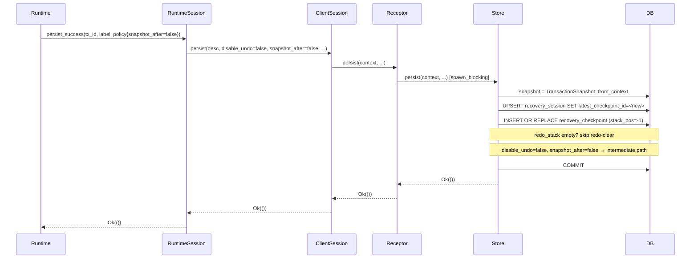

---

## 2. persist — EU-closing mutation (snapshot_after=true)

Command with `snapshot_after=true`, `disable_undo=false`. In addition to the crash-recovery
checkpoint, creates an `experience_unit` row and pushes the unit onto the undo stack.

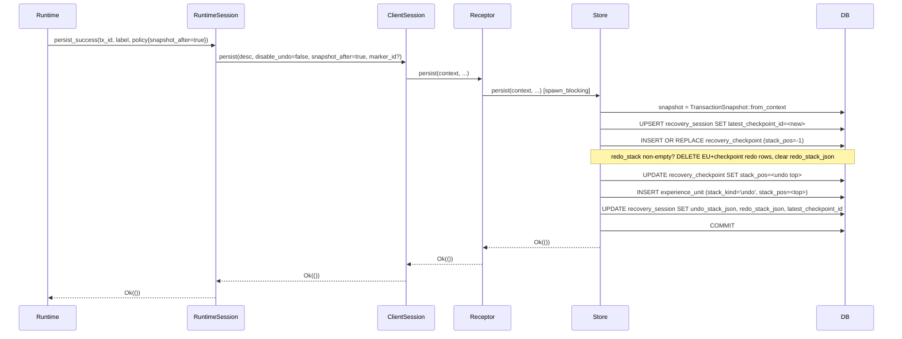

---

## 3. persist — disable_undo mutation

Command with `disable_undo=true`. Writes the crash-recovery checkpoint, clears any pending
redo stack, and permanently sets `undo_checkpointing_enabled=0` for this transaction.
No ExperienceUnit is created regardless of `snapshot_after`.

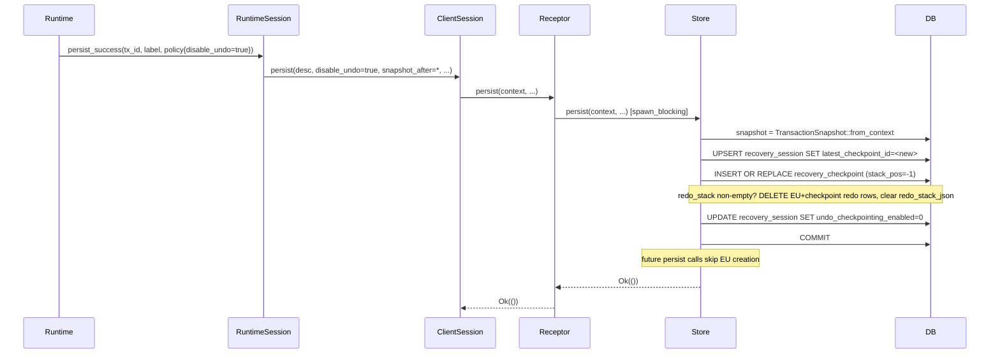

---

## 4. undo_last — mid-stack (prior snapshot exists)

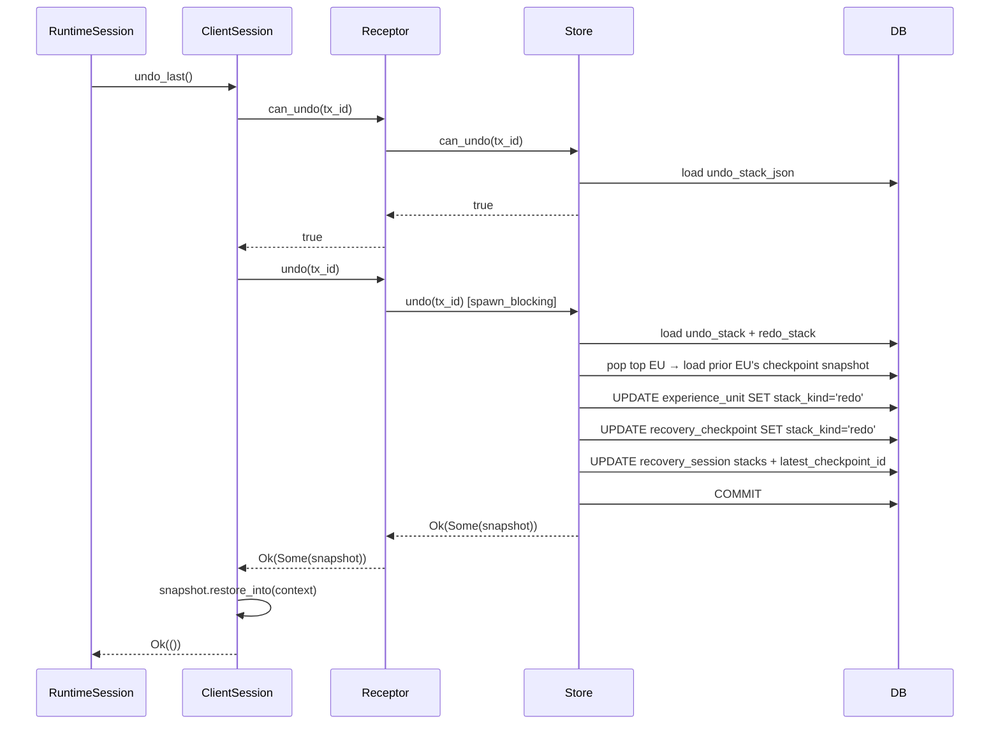

---

## 5. undo_last — last EU (restore to baseline)

Undoing the only remaining EU. The store pops it onto the redo stack and returns `None`
because there is no prior snapshot.

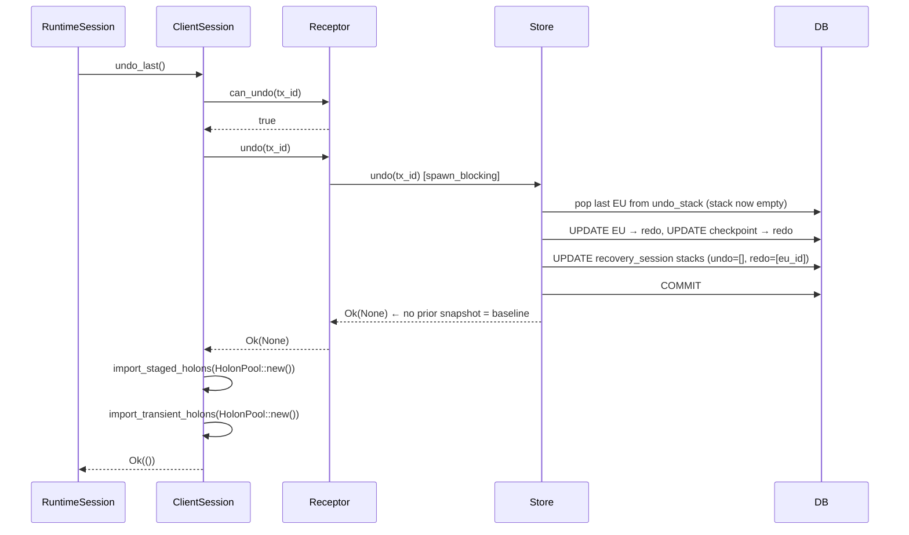

---

## 6. undo_last — nothing to undo (empty stack)

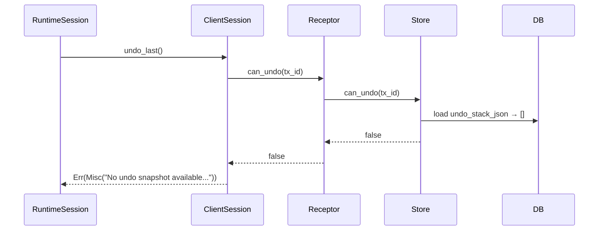

---

## 7. redo_last

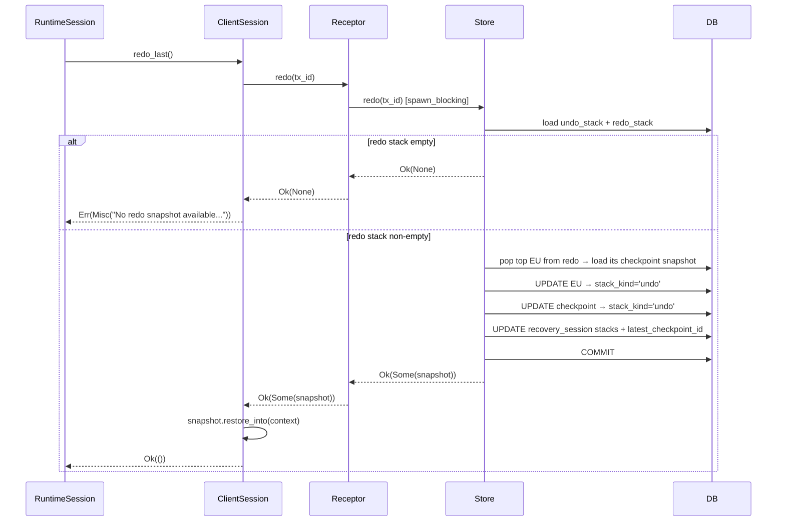

---

## 8. undo_to_marker

Pops all EUs from the top of the undo stack down to and including the marked EU,
moving them all to the redo stack. Restores the snapshot of the EU just below the marker.

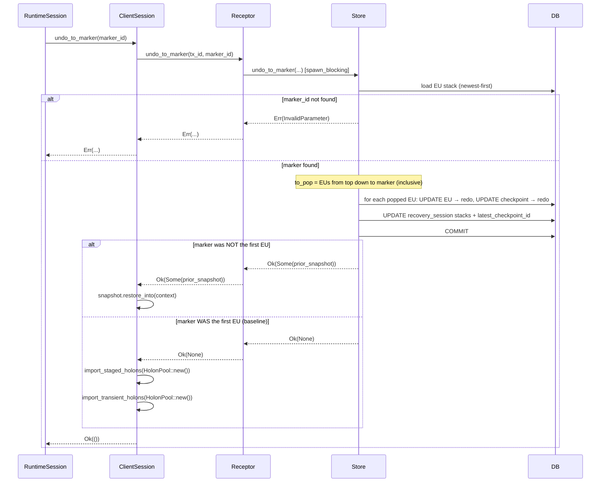

---

## 9. redo_to_marker

Pops EUs from the redo stack up to and including the marked EU, restoring them to undo.
Returns the snapshot of the marked EU (the state after it was applied).

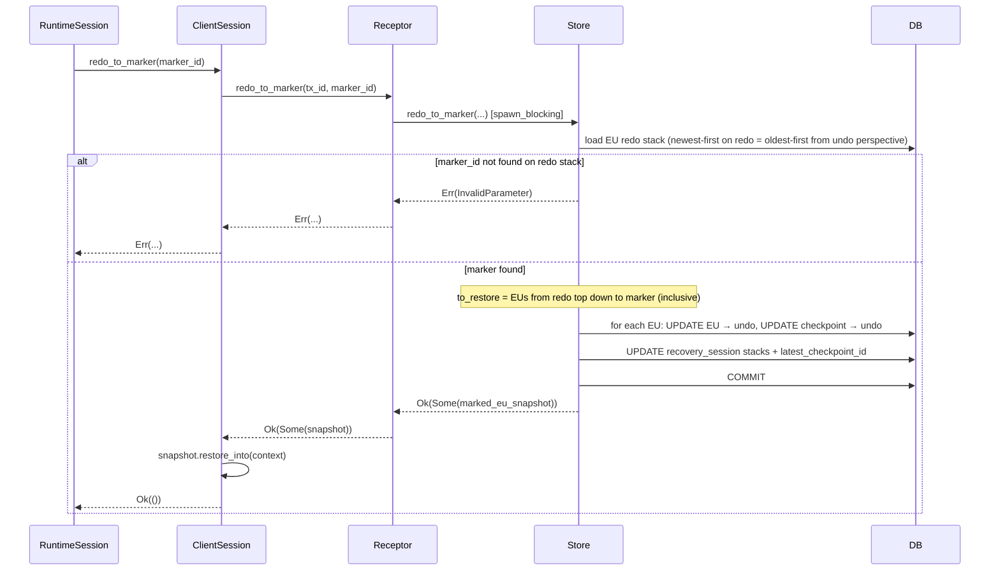

---

## 10. recover_latest — crash recovery on startup

Called from `ClientSession::recover` when reopening a transaction after process restart.

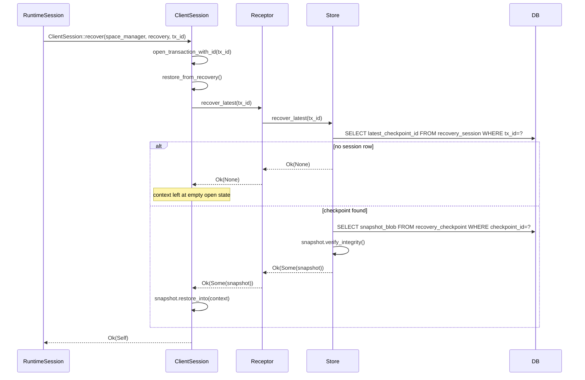

---

## 11. cleanup — on commit

Called by `RuntimeSession::commit_transaction` after `context.commit()` succeeds.
Removes all recovery state for the transaction (CASCADE deletes checkpoints + EUs).

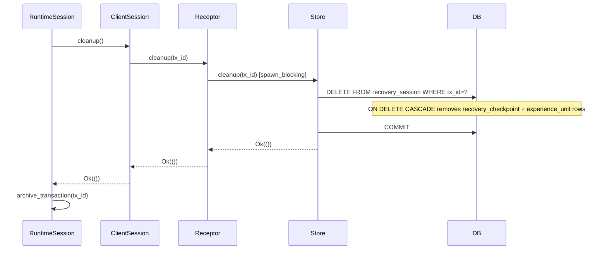

---

## 12. list_open_sessions — startup recovery scan

Called by `RuntimeSession::restore_open_sessions` at process startup to find transactions
that were open when the process last crashed.

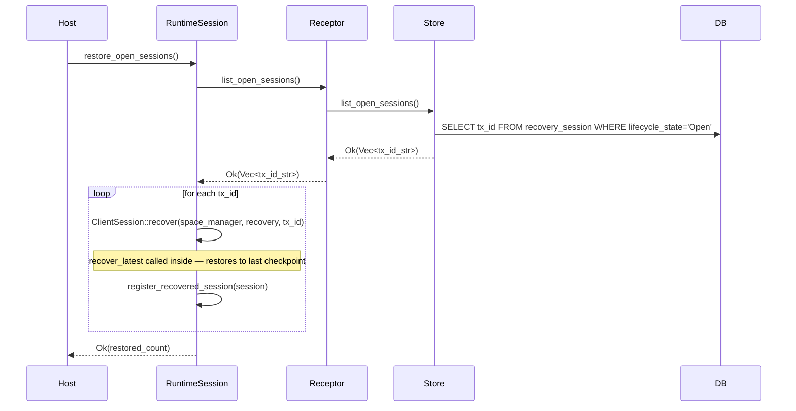

---

## 13. can_undo / can_redo — stack inspection (UI query)

Lightweight reads used to determine whether undo/redo controls should be enabled.
No write to DB.

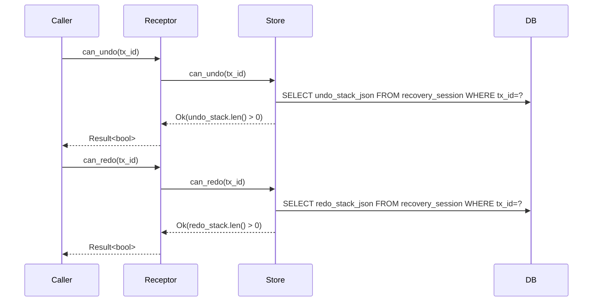

---

## 14. undo_history — undo stack label list (UI query)

Returns the description strings of all closed EUs in undo order (oldest first).

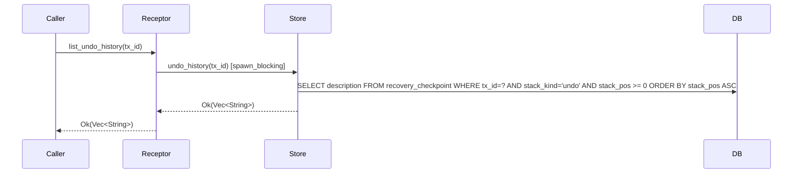

---

## DB schema summary (for reference)

```
recovery_session
  tx_id PK, lifecycle_state, latest_checkpoint_id FK,
  undo_stack_json, redo_stack_json,
  undo_checkpointing_enabled, format_version, updated_at_ms

recovery_checkpoint
  checkpoint_id PK, tx_id FK→session(CASCADE),
  stack_kind ('undo'|'redo'), stack_pos (-1=sentinel, ≥0=EU-linked),
  snapshot_blob, snapshot_hash, description, disable_undo, created_at_ms

experience_unit
  unit_id PK, tx_id FK→session(CASCADE),
  marker_id?, marker_label?,
  checkpoint_id FK→recovery_checkpoint,
  stack_kind ('undo'|'redo'), stack_pos, created_at_ms
```
