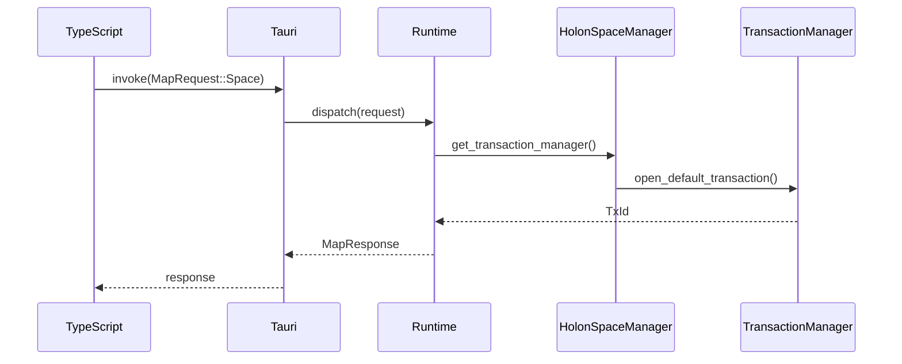
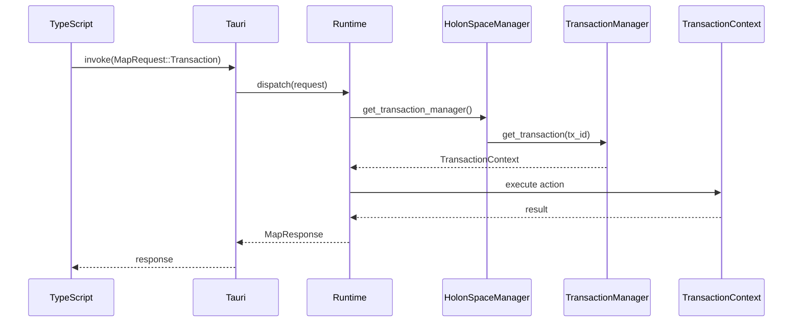
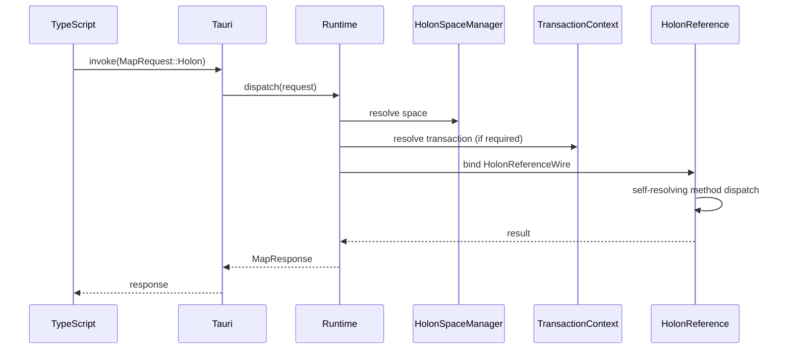

# MAP Commands Specification (v0.2)

---

## 1. Purpose and Design Intent

This specification defines the canonical IPC command API for the Memetic Activation Platform (MAP).

It establishes a stable, structural contract between the TypeScript experience layer and the Rust Integration Hub. The commands defined here are the authoritative IPC surface for MAP.

While many underlying domain operations already exist inside the Integration Hub (e.g., transaction mutation, holon reads and writes, lifecycle transitions), they were not previously expressed as a formal, structural IPC API surface. Historically, IPC dispatch relied on string-based routing, implicit scope reconstruction, and execution authority inferred from session state.

This specification replaces that model with:

- A single structural command architecture
- An explicit scope model
- A unified dispatch boundary
- Descriptor-driven execution policy
- Deterministic lifecycle enforcement

This document is normative for the MAP IPC layer.

---

## 2. Architectural Context

The MAP IPC boundary sits between:

- The TypeScript experience layer
- The Rust Integration Hub

All stateful execution occurs inside the Integration Hub. The experience layer holds no holon state and performs no domain mutation.

All IPC commands must pass through a single structural boundary: `Runtime::dispatch`.

The core reference layer (e.g., `HolonReference`, `StagedReference`, `SmartReference`) is self-resolving. Holon references are transaction-bound and carry their own execution context. The IPC layer does not inject transaction context into reference methods.

---

## 3. Proposed Module Structure

The IPC command system is organized as follows:

```
map-commands/
  mod.rs
  envelope.rs
  command.rs
  scope/
    space.rs
    transaction.rs
    holon.rs
  descriptor.rs
  runtime.rs
  dispatch.rs
  error.rs
```

### Responsibilities

- **envelope.rs** — `MapRequest`, `MapResponse`
- **command.rs** — `MapCommand`
- **scope/** — Scope-specific command enums and payloads
- **descriptor.rs** — `CommandDescriptor`
- **runtime.rs** — `Runtime` struct and dispatch entrypoint
- **dispatch.rs** — Scope-specific dispatch algorithms
- **error.rs** — Serializable error model

Domain logic remains outside `map-commands`.

---

## 4. IPC Envelope

### 4.1 MapRequest

```rust
pub struct MapRequest {
    pub request_id: RequestId,
    pub command: MapCommand,
}
```

The request envelope contains:

- A stable correlation identifier
- A structural command

It contains no implicit authority, no focal space, and no lifecycle hints.

---

### 4.2 MapResponse

```rust
pub struct MapResponse {
    pub request_id: RequestId,
    pub result: Result<MapResult, MapError>,
}
```

Responses must:

- Mirror the request_id
- Return deterministic results
- Avoid leaking internal implementation details

---

## 5. Command Surface (Normative API)

### 5.1 MapCommand

```rust
pub enum MapCommand {
    Space(SpaceCommand),
    Transaction(TransactionCommand),
    Holon(HolonCommand),
}
```

Scope is explicit and structural.

No scope may be inferred from payload shape or session state.

---

### 5.2 Space Commands

```rust
pub enum SpaceCommand {
    BeginTransaction,
}
```

Opening a transaction is a space-scoped operation because no transaction exists yet.

---

### 5.3 Transaction Commands

```rust
pub struct TransactionCommand {
    pub tx_id: TxId,
    pub action: TransactionAction,
}
```

```rust
pub enum TransactionAction {
    Commit,
    CreateTransientHolon { key: Option<MapString> },
    StageNewHolon { transient: TemporaryId },
    StageNewVersion { holon: HolonId },
    LoadHolons { bundle: HolonReferenceWire },
    Dance(DanceInvocation),
    Lookup(LookupQuery),
}
```

Transaction scope binds execution to a specific transaction lifecycle.

---

### 5.4 Holon Commands

```rust
pub struct HolonCommand {
    pub target: HolonReferenceWire,
    pub action: HolonAction,
}
```

```rust
pub enum HolonAction {
    Read(ReadableHolonAction),
    Write(WritableHolonAction),
}
```

Readable and writable actions mirror the public reference-layer façade traits.

---

## 6. Runtime and Tauri Integration

There is exactly one IPC entrypoint into the MAP Integration Hub.

All IPC execution flows through a single Tauri command, which delegates to `Runtime::dispatch`.

---

### 6.1 Tauri Entrypoint

```rust
use tauri::State;

#[tauri::command]
fn dispatch_map_command(
    state: State<Runtime>,
    request: MapRequest,
) -> Result<MapResponse, String> {
    state
        .dispatch(request)
        .map_err(|e| e.to_string())
}
```

This function:

- Accepts a structural `MapRequest`
- Delegates directly to `Runtime::dispatch`
- Performs no scope inference
- Performs no transaction resolution
- Performs no lifecycle enforcement
- Performs no policy branching

All execution authority begins inside `Runtime`.

---

### 6.2 Runtime as Execution Boundary

`Runtime` is the canonical IPC boundary.

```rust
use std::sync::Arc;

pub struct Runtime {
    active_space: Arc<HolonSpaceManager>,
}

impl Runtime {
    pub fn new(active_space: Arc<HolonSpaceManager>) -> Self {
        Self { active_space }
    }

    pub fn dispatch(&self, request: MapRequest) -> Result<MapResponse, MapError> {
        // Scope resolution, descriptor enforcement,
        // binding, and delegation occur here.
        unimplemented!()
    }
}
```

All scope-specific dispatch logic MUST be implemented as methods on `Runtime`.

Dispatch logic MUST NOT exist as:

- Free functions
- Standalone module-level dispatch helpers
- Alternate entrypoints bypassing `Runtime`

This guarantees that:

- Execution authority is centralized
- Descriptor enforcement is centralized
- No parallel dispatch path can emerge

---

### 6.3 Runtime Registration

`Runtime` must be registered during application startup so it can be injected via `State<Runtime>`.

```rust
use std::sync::Arc;

fn build_app() -> tauri::App {
    let space_manager = Arc::new(HolonSpaceManager::new());
    let runtime = Runtime::new(space_manager);

    tauri::Builder::default()
        .manage(runtime)
        .invoke_handler(tauri::generate_handler![dispatch_map_command])
        .build(tauri::generate_context!())
        .expect("Failed to build Tauri application")
}
```

There is exactly one managed `Runtime` instance per process.

---

### 6.4 Execution Invariant

All IPC execution follows this invariant path:

```
Tauri → dispatch_map_command → Runtime::dispatch
```

No command may bypass `Runtime`.

`Runtime` is the single structural execution boundary for MAP IPC.


---

## 7. Scope-Specific Dispatch Sequences

This section defines the canonical execution flow for each scope.

---

### 7.1 Space Scope



Space scope does not bind a transaction or holon reference prior to execution.

---

### 7.2 Transaction Scope



Transaction resolution occurs before action delegation.

Lifecycle validation derives from descriptor policy.

---

### 7.3 Holon Scope



Holon references are self-resolving and transaction-bound. Runtime does not pass a transaction context into reference methods.

Dispatch stops at `HolonReference`. The reference layer delegates internally to staged, transient, or smart implementations.

---

## 8. Descriptor Enforcement Model

Command execution policy derives exclusively from `CommandDescriptor`.

```rust
pub struct CommandDescriptor {
    pub is_mutating: bool,
    pub requires_open_tx: bool,
    pub requires_commit_guard: bool,
    pub snapshot_after: bool,
}
```

Runtime must:

1. Resolve descriptor from command
2. Validate lifecycle state
3. Enforce commit guard if required
4. Trigger snapshot persistence if required

Structural enums define shape only. Policy is not embedded in branching logic.

---

## 9. Error Model

Runtime must return deterministic errors for:

- Unknown transaction
- Invalid lifecycle state
- Commit in progress
- Descriptor violation
- Invalid holon binding

Errors must be serializable and correlated by request_id.

---

## 10. Migration Requirements

Migration to this architecture requires:

1. Replacing string-based dispatch with `MapCommand`
2. Routing all IPC through `Runtime::dispatch`
3. Removing authority derivation from session state
4. Centralizing descriptor enforcement

---

## 11. Non-Goals

This specification does not:

- Introduce multi-space routing
- Define cross-space execution
- Redesign TrustChannel authority
- Implement undo/redo semantics
- Replace transaction lifecycle semantics
- Define query optimization

---

## 12. Forward Evolution

Future evolution may introduce:

- Multi-space focal space resolution
- Cross-space routing
- Authorization descriptors
- Undo/redo integration
- Unified query command surface

All future extensions must preserve:

- Explicit structural scope
- Descriptor-driven policy
- Runtime as the single execution boundary