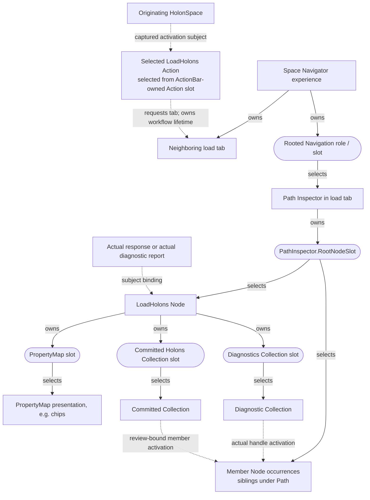

# Load Holons Design Specification

## 1. Purpose and Scope

This specification defines the DAHN-based replacement for the legacy Load Holons experience.

The replacement preserves the canonical `LoadHolons` Dance and existing loader semantics while moving initiation, preparation, execution feedback, and result review into selected DAHN Visualizers.

The initial implementation provides:

- Source selection and validation.
- Explicit submission after source review.
- A dedicated loader TransactionContext.
- Execution feedback and authoritative outcome reporting.
- A flat diagnostic collection.
- Review of committed holons through a separate TransactionContext.
- Explicit disposal when the load presentation is dismissed.

The initial implementation does not introduce:

- Cancellation of an executing load.
- Undo of persisted operations or compensating updates.
- Reconnection to transactions whose presentation has been destroyed.
- Interactive repair of staged holons.
- Display of offending source fragments.
- Guest-emitted progress events and subscriptions.
- Transfer of result inspectors into independently owned navigation contexts.

## 2. Architectural Placement

### 2.1 Affording Subject and Initiation Surface

The originating HolonSpace is the affording subject of `LoadHolons`.

HolonInspector discovers the Dance through the bound HolonSpace’s effective descriptor and projects it into its Action Bar.

Load Holons is initiated through that HolonInspector action presentation. It is not a separately defined Canvas-level Dance or a replacement semantic loading protocol.

Host file selection supplies input to the canonical Dance. It does not directly mutate the HolonSpace.

### 2.2 ActionVisualizer Delegation

HolonInspector requests an applicable ActionVisualizer through the normal Selector contract.

The selected Load Holons ActionVisualizer owns activation, source preparation,
submission, workflow lifetime, and disposal coordination. It requests a neighboring
load tab from the Space Navigator experience and presents pre-response phases
there. A selected response/report Node owns result presentation slots and
loader-specific bindings; the shared inspector implementation supplies geometry
and participation, not semantic slot ownership. Path Inspector owns occurrences,
tracks, traversal, and compression.

The generic Action Bar follows the [Action selection contract](../../hx/dahn-design-spec.md#action-selection-and-activation-boundary).
It contains no loader-specific preparation, validation, or outcome interpretation.
Selection and realization failures are explicit, not hard-coded substitutions.

The runtime supplies authoritative preparation and execution services. The Visualizer presents their state and submits agent intent.

Selection and realization failures are reported explicitly. No component substitutes a hard-coded Visualizer implementation.

## 3. Activation Contract and Ownership

### 3.1 Bound Activation Context

A load activation retains:

| Context | Meaning |
|---|---|
| Originating HolonSpace | The fixed target of preparation and invocation. |
| Selected Dance identity | The canonical Dance selected for this activation. |
| Loader TransactionContext | The context containing loader-related work. |
| Originating HolonInspector occurrence | The specific presentation occurrence that initiated the load. |
| ActionVisualizer occurrence | The presentation owner of the load interaction. |

Changing navigation focus or the active Space does not retarget an existing load.

These bindings describe runtime contracts. They do not independently require new HolonTypes.

### 3.2 Presentation and Runtime Ownership

The Load Holons ActionVisualizer owns the lifetime of the dedicated loader transaction.

The runtime manages the TransactionContext and enforces its operations, including:

- Preparation state.
- Request retention.
- Submission readiness.
- Duplicate-submission prevention.
- Dance invocation.
- Execution state.
- Response, staged holon, and finding retention.
- Explicit disposal.

The ActionVisualizer does not maintain a parallel authoritative copy of holonic state.

The action coordinates ownership of the loader context, the existing diagnostic
presentation context, and the committed-review object described in Section 9.
The review object owns its transaction. A mounted Node owns its child presentations,
not the transaction lifecycle of the workflow that supplied its references.

### 3.3 Readiness

Readiness is distinct from descriptor-defined semantic availability.

| State | Meaning |
|---|---|
| Semantic availability | The effective descriptor establishes that the HolonSpace affords the Dance. |
| Activation readiness | The runtime can establish the required execution context and provide the capabilities needed to begin preparation. |
| Submission readiness | The prepared request satisfies submission requirements and has not already been submitted. |

A runtime limitation does not rewrite the descriptor-defined affordance.

The ActionVisualizer reports readiness and blocking reasons. The runtime enforces readiness when operations are requested.

## 4. Transaction Lifecycle

### 4.1 Creation

Activation begins a dedicated loader transaction before source selection.

Preparation, request construction, invocation, staged holons, diagnostics, and response review all remain associated with this loader TransactionContext.

The transaction remains bound to the originating HolonSpace.

### 4.2 Lifecycle States

The following states describe the interaction lifecycle; they do not replace authoritative loader status values.

| Phase | Behavior |
|---|---|
| Preparing | Sources may be selected, validated, reviewed, and removed. |
| Ready for submission | The request satisfies submission requirements. |
| Executing | The submitted Dance is running; duplicate submission and dismissal are blocked. |
| Reviewing | Execution has ended and available outcomes can be inspected. |
| Disposed | Presentation-owned contexts and retained transient state have been released. |

Preparation failures retain available diagnostics and permit correction or cancellation.

Failures that end invocation without a usable response enter review with an explicit execution failure. They do not acquire an inferred loader status.

### 4.3 Cancellation and Dismissal

Apply the [shared destruction guards](../../hx/dahn-design-spec.md#destruction-guards-and-dependent-work)
and [command admission/disposal contract](../../commands-and-runtime/commands.md#command-admission-and-disposal).
Preparation and submitted execution block destruction of the load tab and any
owning presentation that would destroy it. Pre-submit cancellation waits for
pending transaction creation/binding, ignores late picker results, and then
releases preparation. A submitted invocation cannot be cancelled or resubmitted.
Terminal review permits explicit dismissal. Compression, tab switching, focus
movement, and off-viewport placement are not dismissal.

Teardown follows dependency order:

1. Revoke activation, retry, member-navigation, and relationship callbacks; reject
   late completions through existing generation/abort admission guards.
2. Settle admitted preparation/execution before dismissal is allowed. Drain or
   settle pending reads and materialization using existing lifecycle mechanisms;
   aborting presentation admission does not cancel a semantic invocation.
3. Dispose paths, dependent Node inspectors, and Collection/PropertyMap presentations,
   including retained hidden views. Finish dependent disposal before context release.
4. Dispose the optional committed-review object and presentation context, then the
   loader context. The borrowed originating experience context is not disposed.

The two auxiliary contexts have no required ordering relative to one another once
all their consumers are gone. An initialization or cleanup failure remains explicit
and retryable through its owner; do not mark dependent resources released before
cleanup completes. Never dispose a context while mounted consumers or pending
work still require its references. Disposal is neither persistence rollback nor
deletion of saved holons.

### 4.4 Execution Completion and Transaction Closure

Execution completion and transaction closure are distinct.

The existing transaction policy closes only a `Complete` load. `Incomplete`, `Rejected`, and `Skipped` do not acquire successful closure merely because execution has ended.

All terminal outcomes remain reviewable until explicit dismissal and disposal.
Closure stops operations that require an open transaction; it does not itself
dispose retained references. [Commands lifecycle rules](../../commands-and-runtime/commands.md#8-descriptor-enforcement-model)
permit retained Holon-scoped reads, read-only Visualizer selection, and the bounded
Saved-Nursery membership read, without reopening the loader. General transaction
lookups/mutations and executable materialization still require an open eligible
context. [Transaction binding](../../transactions/transactions-design-spec.md#3-scoped-state-and-reference-binding)
remains authoritative: normal reads resolve through the bound reference.

Commit does not clear the Nursery. Retained staged state remains available for diagnostics and committed-member identification.

### 4.5 Phase and context availability

Use these existing roles, not a new transaction for each phase:

- **O:** borrowed originating Navigator context, owned by its experience. It
  supports initial action selection/materialization; never retarget the captured Space.
- **L:** dedicated loader context created before selection by the action, released
  last. It owns preparation, response, Nursery, and actual loader evidence.
- **P:** existing open diagnostic/presentation context, created lazily by the
  workflow's presentation owner and bound to the captured persisted Space. Reuse
  it for result materialization even if no committed review is available.
- **R:** optional saved-state context owned by `CommittedHolonsReview`, acquired
  only after a usable canonical response and disposed by that review object.

P and R remain distinct established roles; neither substitutes for L's staged
evidence. P is not conditioned on `openCommittedReview()`. Selection over an
actual holon uses its owning context; projected input uses its declared type in
an open presentation context. Only persisted descriptor/Visualizer/slot references
may be rebound for selection/materialization. These routing rules apply to every
row below, including after L closes.

| Phase | Available contexts and owner | Subject reads | Selection | Materialization | Presentation / failure isolation |
| --- | --- | --- | --- | --- | --- |
| Source preparation | O borrowed; action creates open L; P/R absent unless prior diagnostic view retained | Captured Space and prepared references through their owners; source snapshots are retained input values | Initial action through O; no response Node | Initial action through O; no result materialization needed | Source review in load tab; no invented response |
| Parser/preparation failure | L remains open; action's presentation owner lazily creates/reuses P; no R | Parser values from retained error; any real diagnostic report/subject remains L-bound | Actual report/diagnostic subject through L; projected type/Node-owned slots through P | P, never dependent on R | Retained source review, error details, and typed diagnostic report when available; if P fails, readable error/source evidence remains |
| Execution | L active; O borrowed; any retained P stays open but old diagnostic activation is revoked; no R yet | Client phase/elapsed feedback; no fabricated outcome or response | No result selection until evidence exists | Existing action host supplies progress; result work waits | Distinct in-progress tab content; dismissal/submission guarded |
| Complete | L closed/retained, not disposed; P available on demand; optional R acquired by review object | Response/diagnostics through L; saved members through R | L for actual response/diagnostic subject; P for projections; R for committed subjects | P; R may supply existing open realization capability if P is unavailable | Authoritative outcome survives missing review; diagnostics remain independent; committed view uses verified membership |
| Incomplete | L not successfully closed; P on demand; optional R | L evidence includes Saved staged subjects; R independently retrieves saved members | Actual subjects through L or R by ownership; projections through P | P (or already-open R capability) | Partial outcome and diagnostics retained even if saved review fails |
| Rejected | L retained, not successfully closed; P on demand; R optional only after usable response | L response/findings; no committed membership inferred from counts | L actual subjects; P projections; R only for actual review references | P | Rejection/findings remain available; empty saved membership may be verified without requiring a displayed committed view |
| Skipped | L retained, not successfully closed; P on demand; R optional after usable response | L response; do not infer success or fabricate diagnostics | L actual subjects; P projections if any | P when needed | Authoritative Skipped explanation; no mandatory empty collections or R initialization |
| Invocation failure without usable response | L retained in its actual lifecycle state; P only if needed for available diagnostic presentation; no R via `openCommittedReview()` | Retained error values and any available L-bound evidence; no response read | Actual evidence/report only if available; projections through P | P if available; ordinary failure text needs none | Explicit no-response failure, never an inferred loader status. No response root is fabricated; optional typed evidence report is distinct from a response |
| Committed-review initialization failure | L retained; P independent; failed R acquisition cleans up its new context | L outcome/diagnostics remain readable | L/P continue; no usable R subject is claimed | P | Keep summary/diagnostics; committed panel shows initialization/cleanup failure and bounded retry, never resubmission |
| Dismissal/disposal | Blocked while required preparation/execution is active; otherwise revoke/drain and dispose dependents before R/P, then L; O remains borrowed | Only already-admitted work is settled; no new reads admitted | No new selection | Drain admitted realization; no new materialization | Close load tab after release; no persistence rollback, no context use after disposal |

A parser report is actual typed diagnostic evidence created while its owner permits
that operation, not a substitute `HolonLoadResponse`. A no-response failure need
not have a report Node: the action-owned tab always retains explicit failure text.
If a report cannot be constructed/read under permitted operations, keep available
value diagnostics and mark rooted inspection unavailable. Do not reopen L or
invent response semantics to obtain a navigable root.

## 5. Source Preparation and Review

### 5.1 Source Selection

The initial source choice is **Upload from computer**.

The intended native selection experience supports:

- Explicit file selection.
- Directory selection with recursive discovery.
- Multiple selections.
- Selection without requiring the agent to choose file mode or directory mode in advance.

The supported desktop platforms are **macOS and Linux**. Native source ingress uses
RFD 0.17.2: macOS exposes mixed file/directory selection; the Linux XDG Desktop
Portal backend exposes separate file and directory modes. Both expose multiple
selection. These are inspected API capabilities, not native smoke-test results.
Linux separate-choice selection is an interim limitation; the intended mode-free
mixed selection remains a follow-on requirement. See
[native source verification](data-loader-source-verification.md) for evidence and
remaining verification.

Source discovery follows these policies:

- Recursively include regular files with case-insensitive `.json` extensions,
  including hidden entries; ignore other regular files.
- Sort by normalized absolute path and deduplicate repeated/overlapping paths.
  Preserve distinct hard-link paths. Source identity is the normalized absolute
  path and stays stable through review ordering/removal; content is a retained
  UTF-8 snapshot. Identity is not a persistent filesystem identifier across renames.
- Remove redundant current-directory components; reject relative paths and parent
  traversal. Do not manufacture absolute paths from browser names.
- Skip symbolic links, including selected paths beneath a symbolic-link ancestor,
  and report the exclusion. Do not traverse cycles or special files.
- Retain readable sources alongside path-specific discovery/read issues. Invalid
  UTF-8 content is a read failure; JSON validation belongs to the review step.
  Paths that cannot be represented losslessly as UTF-8 are reported, not loaded.
- Distinguish dismissed selection, confirmed empty discovery, and discovery/read
  failures. RFD's optional selection result cannot distinguish every backend
  failure from dismissal; this backend limitation must remain explicit.
- Map the retained path to `FileData.filename` and retained content to
  `raw_contents`. Selection does not prepare or submit a transaction. Preparation
  remains an explicit call using the existing preparation-only API.

### 5.2 Validation and Review

After selection and discovery, the system performs JSON syntax and JSON Schema validation before presenting the review list.

The review surface contains:

- A scrollable file list.
- Absolute source paths.
- Valid or invalid indicators.
- Available validation diagnostics.
- Selection checkboxes.
- Remove selected, Submit selected, and Cancel actions.

If every file is valid, all files are initially selected.

If invalid files exist, only invalid files are initially selected, making removal the immediate bulk action.

Removing a file changes the prepared request; it does not delete the source file.

Discovery failures participate in review even when no content snapshot was produced.
Unreadable files or directories and invalid paths appear as selectable, removable
blocking error entries. They are initially selected with other invalid entries.
Unchecking them does not permit submission; removal acknowledges excluding that
source from the request and does not delete anything on disk. Intentionally
excluded symlinks and special files appear as non-blocking notices. Non-JSON
regular files are omitted by discovery's JSON-only filter.

Schema acquisition, parsing, or compilation failure blocks the entire interaction;
removing individual entries cannot bypass it. Validation completion is associated
with the current source revision. Replaced/removed sources, cancellation, and
disposal must not receive stale validation updates. Review hands off only selected
validated snapshots, retaining their exact paths and strings. The enclosing action
owns transaction preparation, invocation, and authoritative duplicate prevention.

### 5.3 Submission Requirements

Submission requires:

- At least one selected file.
- No invalid files remaining anywhere in the review list.
- No prior submission of this load interaction.

Unchecking an invalid file does not satisfy the validation requirement. It must be removed from the list.

Explicit submission constructs the canonical `HolonLoadSet` request and invokes `LoadHolons` through the originating HolonSpace.

The runtime accepts only one submission transition. Disabled controls provide feedback but are not the sole duplicate-prevention mechanism.

## 6. Execution Feedback

During execution, the ActionVisualizer displays a general loading indication and elapsed time.

More specific status is shown only for transitions actually known to the client. Elapsed time must not imply measured completion percentage or knowledge of guest-side stages.

Intermediate guest signals, event declarations, and subscription infrastructure are deferred.

Updates and outcomes remain associated with the bound load presentation, regardless of changes to active navigation.

## 7. Authoritative Outcomes and Counts

### 7.1 Outcome Mapping

| Authoritative status | Primary feedback | Initial result view |
|---|---|---|
| `Complete` | Load complete | Committed Holons |
| `Incomplete`, with some persisted holons | Load incomplete — some holons were saved | Diagnostics; committed results also available |
| `Incomplete`, with no persisted holons | Load incomplete — no holons were saved | Diagnostics |
| `Rejected` | Load rejected | Validation diagnostics |
| `Skipped`, empty input without reported problems | Nothing to load | Empty-state explanation |
| `Skipped`, with operational problems | Load skipped | Diagnostics |

Diagnostic views remain available when diagnostics exist, including on `Complete`.

Semantic rejection must expose validation findings even when `ErrorCount` is zero.

Persistence quantities must come from authoritative evidence. Missing information must not be interpreted as proof that no holons persisted.

### 7.2 Missing or Unreadable Responses

Preparation or invocation failure without a usable response is presented as **Load could not be completed**, with available diagnostics.

If response fields cannot be read:

- Identify the response-reading failure.
- Present any fields that can be read reliably.
- Mark unavailable information explicitly.
- Do not infer an authoritative status.
- Do not claim that nothing persisted.

A result-presentation failure does not change the underlying load outcome.

### 7.3 Counts

Counts are displayed independently using their authoritative response-contract definitions.

| Presentation label | Intended meaning, subject to the response contract |
|---|---|
| Staged | Candidates assembled in the Nursery. |
| Attempted | Candidates for which persistence was attempted. |
| Committed | Candidates confirmed persisted by this submission. |
| No action required | Candidates classified as `NoAction`. |

Counts must not be assumed to form a partition.

In particular:

- Do not derive a failed count by subtracting committed from staged.
- Do not describe `NoAction` candidates as newly committed solely because they required no action.
- Display unavailable counts as unavailable, not zero.
- Make the outcome and committed count prominent; place supporting counts in secondary detail.

Committed collection membership follows the Saved-state evidence defined in Section 9, rather than arithmetic over these counts.

## 8. Result Composition and Diagnostics

### 8.1 Composition and slot ownership

The selected `LoadHolons.NodeVisualizer` owns its PropertyMap, Diagnostics, and
Committed Holons slots. It binds an actual load response, or an actual typed
preparation-diagnostic report where that report exists. Result Collections retain
independent selection, ordering, and scroll state even when tabs share a region.
The action supplies workflow evidence and lifetime capabilities; it is not the
semantic owner of these result slots. The originating HolonSpace is the affording
subject, not a Visualizer or slot owner. A shared inspector shell is implementation
reuse, not another semantic owner.

| Owner | Owned boundary / binding |
| --- | --- |
| Initiating Holon Inspector / selected ActionBar | ActionBar slot / selected Action slot; captured HolonSpace is activation context, Dance descriptor is Action selection subject |
| Space Navigator experience | Neighboring load tab and Rooted Navigation role/slot used to host result navigation |
| Selected Path Inspector | Node slot (`PathInspector.RootNodeSlot`) used for root and member occurrences |
| Selected LoadHolons Node | PropertyMap and typed result Collection slots; actual response/report is its subject |
| Action workflow | Preparation/submission and disposal coordination; no transfer of child slot ownership |
| Shared inspector implementation | Geometry and participation code; no independent semantic slots |

Solid edges identify composition ownership or selection as labeled; dotted edges
identify subject binding, lifecycle requests, or navigation. A tab's lifetime,
a slot's semantic owner, and a selected Node's subject are different relationships.
Preparation and execution use action-owned tab content before any response exists.
A report-rooted diagnostic view may coexist with preparation review. Invocation
failure may remain plain failure feedback without a rooted presentation.

This target changes current executable ownership: the inspected schema declares
result slots on `LoadHolons.ActionVisualizer`, and runtime adapters inject their
content into the specialized Node. Migration must move ownership and selection
parent references together; declaring the Node owner in prose does not change
that implementation. The delivery delta is recorded only in the integrated plan.

### 8.2 Diagnostic Collection

The load response retains the original Commit response through `LoadCommitResponse`
when Commit was attempted. Its `RejectedHolons` retain their structured staged
findings; its `HasValidationFinding` carriers retain findings without a staged
subject. These remain separate destinations, not duplicate copies of the same
findings. Public SDK reads preserve finding kind, rule identity/code, severity,
structured subject, optional descriptor identity, and message. Missing or
inconsistent diagnostic evidence is a read error, not an empty successful report.

`HasValidationSource` carries input provenance linked by `ValidationSourceSubject`
to the exact staged reference produced by the mapper. It preserves filename,
loader key, and byte offset when supplied; it does not infer line/column positions
or associate unstaged subjects by matching display keys. Source carriers and Commit
carriers remain owned by the loader transaction and expire with its disposal.

Diagnostics are presented as one homogeneous collection of diagnostic projections while preserving their original categories.

The workflow retains the evidence; the response/report Node binding supplies
these display values and their stable row identities. The declared
`LoadDiagnostic.Projection` descriptor identifies the effective projection type;
rows are not fabricated staged holons. Actual subject references and originating
Space/Dance provenance remain separate from the renderer's value-only columns.
Operational error-carrier keys never substitute for offending subject keys.

Projected Collection selection follows the [declared projected-input contract](../../hx/visualizers/collection/kind-spec.md#projected-collection-input).
The declared `LoadDiagnostic.Projection` element type is a selection witness;
actual projected membership and counts come from the retained rows, not the empty
witness envelope. P supplies open selection/materialization for this value input,
using the selected Node and its owned slot as persisted selection references.
A diagnostic row's actual reference, when supplied, remains separate from its
value-only display columns and is never fabricated from a display key.

Activating a diagnostic uses its actual handle; Inspect subject uses the supplied
subject handle, if any. Route each through its owner under §9.6. An actual typed
diagnostic/report holon and its value projection are distinct; a projection alone
does not fabricate staged evidence. Preparation retry releases dependent diagnostic
views before reusing L, while retaining reviewed source snapshots and selection.
Disposal follows §4.3. P supports presentation without requiring R or reopening L.

Sources include:

- Operational loader errors.
- Staged semantic validation findings.
- Unattached validation findings.
- Parser diagnostics.

The minimum projection contains:

| Field | Meaning |
|---|---|
| Diagnostic identity | Stable identity within the retained load review. |
| Category | The diagnostic’s original category. |
| Message | The reported explanation. |
| Subject reference, when available | A StagedReference belonging to the loader context. |
| Subject key, when available | A display identifier for the affected subject. |
| Source identity and path, when available | The originating input source. |
| Source location, when available | Location evidence in its reported representation. |
| Load provenance | Originating loader transaction, HolonSpace, and Dance. |

For partial commits, diagnostic subjects may include Saved holons accessed through their StagedReferences.

Parser diagnostics do not require a staged subject or response holon. Their projections are constructed from the available parser evidence in the loader context.

Preparation carries parser failures through the existing `LoaderParsingError`
category as a structured payload with a readable summary and individual issues.
Each issue retains filename, original category, message, optional underlying error,
and optional original-file location. Decoder coordinates use a one-based line and
UTF-8 byte column (column zero can occur at early end-of-input); slice coordinates
are translated against the retained original contents. Structural rules without
location evidence leave location absent. Public SDK `readParserDiagnostics(error)`
projects this evidence without requiring wire imports or parsing summary text.
Any failed preparation, including mixed valid/invalid input, returns no usable
request and does not invoke loading or Commit. Partial transient preparation state
remains owned by the dedicated transaction until disposal.

### 8.3 Display and Ordering

Default diagnostic ordering compares source path, coordinate representation, then
numeric coordinates. Within a source, byte offsets precede line/UTF-8-byte-column
coordinates; missing locations follow both. Missing source paths sort last. Byte
offsets and each line/column component compare numerically; ties preserve producer
order. This deterministic representation order does not claim positional equivalence.
The producer supplies a stable row-ID permutation and readable default-order label;
explicit user column sorting overrides it without changing membership or identities.

Location comparisons must respect the reported coordinate representation. Missing coordinates must not be invented to create a sort key.

Missing display values are shown as **Not available**.

A missing subject key does not prevent inspection when a subject reference exists.

`StartUtf8ByteOffset` is displayed as **UTF-8 byte offset: N**. It must not be relabeled as a line or column without an actual conversion.

### 8.4 Empty States and Presentation Failures

An empty collection receives an explicit empty-state explanation.

Collection Visualizer selection and realization failures receive explicit presentation errors. They do not trigger a hard-coded Table fallback or alter authoritative loader status.

Inspectors opened from diagnostic entries remain dependent on the loader TransactionContext and close when the load presentation is dismissed.

## 9. Committed-Holons Review

### 9.1 Membership Evidence

The committing transaction’s Nursery is the source of committed-member identities.

The runtime:

1. Iterates the Nursery’s StagedReferences.
2. Calls `ReadableHolon::holon_id()` on each staged holon.
3. Includes only members for which that method returns a HolonId.

The method returns a HolonId only when the staged holon is in Saved state, indicating that it has been committed.

This rule applies to both complete and partial outcomes. Neither the presence of a staged reference nor aggregate counts independently establish committed membership.

### 9.2 Separate Review Context

The ActionVisualizer obtains a separate review TransactionContext bound to the originating HolonSpace.

SmartReferences are constructed from the Saved members’ HolonIds in that review context and assembled into the committed-result HolonCollection.

The loader context remains the authority for staged diagnostics. The review context supplies committed-state inspection.

The public SDK entry point is `MapTransaction.openCommittedReview()`, available
once `invokeLoadHolons` has returned a usable response on the dedicated loader
transaction. It discovers that transaction's Saved Nursery membership through
the ordinary `GetCommittedHolons` command, then creates and owns a fresh review
transaction. Space binding is verified before returning the review. An unsuccessful
review initialization releases the newly acquired context and reports any cleanup
failure explicitly.

`CommittedHolonsReview.collection` is a DescribedHolonCollection with common
`HolonType.TypeDescriptor` element type; members retain their concrete descriptors.
It retains identity-only SmartReferences with no
staged or cached property map copied from the loader. `readMembers()` retrieves
committed keys and concrete descriptors, reporting per-field access failures while
retaining every member's identity and reference. Missing keys remain absent rather
than excluding a member. Other committed properties and relationships are read
through these ordinary bound references. Review lookup failures do not alter the
load outcome or claim complete relationship persistence.

The caller owns the returned review and disposes it explicitly. Review disposal
waits for its own pending member reads; it does not dispose the loader transaction.
The enclosing presentation remains responsible for releasing both owners. Visible
Collection presentation and inspector wiring are delivered separately.

### 9.3 Retrieval

These SmartReferences initially identify holons not yet cached in the review context. Iteration triggers DHT retrieval as a by-product of resolving them.

Successful retrieval verifies that the saved holons can be read and supplies committed properties, including keys.

Retained staged property maps must not substitute for retrieved committed properties.

Keyless holons remain inspectable by identity.

Retrieval failures remain visible as saved members whose retrieval failed. They do not silently remove members, substitute staged values, or rewrite the load outcome.

### 9.4 Review Lifetime

The ActionVisualizer owns the review TransactionContext for the lifetime of the load presentation.

Inspectors opened from the committed-result collection use that review context.

Dismissing the load presentation follows the dependency-ordered teardown in
[§4.3](#43-cancellation-and-dismissal); mounted consumers are released before their contexts.

Persisted holons remain accessible through ordinary Space navigation.

Transfer to an independently owned navigation context is deferred.

### 9.5 Result Presentation and Navigator Refresh

The load presentation retains separate Diagnostics and Committed Holons views.
Complete outcomes initially select committed results; other outcomes initially
select diagnostics. Switching views and returning from inspection retains the
mounted collection and its selection, sort, and scroll state.

Committed rows use the review's authoritative membership and bound references.
The presentation may supply a typed value projection of committed keys and
per-member read failures to the selected Collection Visualizer. Missing keys
remain absent, and failed members remain selectable by identity. Retry refreshes
saved-state reads without resubmitting the load.

`CommittedHolonsReview.transaction` exposes the owned review context for normal
Visualizer selection and inspection. The review remains its disposal owner.
The invoking Navigator supplies its selected RootedNavigation presentation and
Node slot context. The load response is the root subject of one ordinary Path
Inspector instance. Rust selects its Node Visualizer against
`HolonLoadResponse.DanceResponseType`, using the existing
[slot-directed descriptor selection](../../hx/dahn-design-spec.md#1421-slot-directed-descriptor-selection)
contract: inspect the concrete type's local applicability declarations, then
follow `Extends` only when there is no eligible candidate, stopping at the
TypeKind boundary. An ambiguous eligible set is an explicit selection failure,
not a reason to continue upward.

`LoadHolons.NodeVisualizer` declares applicability to that concrete response
type and realizes the load summary and result collections through the shared
[Holon Inspector composition](../../hx/visualizers/node/holon-inspector/design-spec.md#shared-inspector-composition).
Its eligible singular navigation includes the response's descriptor, owner, and
other declared relationships when present; missing relationships are not fabricated.
The generic Holon Inspector remains applicable at the
ancestor DanceResponseType boundary. This is registered semantic selection,
not a TypeScript dispatch on a type name or a hard-coded fallback.

The response retains its loader-bound reference. Read-only Visualizer selection
is permitted against that retained evidence after commit without reopening L.
Executable materialization requires an open context and follows §9.6, using the
existing P independently of committed-review initialization; an already-open R
may supply that capability when appropriate. Only persisted Visualizer/slot
references are rebound, never staged subjects. Committed collection members
retain their review-bound saved references. The root collection adapter supplies
stable result-role provenance to the ordinary Path Navigator; activating a
committed member creates or restores a vertical occurrence in that same path.
Descendant reads and selection route by actual reference ownership under §9.6,
not by visual parentage or a blanket review-context rule. Collection tab changes
retain existing path occurrences and revoke activation from hidden collections.
The specialized root participates in the same Node allocation and restoration
contract as other Nodes. It offers `ApplyNodePresentation` and receives the same
coherent capability assignment. Summary chips are a selector-chosen PropertyMap
realization where applicable, with bounded selected Collection presentations.
Path owns traversal, occurrence placement, and compression; the shared inspector
owns geometry, responsive rail/viewer behavior, expansion, and restore. Specialized
bindings retain diagnostic evidence, committed-holon membership/review, outcome-
dependent initial tabs, and transaction-sensitive references. These differences
justify bindings, not copied layout code. Operator invocation is local and does
not rebind subjects or reopen a transaction.
The load owner disposes the path before releasing its presentation, review, and loader contexts.
No second mutation workflow or independent exploration ownership is introduced.
Diagnostic rows remain projections of retained loader evidence; their detail
presentation must not rebind staged evidence into the saved-state review.

After Complete or Incomplete outcomes, the invoking Navigator invalidates its
semantic reads without recreating exploration. Relationship discovery and open
collections request membership with the public `requireFresh` option before
reading described collection envelopes. The fresh read updates the relationship
cache used by the described read. Failures remain visible in the affected view
and do not change the load outcome. Existing navigation topology is retained.

### 9.6 Reference-owned routing

Reading a semantic subject, selecting its Visualizer, and materializing executable
code are separate operations. A reference carries its context; ordinary reads
remain self-resolving. The context used to run a selector must own its actual
subject argument, while saved selector inputs may be rebound as permitted.

| Input / target | Subject read and selection route | Executable realization route |
| --- | --- | --- |
| Load response | Actual L-bound response; descriptor/candidate reads for Node selection through L's permitted read-only selector, including retained Complete evidence | P, or already-open R if used as the realization capability; bind only saved selected Visualizer/slot/descriptor inputs there |
| Diagnostic value projection | Read retained row values; selection uses the declared element-type witness and Node-owned slot in P | P; unsupported projected input is an explicit failure |
| Actual diagnostic/report or offending subject handle | Its original owner, normally L; Saved Nursery members remain L-bound StagedReferences for evidence reads | P; never cast/rebind staged evidence into R for convenience |
| Committed member | Identity-only R-bound SmartReference; properties/descriptors fetched in R, not copied from L; select against that R subject | P with saved selected identities rebound, or existing R realization capability |
| Persisted descriptors, Visualizers, slots | Their bound reads; saved identities can be rebound into the context running the selector, preserving actual slot ownership | An open P/R may rebind these persisted resources for materialization and artifact acquisition |
| Singular target reached from response or descendant | Preserve the returned target handle and route by its actual owner (L, P, or R), regardless of where its inspector appears | Open P/R capability, separate from subject reads |

Use existing context ownership checks and explicitly retained workflow contexts.
Do not assume every non-L reference belongs to R. If the adapter cannot identify
or support a target's owning context, or a lifecycle gate disallows an operation,
show an explicit unavailable-inspection result for that target and retain the
source/outcome. Do not guess a context, coerce a StagedReference to Smart, reopen
a closed transaction, or promise inspection that cannot be routed correctly.

A failed R initialization affects only committed-state retrieval/inspection.
Outcome feedback and available L/P diagnostics remain. Likewise, failed P
initialization retains ordinary status/error text; if an already-open eligible R
can realize saved artifacts, reuse it without transferring workflow ownership.
No auxiliary context is created solely to hide another context's failure.

## 10. Specification Ownership and Delivery

| Document | Responsibility |
|---|---|
| Load Holons use case model | Agent intentions, action/response flows, and alternatives. |
| Load Holons Design Spec | Loader-specific interaction, ownership, lifecycle, outcomes, diagnostics, and review contracts. |
| DAHN Design Spec | Reusable action activation, Visualizer selection, and composition contracts. |
| Space Navigator Design Spec | HolonInspector initiation and navigation integration. |
| Owning transaction specifications | Generic transaction, Nursery, reference, closure, and disposal semantics. |
| Loader implementation plan | Delivery sequence, dependencies, boundaries, and acceptance checks. |

Reusable contracts must be recorded in their owning specifications and referenced here rather than independently redefined.

Space Navigator PR 40.a delegates loader delivery to DL-01–DL-14. The plans must avoid duplicate accounting for the same work.

Existing Canvas-scoped initiation language must be reconciled with the HolonSpace-afforded, HolonInspector-initiated model.

DL-05 retains the native picker feasibility investigation.

## 11. Required Reconciliation Checks

Before implementation is considered aligned:

- Normal, partial, rejected, parser-failure, and no-response flows must identify the ActionVisualizer presentation owner and relevant TransactionContext.
- Destruction of the owning presentation must be blocked during execution.
- Only `Complete` must receive the existing successful transaction-closure behavior.
- Diagnostics must remain rooted in the loader context.
- Committed-result membership must come from Nursery Saved-state evidence.
- Committed inspection must use the separate review context.
- Disposal must release transient state without implying undo of persisted operations.
- Generic Action Bar code must contain no loader-specific interaction logic.
- Visualizer failures must remain explicit, without hard-coded fallbacks.
- Use cases and delivery plans must reference the final design contracts rather than retain superseded ownership or dismissal rules.

## Action presentation and host lifecycle contract

Reusable ActionBar/Action selection is defined by the
[Action selection boundary](../../hx/dahn-design-spec.md#action-selection-and-activation-boundary),
with concrete layout in [Holon Inspector](../../hx/visualizers/node/holon-inspector/design-spec.md#action-child-selection).
Workflow destruction follows [DAHN guards](../../hx/dahn-design-spec.md#destruction-guards-and-dependent-work);
command admission and disposal follow [Commands](../../commands-and-runtime/commands.md#command-admission-and-disposal).
This section applies those contracts to the captured HolonSpace load workflow.

The selected Load Holons action opens a neighboring Navigator tab. Source review,
progress, diagnostics, committed results, and normal inspection share that tab,
using the available workspace allocation. Switching tabs retains load state.
The load presentation acts as a specialized Node using the shared inspector
composition: summary properties may use selected chips, Diagnostics and Committed
Holons use selected collections, and eligible singular navigation remains
available under the assigned capabilities. Collection members occupy a bounded
vertical allocation; activating a member expands inspection below the collection without replacing
the summary or requiring a Back to results transition.
This supersedes the earlier modeless pop-up placement. Its host adapter explicitly
mounts and destroys the Angular source-review view and subscriptions. A dedicated
transaction is created and the captured persisted HolonSpace is checked against
its Space authority before native source selection. Navigation never retargets it.

The Commands runtime records the latest successfully prepared request and atomically
admits at most one canonical LoadHolons submission per transaction. A preparation
failure permits correction; a submitted invocation, including a no-response failure,
never re-enables submission. Readable response and staged evidence remain retained.
The Commands admission/disposal contract enforces safe release; presentation
closure is not transaction closure and neither implies persistence rollback.

Pre-submit cancellation waits for pending transaction creation/binding to settle,
then disposes it and ignores late picker results. Preparation/submission execution
blocks dismissal at the load tab, owning Node, branch replacement, exploration tab,
and experiential context. Focus changes and retained off-screen presentations are
not dismissal. Terminal review permits explicit release. Loading feedback reports
only client-observed preparation, invocation, and response-reading transitions with
elapsed time; status and counts come from the authoritative response.

Submitting replaces the source review contents with a distinct “Load in progress”
view in the same load tab: indeterminate activity, parsing/preparation and execution feedback,
submitted file count, and elapsed time. Phase changes are announced accessibly;
timer ticks are not repeated live announcements, and motion respects the agent's
reduced-motion preference. Review controls are absent during loading. This does
not add guest progress measurement or cancellation. A preparation failure restores
the retained review selection for correction/retry; a usable response or invocation
failure replaces pending content with the corresponding terminal review.

