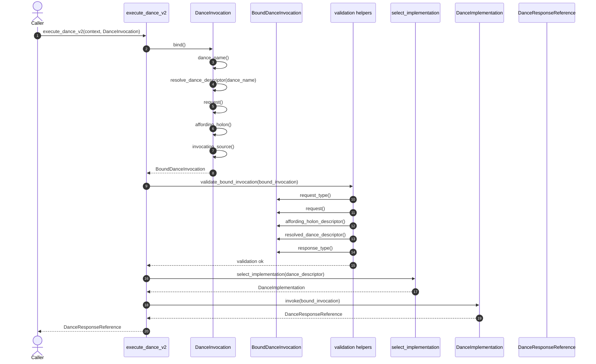

# MAP Design Spec: Dances, Descriptor Affordances, and Holonic Invocation (v2.3)

## ChangeLog

### v2.4

- defines the host-to-guest `GetSavedHolonByKey` dance boundary for saved-holon
  lookup and retires `GetSavedHolonsByBaseKey`

### v2.3

- makes `DanceInvocation.AffordingHolon` required for every Dance and defines
  its effective afforded dances as the unique DanceName resolution scope
- removes the `AffordingHolonRequirement` policy and subjectless Dance
  invocation semantics
- aligns the current foundation with [map-holons #652](https://github.com/evomimic/map-holons/issues/652)
  and [PR #654](https://github.com/evomimic/map-holons/pull/654), which defer
  structural request/response conformance to the shared Validation track

### v2.2

- reconciles Issue 17's Dance naming, affordance, and delivery-plan
  contradictions with the merged Schema 2.0 package layout
- defines `TypeDescriptor.TypeName` as the sole DanceType identity and
  `DanceInvocation.DanceName` as the required uniquely resolved invocation name
- standardizes `AffordsDance` / `DanceAffordedBy` and `RequestType` /
  `RequestTypeFor`
- records required `HolonSpace` affordance for `LoadHolons` and `QueryDance`
- defines shared structural request/response validation at the Dance boundary
  and separates it from TrustChannel/Agreement disclosure authorization
- replaces legacy-coexistence guidance with the clean contract-cutover posture


### v2.1

This revision aligns dance invocation, request validation, projections, and
query execution with the stable-name and structural-contract posture.

- changes dance invocation identity from descriptor-reference identity to
  canonical `DanceName`
- clarifies that the host resolves `DanceName` through the affording holon's
  effective afforded dances before validation and dispatch
- clarifies that dance request validation is structural against the resolved
  `DanceType.RequestType`, not exact descriptor-holon identity on the supplied
  request holon
- distinguishes persistent Projection-shaped contracts from ephemeral
  Projection-shaped values
- clarifies that query-produced projection holons may be descriptorless because
  their shape is a function of the producing `QueryExpression`
- separates independently invocable Query execution from the Query–Dance
  adapter, rather than making the Query Schema depend on Dance descriptors
- clarifies that builders create transient invocation and request value holons
  without minting per-invocation request descriptors
- separates the holonic schema design from Rust wrapper and helper types
- reorganizes the spec so schema artifacts are presented in one complete schema
  section and Rust/runtime behavior is presented in one runtime section

### v2.0

The old spec (v1.3) has been moved to the archive. Starting a new changelog here. These are the principal changes from 1.3.

- consolidates the revised holonic dance design as the current target posture
- re-centers dance contracts on `DanceType`, `DanceInvocation`,
  `DanceResponseType`, `DanceImplementation`, and `Projection`
- replaces dance-specific wire envelopes with holon-backed invocation and
  response records
- clarifies `Projection` as the base shell for value-shaped request, response,
  and projection-result holons
- simplifies implementation binding so active implementations are selected by
  `ForDance` rather than per-target dynamic dispatch
- restores concrete guidance for query/navigation dance categories under the
  new holonic design
- restores a legacy surface disposition appendix, updated to clarify
  `Deprecated` suffix strategy for deprecated schema descriptors
- distinguishes the canonical descriptor-driven host dance surface from the
  guest-side primitive persistence surface
- clarifies that guest-side primitives may remain non-descriptor-driven and be
  wrapped through `DanceImplementation` when a canonical host dance needs guest
  authority
- adds a Dances DSL authoring section and aligns the spec with the updated MAP
  type-definition DSL work

- **Status:** Draft
- **Intent:** Specify the MAP Dances design: dances are descriptor-afforded behaviors, invocations are holons, responses are holons, and command ingress carries holon references rather than dance-specific wire payloads.
- **Scope:** Dance type definition, afforded dances, request and response shapes, invocation records, response bodies, implementation binding, ABI, command ingress, dispatch, validation, persistence, audit posture, performance, and test migration posture.

---

## 1) Design Summary

This spec is organized around two layers:

1. The schema layer defines the durable holonic contract: the HolonTypes,
   PropertyTypes, RelationshipTypes, and invariants that make dances portable,
   inspectable, and valid across hosts.
2. The Rust type layer is an implementation convenience over that contract:
   typed wrappers, builders, references, and bound execution contexts that make
   the schema ergonomic and safe to use in code. In short, schema says what a
   dance is and what structure it promises; Rust types say how a host program
   reads, constructs, validates, and executes those schema-backed holons without
   becoming a second source of truth.

The foundational ontology of the MAP is self-describing, active holons and holon relationships. The self-describing part means that holons carry a `DescribedBy` relationship to their own HolonType descriptor. We say holons are _active_ because they are not just passive information containers, they offer behaviors -- i.e., they can do stuff. These behaviors represent the _affordances_ the holon type offers. We've shortened the term _affordances_ to simply, _dances_. Thus, a dance is a behavior afforded by a MAP Holon Type and the set of dance types a holon type affords is available through its `AffordsDance` relationship to schema-backed `DanceType`
descriptors. A dance's stable canonical `DanceName` is its inherited `TypeDescriptor.TypeName`.

Dances can have either statically bound implementations or (in the future) dynamically bound implementations. A dance's implementation is described through its associated `DanceImplementation` descriptor.

Dances may be invoked through either _Command_ or _TrustChannel_ ingress paths.

A dance is invoked when an ingress adapter delivers a `HolonReference` to a
`DanceInvocation` holon to the canonical `execute_dance_v2` host executor with
its transaction context. For Commands this is expressed as
`TransactionAction::DanceV2 { invocation }`; other ingress paths adapt their
own envelopes to the same executor call. A dance invocation is a holon.
`DanceInvocation` specifies the dance being
invoked by canonical `DanceName`, the required affording holon that is the
subject of the invocation, the request holon supplied to the dance, and the
ingress source of the invocation. The invocation record is part of the holonic
model; it is not a bespoke request wire object.

A dance is invoked when an ingress adapter, such as Commands or TrustChannels,
calls the canonical executor with a Rust `DanceInvocation` typed reference
wrapper. That wrapper contains the ordinary `HolonReference` to the
`DanceInvocation` holon. The host binds that reference, resolves
`DanceInvocation.DanceName` through the affording holon's effective afforded
dances, validates the invocation
against the resolved dance contract, selects a `DanceImplementation`, executes
it, and returns a `DanceResponseReference` or `HolonError`.

The supplied request holon is validated structurally against the resolved
dance's declared request contract. It may reference a descriptor when one is
available, but exact descriptor-holon identity is not the basis for accepting or
rejecting the request.

The canonical descriptor-driven dance surface is host-biased and extensible.
The guest is not the general dance runtime. Instead, the guest exposes a small,
stable primitive persistence surface for operations that require HDK or DHT
authority. These runtime surfaces need not be identical. `DanceImplementation`
is the layer that can wrap guest-side primitives so that canonical host dances
can still execute through one descriptor-driven executor when appropriate.

A successful dance response is a holon whose descriptor extends
`DanceResponseType`. The response can point to its structured result body
through `ResponseBody`. Result state lives in normal MAP holon state managers
and is reached by relationship, not embedded in a command payload.

Query execution is independently callable by peer Rust objects. The
Query–Dance adapter provides the ordinary Dance path: it accepts a
`QueryDanceRequest`, invokes the selected `Query`, and returns a holonic
response. Query expressions such as seed, expand, filter, order, skip, limit,
and project remain query-domain behavior rather than separate canonical
`DanceType`s. Commands invoke this adapter through Dances and do not acquire a
direct Query dependency.

## 2) Relationship to Descriptor Design

The descriptor design owns the structure and interpretation of MAP type
descriptors. It defines how holon types declare properties, relationships,
commands, dances, inheritance, abstract target endpoint type declarations, and descriptor-local
lookup. The Dances design builds on that foundation; it does not define a
second descriptor system.

Descriptor design owns:

- `TypeDescriptor`, `HolonType`, and the meta-type structure
- `Extends` inheritance and effective descriptor flattening
- `HolonDescriptor` as the caller-facing lookup surface for type structure and
  affordances
- relationship source and target endpoint type declarations, including abstract target
  declarations such as `HolonType`
- property and relationship validation for ordinary holon state

Dances design owns:

- `DanceType` as the descriptor family for executable behavior
- `AffordsDance` as the behavior affordance from holon types to dances
- `DanceImplementation` as the executable binding model
- `DanceInvocation` as the holonic execution request record
- `DanceResponseType` as the successful response model
- dance dispatch, implementation selection, command ingress, runtime-surface
  adaptation, and audit posture

The Dances design must not introduce a second global dance registry, require
callers to reconstruct `Extends` inheritance, detach behavior meaning from
descriptors, or make ABI payload encoding the semantic owner of invocation and
response meaning. A caller asks descriptors what a holon affords; the dance
runtime executes the afforded behavior.

---

## 3) Foundational Assumptions

1. **Self-describing types**
    - MAP types are holons described by descriptor holons.
    - Runtime wrappers are typed views over `HolonReference`.
    - Structural and behavioral affordances are discovered through descriptors.

2. **Descriptor-owned affordance lookup**
    - Dances are behaviors afforded by `HolonType` descriptors.
    - Effective dance lookup is inherited and flattened through `Extends`.
    - `HolonDescriptor` owns the caller-facing dance discovery surface.

3. **Holonic execution records**
    - Dance invocation is represented by `DanceInvocation`.
    - Successful dance response is represented by a holon whose descriptor
      extends `DanceResponseType`.
    - Result state is reached through relationships and `HolonReference`, not
      embedded as command payload state.

4. **Ingress adapters do not own dance meaning**
    - Commands and TrustChannels are ingress paths into dance execution.
    - They carry references and enforce ingress policy.
    - They do not define separate dance request, response, query, or result
      semantics.

5. **Query–Dance invocation is an adapter**
    - Query execution is independently invocable beneath the Dance layer.
    - `QueryDance` is the ordinary descriptor-afforded adapter for Dance
      ingress; it does not own query execution semantics.
    - Query expressions are not separate canonical `DanceType`s.
    - Plural holon-backed results use `HolonCollection`.
    - Projection records are holonic values. They may be descriptorless when
      their shape is derived from the producing query graph or query step.
    - Row-shaped query result contracts are not part of the Dances design.

6. **Value semantics stay with value descriptors**
    - Dances do not own scalar value meaning or operator semantics.
    - Value validation and operator support are resolved through
      `ValueDescriptor`.

---

## 4) Dance Schema Design

The Dance Schema is the holonic schema contract. It defines the descriptor
families, invocation and response holons, implementation binding holons,
projection roots, and the property and relationship types that connect them. It
does not define Rust wrappers, wire encodings, dispatch algorithms, or runtime
state-manager behavior.

### 4.1 Schema Inventory

Core Dance Schema holon types:

```text
Abstract HolonType: DanceType
Abstract HolonType: DanceResponseType

HolonType: DanceImplementation
HolonType: DanceInvocation
HolonType: DanceDiagnostic
HolonType: Projection
```

Core enum value types:

```text
EnumValueType: InvocationSource
EnumValueType: DanceDiagnosticSeverity
```

Query–Dance adapter schema types:

```text
DanceType: QueryDance
HolonType: QueryDanceRequest
HolonType: QueryDanceResponse extends DanceResponseType
```

`QueryDance`, `QueryDanceRequest`, and `QueryDanceResponse` are owned by the
Query–Dance adapter schema, not MAP Core and not the independently loadable
Query Schema. `QueryDance` participates in Dance's one generic
`AffordsDance` / `DanceAffordedBy` relationship as a concrete extension of
`DanceType`; the adapter defines no QueryDance-specific affordance pair.
`MAP Dance Schema-v0.1.0` is a separately loadable package at
`map-holons/schema-src/dance/schema.tdl` and depends on
`MAP Core Schema-v0.0.7`. QueryDance depends on Dance, Query, and Core. Dance
must not import QueryDance.

### 4.2 PropertyTypes

Dances use ordinary MAP property descriptors. The Dance Schema owns the
following property types:

| PropertyType                | Used By                        | Meaning                                                                                                                                                |
|-----------------------------|--------------------------------|--------------------------------------------------------------------------------------------------------------------------------------------------------|
| `DanceName`                 | `DanceInvocation`              | Required canonical dance name used to resolve exactly one Dance through the affording holon's effective afforded dances. The resolved DanceType's inherited `TypeDescriptor.TypeName` is the same canonical identity. |
| `DanceDescription`          | `DanceType`                    | Dance-specific description of what the dance does and when it should be invoked. Shared descriptor metadata still comes from `TypeDescriptor`.         |
| `InvocationSource`          | `DanceInvocation`              | Trusted ingress source stamped internally by the ingress adapter; it is never caller-supplied API input.                                               |
| `Engine`                    | `DanceImplementation`          | Implementation engine family, such as built-in Rust or a dynamic module engine.                                                                        |
| `ModuleRef`                 | `DanceImplementation`          | Executable module identity or built-in implementation identity.                                                                                        |
| `Entrypoint`                | `DanceImplementation`          | Function, method, or exported entrypoint used by the implementation engine.                                                                            |
| `AbiId`                     | `DanceImplementation`          | ABI contract identifier expected by the implementation.                                                                                                |
| `Version`                   | `DanceImplementation`          | Implementation version used for compatibility and deterministic selection.                                                                             |
| `Compat`                    | `DanceImplementation`          | Compatibility declaration for host, engine, ABI, or schema expectations.                                                                               |
| `DanceSummary`              | `DanceImplementation`          | Human-readable implementation summary.                                                                                                                 |
| `DanceDiagnosticSeverity`   | `DanceDiagnostic`              | Non-fatal diagnostic severity.                                                                                                                         |
| `DiagnosticCode`            | `DanceDiagnostic`              | Stable diagnostic code.                                                                                                                                |
| `DiagnosticMessage`         | `DanceDiagnostic`              | Human-readable diagnostic message.                                                                                                                     |

Schema-backed value semantics for these properties come from their
`ValueDescriptor`s. Dance implementations must not reinterpret their scalar
meaning locally.

### 4.3 RelationshipTypes

Dances use ordinary MAP relationship descriptors. The Dance Schema owns the
following relationship types:

| RelationshipType    | Source                | Target                | Cardinality | Meaning                                                                                    |
|---------------------|-----------------------|-----------------------|-------------|--------------------------------------------------------------------------------------------|
| `AffordsDance`      | `HolonType`           | `DanceType`           | `0..*`      | Instances of the source holon type may invoke the target dance.                            |
| `DanceAffordedBy`   | `DanceType`           | `HolonType`           | `0..*`      | Inverse of `AffordsDance`.                                                                 |
| `RequestType`       | `DanceType`           | `HolonType`           | `0..1`      | Declares the request-body contract for the dance. Absent means no structured request body. |
| `Response`          | `DanceType`           | `DanceResponseType`   | `1..1`      | Declares the successful response type for the dance.                                       |
| `ForDance`          | `DanceImplementation` | `DanceType`           | `1..1`      | Binds executable implementation metadata to one dance descriptor.                          |
| `HasImplementation` | `DanceType`           | `DanceImplementation` | `0..*`      | Inverse of `ForDance`.                                                                     |
| `AffordingHolon`    | `DanceInvocation`     | `HolonType`           | `0..1`      | Points to the subject holon for a holon-afforded invocation.                               |
| `Request`           | `DanceInvocation`     | `HolonType`           | `0..1`      | Points to the request value holon supplied for one invocation.                             |
| `ResponseBody`      | `DanceResponseType`   | `HolonType`           | `0..1`      | Declares the structured body type for successful responses of this response type.          |
| `ResponseBodyFor`   | `HolonType`           | `DanceResponseType`   | `0..*`      | Inverse of `ResponseBody`.                                                                 |
| `Diagnostics`       | `DanceResponseType`   | `DanceDiagnostic`     | `0..*`      | Attaches non-fatal diagnostics to a successful response.                                   |

The Query–Dance adapter request type declares:

| RelationshipType  | Source              | Target            | Cardinality | Meaning                                               |
|-------------------|---------------------|-------------------|-------------|-------------------------------------------------------|
| `RequestedQuery`  | `QueryDanceRequest` | `Query`           | `1..1`      | Reusable query definition to execute.                 |
| `InitialInput`    | `QueryDanceRequest` | `HolonCollection` | `1..1`      | Initial collection for the query execution.            |
| `RequestParameters` | `QueryDanceRequest` | `QueryParameterBinding` | `0..*` | Invocation-level bindings.                             |

Relationship target endpoint type declarations that name abstract `HolonType` may point to any
holon whose concrete descriptor extends `HolonType`. Descriptorless
`Projection` values are the special value-shaped exception: they may be used as
request or query-produced response-body values when accepted by the resolved
dance contract or derived from the producing query.

`ResponseBody` is declared on response descriptors to name the response-body
contract. Response holons described by those descriptors use the same
relationship name to point to the concrete response-body holon produced by an
execution.

### 4.4 HolonType Definitions

```text
Abstract HolonType: DanceType

Properties:
  DanceDescription

Relationships:
  RequestType -> HolonType [0..1]
  Response -> DanceResponseType [1..1]
  HasImplementation -> DanceImplementation [0..*]
  DanceAffordedBy -> HolonType [0..*]
```

`DanceType` descriptors are ordinary `TypeDescriptor` holons. Shared descriptor
metadata such as `type_name`, `display_name`, and `description` comes from the
shared descriptor model. Its `TypeDescriptor.TypeName` is the stable canonical
`DanceName` used for lookup and dispatch; descriptor holon IDs are host-local
resolution artifacts, not portable invocation identity.

`RequestType` is the dance's request contract. If present, it points to the
holon type that defines the structural shape expected as the request body. If
absent, the dance accepts no structured request body. When a dance needs scalar
parameters, its request type can extend `Projection` and declare the required
instance properties directly.

```text
HolonType: DanceImplementation

Properties:
  Engine
  ModuleRef
  Entrypoint
  AbiId
  Version
  Compat
  DanceSummary

Relationships:
  ForDance -> DanceType [1..1]
```

`DanceImplementation` is executable binding metadata. It is part of the schema
because implementations are discoverable holons, but implementation selection
and execution are runtime concerns.

```text
HolonType: DanceInvocation

Properties:
  DanceName
  InvocationSource

Relationships:
  AffordingHolon -> HolonType [0..1]
  Request -> HolonType [0..1]
```

`DanceInvocation` records a request to execute a dance. It names the dance by
canonical `DanceName`; it does not point to a `DanceType` descriptor as portable
identity. `AffordingHolon` points to the concrete subject holon when the dance
is holon-afforded. `Request` points to the concrete request value holon for this
invocation.

```text
Abstract HolonType: DanceResponseType

Relationships:
  ResponseBody -> HolonType [0..1]
  Diagnostics -> DanceDiagnostic [0..*]
```

A successful response holon is described by a concrete descriptor extending
`DanceResponseType`. `ResponseBody` declares the shape of the structured result
body when one exists. Failure is represented by `HolonError`, not by a
successful response with an error-shaped status body.

```text
HolonType: DanceDiagnostic

Properties:
  DanceDiagnosticSeverity
  DiagnosticCode
  DiagnosticMessage
```

`DanceDiagnostic` records non-fatal diagnostics attached to a successful
response. Diagnostics do not replace `HolonError`.

```text
HolonType: Projection
```

`Projection` is the base holon type for value-shaped holons. It is intentionally
only a shell. Concrete dance request, response-body, parameter, and reusable
projection contracts extend `Projection` when their state is a property map
rather than a reference to another whole holon.

### 4.5 EnumValueTypes

```text
InvocationSource =
  | ClientCommand
  | TrustChannel
  | Internal
```

```text
DanceDiagnosticSeverity =
  | Info
  | Warning
```

`InvocationSource` is trusted runtime metadata stamped internally by the
ingress adapter; it is not caller-supplied API input. A client cannot claim
`TrustChannel` or `Internal` authority for itself.

### 4.6 Projection Contracts And Values

Projection has two distinct roles:

- persistent schema root for reusable value-shaped contracts, such as a dance
  request type or response-body type
- ephemeral holonic value shape for query-produced records whose shape is
  derived from the producing `QueryExpression`

Dance request projections usually have persistent descriptors because their
shape is part of the dance contract. The supplied projection value does not need
to reference that descriptor, or any descriptor, if it structurally satisfies
the resolved contract.

Query-produced projection values may be descriptorless by design. Their shape is
a function of the query that produced them. A transient descriptor may be
created when useful, but descriptor creation is not required merely to carry
projected values.

### 4.7 Query–Dance Adapter Schema

### 4.7.1 Current Concrete Dances

The current TDL defines the following concrete DanceTypes. Both require an
`AffordingHolon` whose effective descriptor is `HolonSpace` or extends it, and
which affords the resolved Dance through its effective affordances:

| DanceType | Canonical DanceName | RequestType | Response | Affordance owner |
| --- | --- | --- | --- | --- |
| `LoadHolons` | `LoadHolons` | `HolonLoadSet` | `HolonLoadResponse` | Generic `HolonSpace -[AffordsDance]-> DanceType` relationship |
| `QueryDance` | `QueryDance` | `QueryDanceRequest` | `QueryDanceResponse` | Generic `HolonSpace -[AffordsDance]-> DanceType` relationship |

The names in the second column are each DanceType's inherited
`TypeDescriptor.TypeName`, not values of a separate DanceType property.

### 4.7.2 Query–Dance Adapter Schema

The canonical query affordance is coarse-grained:

```text
DanceType: QueryDance extends DanceType
  RequestType -> QueryDanceRequest
  Response -> QueryDanceResponse

HolonSpace -[AffordsDance]-> QueryDance
```

```text
HolonType: QueryDanceRequest

Relationships:
  RequestedQuery -> Query [1..1]
  InitialInput -> HolonCollection [1..1]
  RequestParameters -> QueryParameterBinding [0..*]
```

```text
HolonType: QueryDanceResponse extends DanceResponseType

Relationships:
  ResponseBody -> HolonType [0..1]
```

`QueryDanceResponse.ResponseBody` points to the query result
`HolonCollection`. The adapter passes its selected query, input, and bindings to
the direct Query engine. It does not own the query tree or execution state.

### 4.8 Schema Invariants

- Concrete dance descriptors extend `DanceType`.
- A DanceType's inherited `TypeDescriptor.TypeName` is its stable canonical
  DanceName; only `DanceInvocation` carries a `DanceName` property.
- `DanceType.RequestType`, when present, points to a `HolonType` descriptor.
- `DanceType.Response` points to a `DanceResponseType` descriptor.
- `DanceResponseType.ResponseBody`, when present, points to a `HolonType`
  contract, while query-produced projection values may still be descriptorless
  runtime values.
- `AffordsDance` points from `HolonType.TypeDescriptor` to the abstract
  `DanceType.HolonType`; `DanceAffordedBy` is its inverse. `LoadHolons` and
  `QueryDance` extend `DanceType` and are substitutable targets of that one
  generic relationship.
- `ForDance` points from `DanceImplementation` to exactly one `DanceType`;
  `HasImplementation` is its inverse.
- Dance affordances inherit through `Extends` using the same descriptor
  flattening rules as other type affordances.
- Request and response-body holon types are owned by the Dance-layer adapter
  that declares them. The Dances Schema does not define a generic `Parameter`
  holon type.
- `ResponseStatusCode`, `OutcomeOf`, and `DanceEvent` are not part of the active
  schema. If event-like artifacts are later needed, they should be modeled as
  explicit holons related to the invocation, response, or response body they
  describe.

### 4.9 Dance Signature DSL

The holonic representation is canonical, but verbose for human authors. A
Dances DSL is a concise authoring surface for declaring dance signatures. It
compiles into the schema artifacts above; it does not define a second semantic
model.

Example:

```text
dance Summarize
  target Article
  request SummarizeRequest extends Projection
    properties
      max_sentences: PositiveInteger
      tone: SummaryTone
  response SummarizeResponse
  response_body SummaryProjection extends Projection
    properties
      summary_text: LongString
```

This compiles to:

- a `DanceType` descriptor for `Summarize`
- a `SummarizeRequest` holon type extending `Projection`
- a `SummarizeResponse` holon type extending `DanceResponseType`
- a `SummaryProjection` holon type extending `Projection`
- `Summarize -[RequestType]-> SummarizeRequest`
- `Summarize -[Response]-> SummarizeResponse`
- `SummarizeResponse -[ResponseBody]-> SummaryProjection`
- `Article -[AffordsDance]-> Summarize`

The DSL should prefer existing property definitions over generating new ones
when projected or parameter fields already correspond to known MAP properties.
It may define new property types where genuinely needed, such as aggregate or
computed fields that do not correspond to a single existing source property.

---

## 5) Runtime And Execution Design

The runtime design explains how Rust wrappers, builders, ingress adapters,
validation, implementation selection, ABI calls, state managers, and wire
boundaries use the Dance Schema. Runtime behavior must not redefine schema
meaning.

### 5.1 Rust Types

Rust types are typed views, builders, and execution contexts over holonic state.
They are not additional schema types.

Representative Rust surfaces include:

- `DanceDescriptor`, a typed view over a `DanceType` descriptor holon
- `DanceInvocation`, a typed reference wrapper around a `HolonReference` to a
  `DanceInvocation` holon at the execution boundary
- `BoundDanceInvocation`, a host-side resolved execution context used after
  binding
- `DanceResponse` or `DanceResponseReference`, typed views over response holons
  whose descriptors extend `DanceResponseType`
- request builders for Projection-shaped request values
- `TransactionAction::DanceV2`, the command ingress variant that carries a
  `HolonReference` to a `DanceInvocation`

Representative executor and command-facing Rust shapes:

```rust
pub async fn execute_dance_v2(
    context: &Arc<TransactionContext>,
    invocation: DanceInvocation,
) -> Result<DanceResponseReference, HolonError>{}
```

```rust
pub struct DanceInvocation {
    invocation: HolonReference,
}
```

```rust
pub enum TransactionAction {
    DanceV2 { invocation: HolonReference },
}
```

```rust
pub enum TransactionActionWire {
    DanceV2 { invocation: HolonReferenceWire },
}
```

Rust helper types may expose the canonical `DanceName`, host-resolved
`DanceType`, optional request holon, declared request and response descriptors,
required affording holon and descriptor, invocation source, and state managers. They must
preserve the schema rules: dance identity is name-based, request validation is
structural against the resolved contract, and builders do not mint
per-invocation request descriptors merely to carry request values.

### 5.2 Ingress And Builders

Commands and TrustChannels are ingress paths into the same dance execution
core. They carry references and enforce ingress policy; they do not define
separate dance request, response, query, or result semantics.

Canonical executor signature:

```text
execute_dance_v2(
  context: &Arc<TransactionContext>,
  invocation: DanceInvocation
) -> Result<DanceResponseReference, HolonError>
```

The Rust `DanceInvocation` argument is a typed reference wrapper around the
ordinary `HolonReference` to the invocation holon. Ingress adapters construct or
receive the invocation holon reference, wrap it as `DanceInvocation`, then call
the executor.

Command and wire envelopes remain reference-oriented:

```text
DanceV2(invocation: HolonReference) -> Result<HolonReference, HolonError>
```

The command input reference points to a `DanceInvocation` holon. The command
output reference points to the response holon reached through the
`DanceResponseReference` returned by the executor.

A shared host-side builder creates transient `DanceInvocation` holons in the
chosen transaction-bound transient manager. When the builder creates a
Projection-shaped request holon, it creates and populates the request value
holon. It does not need to mint a request descriptor for that invocation or
attach the dance's declared request descriptor to the request value. Validation
is performed later against the resolved `DanceType.RequestType`.

The Dances design does not define `DanceInvocationWire`, `DanceResponseWire`,
dance-request wire types, or dance-result wire unions.

### 5.3 Binding And Dispatch

Given a Rust `DanceInvocation` typed reference wrapper, runtime dispatch:

1. Reads the underlying `HolonReference` to the `DanceInvocation` holon.
2. Binds the invocation reference and reads the invocation's canonical
   `DanceName`.
3. Resolves that name through the affording holon's effective afforded dances.
4. Resolves the request holon, required affording holon, invocation source,
   declared request type, and declared response type.
5. Performs executor ingress validation.
6. Binds the invocation into a `BoundDanceInvocation` or equivalent resolved
   execution context.
7. Resolves candidate implementations through `ForDance`.
8. Applies activation-time validation and deterministic implementation
   selection.
9. Executes the selected implementation through the dance ABI.
10. Places produced state in the correct MAP state manager.
11. Receives the final response holon described by `DanceResponseType` from the
    selected implementation.
12. Returns the response wrapper or reference.


```mermaid
sequenceDiagram
    autonumber
    actor Caller
    participant Executor as execute_dance_v2
    participant Invocation as DanceInvocation
    participant Bound as BoundDanceInvocation
    participant Validator as validation helpers
    participant Selector as select_implementation
    participant Impl as DanceImplementation
    participant ResponseRef as DanceResponseReference

    Caller->>Executor: execute_dance_v2(context, DanceInvocation)
    Executor->>Invocation: bind()
    Invocation->>Invocation: dance_name()
    Invocation->>Invocation: resolve_dance_descriptor(dance_name)
    Invocation->>Invocation: request()
    Invocation->>Invocation: affording_holon()
    Invocation->>Invocation: invocation_source()
    Invocation-->>Executor: BoundDanceInvocation

    Executor->>Validator: validate_bound_invocation(bound_invocation)
    Validator->>Bound: request_type()
    Validator->>Bound: request()
    Validator->>Bound: affording_holon_descriptor()
    Validator->>Bound: resolved_dance_descriptor()
    Validator->>Bound: response_type()
    Validator-->>Executor: validation ok

    Executor->>Selector: select_implementation(dance_descriptor)
    Selector-->>Executor: DanceImplementation

    Executor->>Impl: invoke(bound_invocation)
    Impl-->>Executor: DanceResponseReference
    Executor-->>Caller: DanceResponseReference
```

### 5.4 Runtime Validation

The name-addressed schema and binding foundation is implemented by
[map-holons #652](https://github.com/evomimic/map-holons/issues/652), delivered
through [map-holons PR #654](https://github.com/evomimic/map-holons/pull/654).
It establishes required `DanceName` and `AffordingHolon` binding through the
effective `AffordsDance` surface. It deliberately does not implement full
descriptor-aware request/response conformance or an
`AffordingHolonRequirement` policy enum.

The remaining structural validation requirements below are a follow-up
integration with the shared Validation track. Dance must not introduce a local
substitute validator.

Executor ingress validation:

- `DanceInvocation.DanceName` is required and resolves to exactly one Dance
  through the required affording holon's effective afforded dances.
- `DanceInvocation.AffordingHolon` is required and points to a holon accepted
  by the relationship constraint.
- `DanceInvocation.Request` is required when the resolved dance declares a
  `RequestType`.
- `DanceInvocation.Request` must be absent when the resolved dance does not
  declare a `RequestType`.
- `DanceInvocation.Request`, when present, structurally satisfies the resolved
  dance's declared `RequestType`.
- A supplied request holon's own descriptor reference is optional and is not the
  authority for acceptance. Exact descriptor-holon identity with `RequestType`
  is not required.
- `InvocationSource` is valid for the ingress path.
- The affording holon's effective descriptor affords the resolved Dance through
  `AffordsDance`; a missing or unaffording subject is rejected.

Once delivered, the shared Descriptor-Aware Holon Validation capability
validates the `DanceInvocation` and request holon structurally at Dance ingress
and validates the produced response before it is returned.

Dance-specific semantic validation remains the responsibility of the selected
implementation as part of ordinary execution logic. Semantic checks such as
value ranges, cross-reference consistency, cycle prevention, or same-space
constraints fail through the normal `HolonError` channel.

Response-time validation:

- The returned response holon is described by a concrete type extending
  `DanceResponseType`.
- The returned response holon conforms to the resolved dance's declared
  `Response` descriptor.
- `ResponseBody`, when present, points to a holon compatible with the declared
  response-body contract.
- Response-body values conform to the declared response-body contract when one
  exists.
- Query-produced projection records may be descriptorless when their shape is
  derived from the producing `QueryExpression`.
- `Diagnostics` points to `DanceDiagnostic` holons.

Structural response validation is the inner execution boundary. A TrustChannel
then applies its Agreement's role, permission, and information-access promises
before valid response data crosses the outbound trust boundary. That disclosure
authorization is not Dance validation or Dance dispatch work.

### 5.5 Implementation Selection And Runtime Surface Split

The canonical descriptor-driven dance surface is host-biased. Query dances,
extension dances, integration dances, orchestration dances, and other host
semantics use the same host-facing executor surface, though particular dances
may use only a read-oriented subset in practice.

The guest-side surface is narrower. It exists for primitive persistence and
authority-bearing operations that require direct HDK or DHT semantics. Guest
primitives do not need to be descriptor-driven in their native form. They may
continue to use an existing stable guest surface as long as canonical host
dances do not leak guest-specific request or response shapes back into the
descriptor-driven contract.

Representative guest-side primitives include commit holon, delete holon, get
holon by id, get related holons, get all related holons, get all holons, and
load holons. These primitives are not automatically canonical host dances.
`DanceImplementation` is the adaptation layer when a canonical host dance needs
guest authority.

For a given invocation, the runtime resolves candidate implementations from the
resolved dance. Candidate implementations must satisfy:

- `ForDance` points to the resolved `DanceType`
- `Engine`, `AbiId`, `Version`, and `Compat` are compatible with the host and
  invocation
- runtime policy allows the implementation for the invocation source and
  execution context

Multiple active implementations for the same `DanceType` must be semantically
interchangeable under that dance's declared contract. Selection is deterministic
and independent of traversal order, insertion order, or host-local registration
order. If no candidate is eligible, dispatch fails with `HolonError`. If policy
requires uniqueness and ordering cannot produce a single winner, dispatch fails
rather than choosing nondeterministically.

### 5.6 ABI And Wire Boundary

The dance ABI is the contract between the runtime that dispatches a dance and
the implementation that executes it. It carries the resolved invocation context
and returns either a response reference or `HolonError`.

The implementation receives a bound view containing at least:

- invocation holon reference
- canonical `DanceName`
- resolved `DanceType`
- optional request holon
- optional declared request type descriptor
- required affording holon and descriptor
- invocation source
- descriptor and value semantics needed to validate request values,
  relationships, predicates, and operators
- MAP state managers needed to read or create holon state

ABI output:

```text
Result<DanceResponseReference, HolonError>
```

At command or host/guest boundaries, the equivalent wire shape is:

```text
Result<HolonReference, HolonError>
```

Opaque ABI payloads must preserve these distinctions:

- invocation failure versus successful response
- dance identity versus selected implementation identity
- affording holon versus request holon
- invocation source versus authorization or provenance claims
- response holon versus response body holon
- response body references versus separately transferred holon state
- diagnostics attached to a successful response versus fatal `HolonError`

The Dances design uses `HolonReference`, `HolonCollection`, normal holon
serialization/deserialization, typed Rust wrappers over holonic state, and
command or trust-channel adapters that carry references. It does not use
dance-specific invocation wire types, response wire types, request-body wire
types, result wire unions, direct full-`Holon` result payloads, row-shaped query
result contracts, or a standalone query command envelope.

### 5.6.1 `GetSavedHolonByKey` host-to-guest dance

`GetSavedHolonByKey` is the host-to-guest dance boundary for the public
`get_saved_holon_by_key(key)` operation. Its request carries the supplied key
to the guest; the guest invokes `get_saved_holon_by_key` and returns the bound
`SmartReference` for the sole visible head whose actual `Key` equals the
requested key on success.

The dance preserves the `HolonError` result unchanged across its wire boundary.
In particular, `HolonNotFound`, `MultipleLineageHeads`, and
`LineageIntegrityError` remain
distinguishable to host, IPC, and loader callers. The shared error variants and
their meanings are defined by [Runtime Shared Types](../core-runtime/runtime-shared-types.md).

`GetSavedHolonsByBaseKey` is obsolete and must not be exposed, invoked, or
retained as a compatibility name. `get_lineage_heads_by_key` remains an
internal guest helper; no separate `GetLineageHeadsByKey` dance is defined.

This dance delegates key-to-lineage resolution and visible-head traversal to
the keyed-`Owns` index and visible-head selection semantics in the
[Knowledge Evolution Architecture](../architecture/knowledge-evolution-architecture.md).
It does not add a dance-specific error envelope or independently reinterpret
the generic SmartLink service operations.

### 5.7 Descriptor And Value Semantics

Dances use descriptor-owned semantics when interpreting properties, values,
relationships, and operators. Dance implementation code may perform business
logic, navigation, mutation, projection, and orchestration, but it does not
become the semantic owner of MAP value interpretation.

Interpretation rules:

- property legality comes from the affording holon's effective
  `HolonDescriptor` when the dance is holon-afforded
- relationship legality comes from the relevant relationship descriptor
- scalar value validation comes from `ValueDescriptor`
- operator availability comes from descriptor-backed operator affordances
- unsupported operators fail explicitly with `HolonError`
- dance-specific code does not silently reinterpret descriptor semantics

Query step implementations check whether the relevant value descriptor supports
the requested operator. Query projection steps return projection values,
optionally with transient descriptors when useful, rather than inventing ad hoc
row shapes.

### 5.8 Persistence, Audit, And Performance

DanceInvocation holons, their request values for the current vertical slice,
and successful DanceResponseType-derived response holons are transaction-bound
transient holons. The executor rejects staged or saved invocation and response
references; durable audit, provenance, or observability state is modeled
separately.

Produced state lives in the appropriate MAP state manager:

- `Nursery` for staged holons
- `TransientHolonManager` for transient holons
- `HolonsCache` for saved holons

The Dance Schema does not treat invocation and response holons as a durable
execution log. If durable audit, provenance, or observability records are
needed, they should be separate holons or operational logs that record the
relevant execution facts without changing the lifecycle of `DanceInvocation` and
`DanceResponseType`-derived response holons.

Any separate durable audit or provenance record should be able to recover:

- invocation holon
- invocation source
- invoked canonical `DanceName`
- resolved `DanceType`
- affording holon
- request holon, when present
- affording holon descriptor used for affordance validation
- selected `DanceImplementation`
- response holon
- response body holon, when present
- diagnostics, when present
- failure classification for failed dispatch or execution

The Dances design does not introduce a dance-specific caching layer. Dance
execution already benefits from the Shared Objects Layer through
`HolonReference`. Descriptor caching is a Shared Objects Layer decision, not a
Dances design concern. Performance optimizations must not create a second source
of truth for descriptors, affordances, invocations, responses, or response
bodies.

### 5.9 Contract Cutover

The canonical Dance model is holonic: invocation, response, response body,
diagnostics, and implementation bindings are represented as holons and
relationships. There is no deployed compatibility requirement for the
superseded Dance model. The implementation therefore replaces its schema,
runtime, ingress, SDK, and test surfaces as one contract cutover rather than
retaining translation bridges.

Cutover guidance:

- direct descriptor-reference invocation is replaced by `DanceInvocation`
  holons carrying canonical `DanceName`
- legacy request and response bridges are removed in favor of
  `DanceInvocation` and `DanceResponseType`-derived response holons
- old-world query/navigation entry points are replaced by the `QueryDance`
  adapter over independently invocable `Query` execution
- row-shaped query results are replaced by `HolonCollection`, projection-result
  holons, or other response-body holons promised by the resolved dance contract
- boundary serialization transfers holon state separately from the response
  reference when the receiving side needs state hydration
- typed Rust structs remain wrappers over `HolonReference`, so behavior can
  evolve without creating new wire types

The cutover preserves the semantic distinction between the canonical
dance name requested by the caller, the `DanceType` descriptor resolved through
the affording holon's effective affordances, the descriptor that affords the dance, the implementation selected by
the runtime, the response holon returned by successful execution, the response
body holon that carries result state, and `HolonError` returned by failed
execution.

---

## 6) Deferred Design Decisions

- `DanceEvent` is deferred until the asynchronous event-handling architecture
  is designed and a concrete event consumer requires it.

---

## Appendix A) Superseded Surface Removal

The following superseded surfaces have no compatibility role in the target
contract and are removed with their callers and tests. They must not be renamed,
retained as deprecated bridges, or used as a migration path.

| Surface | Target disposition |
| --- | --- |
| `DanceInvocation`, `DanceResponseType`, `DanceImplementation`, `Projection`, and the canonical `ResponseBody` relationship | Active canonical contract |
| `DanceRequest`, `DanceResponse`, `RequestBody`, and old response-body wrapper types | Remove with callers and tests |
| `ResponseStatusCode`, `ResponseBodyType`, `ImplementsDance`, `ImplementedFor`, `InvokesDance`, `InvokedBy`, `DanceInput`, and `DanceInputFor` | Remove from schema, generated surfaces, runtime, and tests |
| Old query-navigation DTOs and entry points | Remove only in their separately scoped Query cutover; do not retain them as Dance compatibility bridges |
