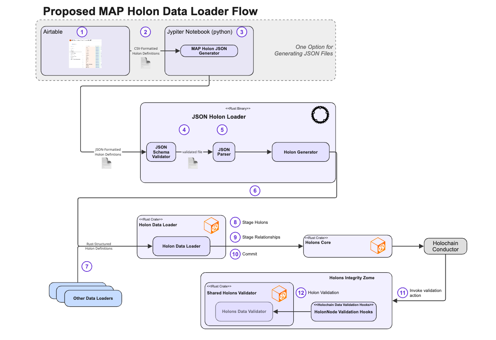

# MAP _Holon Data Loader_ Design Specification (Updated)

The _Holon Data Loader_ will convert holon data presented in JSON files into Holons and HolonRelationships that are staged and committed to a (single) MAP Space using existing MAP APIs. Because all MAP types (e.g., PropertyType, HolonType, RelationshipType) are themselves holons, the _Holon Data Loader_ can be used to load TypeDescriptors just like any other data — eliminating the need for a separate type-specific loader. Input files are syntactically validated against a JSON Schema to ensure they represent well-formed holons, properties, relationships and, eventually, dances.

Validation of imported holons and their properties and relationships against their Type Descriptors is triggered by standard Holochain validation callbacks. These callback functions, implemented in the `holons_integrity_zome` invoke shared validation functions to actually perform the validations. All Holochain dependencies are isolated in the integrity zome so that the shared validation functions have no holochain dependencies.

If the target space does not already contain all required TypeDescriptors (e.g., BookType, title, HAS_AUTHOR), they must be included as part of the import and loaded first. Since we do not yet have deployed instances of the MAP that persist data, all types and data required for an integration Test Case must be loaded as part of the test case itself. This includes importing the MAP Schema. Thus, the test case initialization includes the following steps:

1. Import MAP Meta-Schema
2. Import MAP Core Schema
3. Import Domain-Specific Type Descriptors (if any)
4. Import Domain-Specific Data (if any)

All four test steps use the same _Holon Data Loader_. Each step imports the type descriptors needed to validate the data imported in the subsequent step.

## 🧩 Process Overview

The following diagram shows the Holon Data Loading process.



## 🧭 Step-by-Step: MAP Holon Data Loader Flow

1. **Define Holons in Airtable** -- For now, we are using Airtable as our source of truth for data imports. A user or domain expert defines holons, properties, and relationships as rows in a spreadsheet-like interface. NOTE: This is just one option — other JSON generation methods are possible.

2. **Export CSV from Airtable** -- Airtable exports the holon definitions into a **CSV file**, which contains structured tabular data for each holon, including properties, types, and relationships.

3. **Convert CSV to JSON** -- A **Jupyter Notebook** (written in Python) loads the CSV file and uses the **MAP Holon JSON Generator** to transform the rows into **JSON-formatted Holon Definitions**. These definitions conform to the MAP Holon Data Loader's expected schema.

4. **Run the JSON Schema Validator** -- Before loading, the generated JSON input file is validated using a **JSON Schema Validator**. This ensures that the file:
- Is structurally valid
- Uses valid type names and relationship formats

The validated file represents well-formed **Holons**, **Properties**, and **Relationships**.

5. **Parse and Prepare Holons**  -- The validated JSON is parsed into in-memory data structures. The **Holon Generator** builds internal `HolonImportSpec` structs from the parsed data.

6. **Invoke the Holon Data Loader** -- The **Holon Generator** passes the structured holon definitions to the **Holon Data Loader**, a Rust crate. This loader:
- Handles all staging and relationship resolution
- Works for both instance data and TypeDescriptors

7. **(Optional) Other Data Loaders** -- Other data loaders may bypass JSON entirely and produce Rust-structured holon definitions directly. These are also accepted by the Holon Data Loader pipeline.

8. **Stage Holons** -- The loader performs **Pass 1**, where each holon is:
- Assigned a local ID or temp key
- Validated for syntactic structure
- Staged with its properties only (relationships deferred)

9. **Stage Relationships** -- The loader performs **Pass 2**, resolving all deferred relationships:
- References to staged holons use `temp_key`
- References to saved holons use keys or HolonIds
- External references resolve via space proxies

10. **Commit Holons** -- All staged holons are committed into the MAP space via the `holons_core` crate. This action triggers holochain’s commit lifecycle.

11. **Trigger Validation** -- As part of the commit, the **Holochain Conductor** invokes validation actions. These hit the **HolonNode Validation Hooks** in the `holons_integrity_zome`. The implementation of these hook functions converts the data into "holochain-independent" data structures in order to invoke the shared validation functions.

12. **Run Shared Validation Logic** The hooks delegate to the **Shared Holons Validator**, which contains:
- Validation against TypeDescriptors
- Enforcement of required properties and cardinalities
- No direct Holochain dependencies — enabling reuse of these validations from holons_core without pulling in holochain and its dependencies.

---

## 🧠 Design Philosophy

| Principle                   | Description                                                                 |
|----------------------------|-----------------------------------------------------------------------------|
| Holonic Uniformity         | Everything — including types — is a holon                                   |
| Self-Describing Types      | The `type` and `key` fields provide identity and classification             |
| Declarative Imports        | Inverse relationships and embedded holons may be expressed naturally        |
| Keyed Reference Integrity  | Only keyed holons may be targeted by `$ref`                                 |
| Two-Pass Import            | Enables circular references and loose ordering in authoring                 |
| Minimal, Consistent Format | Supports both human authoring and automated generation                     |

---

## 📌 Keyed vs Keyless Holons

MAP distinguishes two structural categories of holons:

| Feature                              | Keyed Holons | Keyless Holons |
|-------------------------------------|--------------|----------------|
| Includes `key`                      | ✅ Yes        | ❌ No           |
| Unique within space                 | ✅ Yes        | ❌ Not applicable |
| Can be referenced via `$ref`        | ✅ Yes        | ❌ No           |
| Must be embedded in JSON            | ❌ Optional   | ✅ Required     |
| Can be target of declared relationship | ✅ Yes     | ❌ No           |
| Must declare outgoing relationship to keyed holon | ❌ Optional | ✅ Required |

- Keyed holons include a stable `key` (materialized from properties) and may be referenced by other holons via `$ref`.
- Keyless holons are contextual and must be embedded as part of another holon’s relationship. They **must not** be referenced or stand alone.

This pattern ensures clean graph semantics, staging integrity, and simplicity for authors.

---

## 🔁 Declared vs Inverse Relationships in JSON

MAP represents both **Declared** and **Inverse** relationships using SmartLinks, but only **Declared Relationships** are:

- Explicitly defined in schemas
- Directly populated and persisted

**Inverse Relationships** are:
- Inferred by the system
- Automatically maintained as mirrors of their declared counterparts
- Not directly writable in the storage layer

### ✨ Ergonomic Authoring Support

To improve JSON authoring, the Holon Data Loader supports:

> ✅ **Expressing inverse relationships in JSON** — which are then automatically **rewritten into their declared equivalents** before staging

For example, a JSON snippet like:

```json
{
  "type": "#Schema",
  "key": "LibrarySchema",
  "relationships": [
    { "name": "Components", "target": [{ "$ref": "BookType" }] }
  ]
}
```

will be rewritten internally to:

```json
{
  "type": "#BookType",
  "relationships": [
    { "name": "ComponentOf", "target": { "$ref": "LibrarySchema" } }
  ]
}
```

This preserves the storage model while making authoring more intuitive.

🛑 Note: If both directions of a relationship pair are expressed in the same import file, the loader will raise a warning or error.

---

## 📂 JSON Import File Structure

Details about JSON formatting, required fields, reference expressions (`$ref`), embedded holons, and schema validation rules have been moved to the **Holon Data Loader Guide**.

See: *Holon Data Loader Guide – Authoring Valid JSON Files*

---

## 🔍 Validation Lifecycle

The Holon Data Loader and MAP system use **multiple layers of validation** to ensure correctness, schema alignment, and safe persistence.

### 1. **Schema Validation (Pre-Load)**

Before holons are even staged, input files are validated using **JSON Schema**:

- The loader always begins by validating imports against the **`bootstrap-import.schema.json`** schema. This schema ensures:
    - Holons are properly structured
    - Properties are well-formed
    - Relationship targets follow required structure
    - No invalid reference forms are present (e.g., unkeyed `$ref` targets)

#### 🧬 Cascading Schema Validation
After loading the **MAP Meta-Schema**, additional JSON Schemas can be generated automatically for downstream validation:

- **Meta-Schema** → Used to validate Core Type imports (e.g., PropertyType, ValueType)
- **Core Schema** → Used to validate Domain-Specific Schema files
- **Domain Schema** → Used to validate Domain-Specific Data files

This allows every import layer to be validated against a **holon-based, introspected schema**, enforcing MAP type rules long before runtime.

### 2. **Runtime Validation (Post-Commit)**

After holons are committed, **Holochain's Conductor** orchestrates the integrity checks by invoking validation callbacks defined in the `map_holons_integrity` zome.

> ❗ Holons do **not** themselves trigger validation — the request to persist a holon causes the Conductor to invoke validation logic.

The validation callbacks:
- Receive Holochain-native types like `Record`, `Link`, `ActionHash`
- Convert these into MAP-native, **Holochain-independent** structures:
    - `Holon`
    - `HolonRelationships`
    - `LocalId`, etc.

These converted forms are passed to shared validation functions (in `holons_core`) that enforce:

- Required and optional property rules
- Cardinality constraints on relationships
- Reference resolution and type compatibility
- Key and relationship uniqueness
- Schema-defined constraints (e.g., min/max values, enum values, etc.)

This design allows the same validation logic to be reused across client tools, data loaders, and runtime validation — avoiding duplication and enabling introspection.

### 3. **Loader-Level Validations**

The Holon Data Loader performs additional checks during staging:

- Ensures no inverse relationship appears more than once (after rewriting)
- Validates that all `$ref` targets resolve to keyed holons or embedded holons
- Rejects direct references to keyless holons
- Ensures that all keyless holons are:
    - Embedded as relationship targets
    - The source of at least one declared relationship
- Ensures that keys (when present) are unique within the load scope
---

## 💾 Staging and Commit Process

### Pass 1: Stage Holons
- Create in-memory Holon stubs for each input
- Only properties are staged; relationships are deferred
- Holons must include `type` (and `key`, if keyed)
- Relationships are stored for Pass 2

### Pass 2: Stage Relationships
- Resolve all `relationships` from JSON
- References are resolved by `$ref`, `Type:Key`, or embedded inline
- Inverse relationships are rewritten to their declared form
- Embedded keyless holons are inlined into source holon relationships

### Commit and Validate
- After all holons are staged, the loader invokes `holons_core` to commit
- Holochain callbacks are triggered
- Shared validation logic enforces type rules

---

# Schema Loading

As noted previously, the

| Programming Concept     | MAP Base Type           | MAP `type_kind`       |
|-------------------------|--------------------------|------------------------|
| `String`                | `MapStringValueType`     | `ValueString`          |
| `bool`                  | `MapBooleanValueType`    | `ValueBoolean`         |
| `i64` / `number`        | `MapIntegerValueType`    | `ValueInteger`         |
| `Vec<u8>` / base64      | `MapBytesValueType`      | `ValueBytes`           |
| Enum (string symbol)    | `MapEnumValueType`       | `ValueEnum`            |
| Holon descriptor        | `MapHolonType`           | `Holon`                |
| Relationship descriptor | `MapRelationshipType`    | `Relationship`         |
| Property descriptor     | `MapPropertyType`        | `Property`             |


## 🔮 Future Enhancements

- Add schema-based authoring for enum types, constraint types, and complex nested holons
- Expand support for symbolic references (`DanceRequest`)
- Enhance loader validation to support contextual awareness of target schemas
- Support streaming JSON parsing for very large imports

---

## 📎 Summary

The Holon Data Loader is the universal import engine for MAP Types and Instances. It supports:

- Bootstrap loading of MAP Meta-Schema and Core Schema
- Domain-specific extension imports
- Declarative instance creation with ergonomic syntax
- Unified graph population using a two-pass process
- Rewriting of inverse relationships for intuitive JSON authoring
- Holochain-independent shared validation

Authors and tool builders can rely on a consistent, minimal JSON format while benefiting from full MAP introspection, validation, and schema enforcement.

See also: **Holon Data Loader Guide** for JSON authoring rules and examples.


### ========== OBSOLETE CONTENT ==============

Everything after this point is left-over from prior versions are targeted to be deleted.

## 🔎 JSON File Structure

A JSON import file contains two top-level keys:


```
{
   "meta": {"... },
   "holons": [ { ... }, { ... }, ... ]
}
```

* `meta` contains metadata about the import (version, author, etc.).
* `holons` contains the list of holons to be imported.

### Holon Structure

Each holon in the `holons` list is represented as a JSON object with the following keys:

- `type` (string): Fully qualified `$ref` to the holon's type (e.g., `"#MapStringValueType"`). Replaces the older `DescribedBy` pattern.
- `key` (optional): A unique identifier if the holon is keyed.
- `temp_key` (optional): A temporary key for referencing other holons within the same import file.
- `properties`: A map of property name to typed value.
- `relationships`: A list of relationship objects, each containing:
   - `name`: Relationship name
   - `target`: Either a `$ref` string or an embedded holon


---

## 🔎 Key Design Rules

### ✅ `type` Implies `DescribedBy`
- Every holon must specify a `type` using `#Key` syntax.
- This replaces the need for an explicit `DescribedBy` relationship.

### ✅ Use `Components` Instead of `IsComponentOf`
- All imported holons are children of a `MapSchemaType` holon.
- The `Components` relationship replaces `IsComponentOf`.

### ✅ Declare `UsesKeyRule` for Keyed Holons
Each keyed holon must include a relationship:
```json
{
  "name": "UsesKeyRule",
  "target": {
    "type": "#FormatKeyRule",
    "properties": {
      "format": "$0",
      "property_names": ["type_name"]
    }
  }
}
```

### ✅ Fully Qualified Keys for Relationship Types
Use a `key` such as:
```text
(HolonType)-[DescribedBy]->(TypeDescriptor)
```
This prevents ambiguity and supports inverse resolution.

### ✅ `$ref` Is the Only Reference Format
Reference targets in relationships must use `$ref` strings, such as:
- `#temp-key`
- `Type:Key`
- `id:<HolonId>`
- `@Proxy:Type:Key`
- `ext:<ProxyId>:<LocalId>`

---

## 📊 Data Loader Flow

1. **Author Holons** – Use Airtable or any editor
2. **Convert to JSON** – Jupyter notebook or custom tool
3. **Validate** – Run against JSON Schema
4. **Parse** – Create internal `HolonImportSpec` structs
5. **Pass 1: Stage Holons**
    - Assign temp_keys and validate shape
    - Properties only; defer relationships
6. **Pass 2: Stage Relationships**
    - Resolve references using `$ref`
7. **Commit** – Insert holons via `holons_core`
8. **Validate** – Trigger integrity zome and shared validators

---

## 🔁 Example Holon with Relationships

```json
{
  "type": "#BookType",
  "temp_key": "book-001",
  "properties": {
    "title": { "type": "#MapStringValueType", "value": "Future Primal" }
  },
  "relationships": [
    { "name": "AUTHORED_BY", "target": { "$ref": "PersonType:charles-eisenstein" } },
    { "name": "MENTORED_BY", "target": { "$ref": "#mentor-temp-001" } }
  ]
}
```

---

## 🎓 Meta-Modeling: Relationship Types

### ✉️ Primary vs. Inverse Relationship Types

Use two types:
- `MetaPrimaryRelationshipType`: explicitly declared by source
- `MetaInverseRelationshipType`: inferred only

### 🔁 Inverse Links
Each relationship holon must link to its inverse using:
```json
{
  "name": "InverseOf",
  "target": { "$ref": "#OtherRelationshipType" }
}
```

Only **primary** relationships are listed in `PRIMARY_SOURCE_FOR` of the source HolonType.

---

## 📄 Key Rules for Relationship Types

```json
{
  "format": "($0)-[$1]->($2)",
  "property_names": ["source_type", "type_name", "target_type"]
}
```

This ensures uniqueness and proper `$ref` resolution.

---

## 🤝 Validation Overview

- Holon validation happens via Holochain callbacks
- Type validation uses shared holochain-independent logic
- `$ref` entries must resolve in Pass 2 or trigger errors

---

## 🌐 Design Philosophy

| Principle | Description |
|----------|-------------|
| Holonic Uniformity | Everything (types, rules, instances) is a holon |
| Self-Describing | `type` and `key` provide all descriptor info |
| Keyed Reference Integrity | No reference unless `key` or `temp_key` defined |
| Two-Pass Import | Enables circular refs and easy authoring |
| Minimal Format | Concise JSON with embedded metadata |

---

## 🔮 Next Steps

- Add section on symbolic references via `DanceRequest`
- Add schema examples for EnumType, PropertyType, etc.
- Publish complete reference `bootstrap-import.schema.json`

⸻

