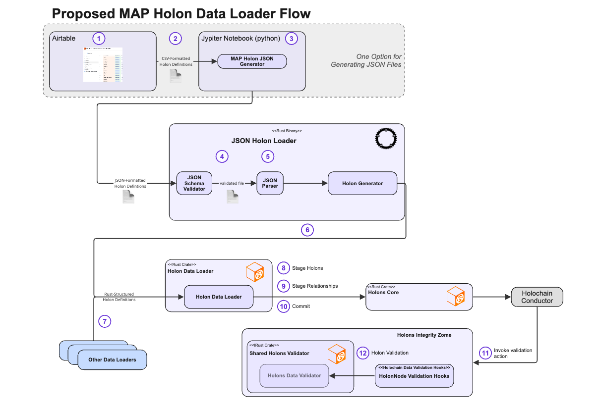

# MAP _Holon Data Loader_ Design Specification (v1.3)

---

## 📘 Summary

The _Holon Data Loader_ converts holon data presented in JSON files into Holons and HolonRelationships that are staged and committed to a single MAP Space using existing MAP APIs.

Because MAP type definitions are themselves holons, the loader supports importing descriptor holons just like any other data. In canonical JSON imports, the `type` field is shorthand for a `DescribedBy` relationship, so runtime holons and schema descriptors share the same loader surface.

Input files are syntactically validated against a JSON Schema to ensure they represent well-formed holons, properties, and relationships.

Before persistence, public Commit invokes the shared, Holochain-independent semantic validator over
every live candidate in the staged Nursery. Semantic findings reject the complete Commit attempt
without writing nodes or relationships. Holochain validation callbacks remain responsible for
persistence-level integrity enforcement.

---

## 🔄 What’s Changed in v1.3

This revision reverses the v1.2 inverse-authoring guarantee. Normalization was removed from the
implementation on 2026-06-29 and replaced with explicit rejection, but the specification was not
updated at the time. A later change on 2026-08-13 removed that rejection without restoring
normalization, leaving the loader silently staging inverse-oriented input for Commit to fail on.
v1.3 records the intended policy rather than the drift: declared-only authoring, enforced by the
loader.

- **Declared-Only Import Authoring**
  - Removed the guarantee that the loader rewrites inverse-style authoring into declared form
  - Imports must author every relationship in its declared orientation
  - The loader neither reverses endpoints nor deduplicates against the declared occurrence

- **Inverse Orientation Is a Loader Resolution Failure**
  - An imported name resolving to an inverse relationship type is rejected before Commit is invoked
  - Reported as a skipped load carrying an operational error that identifies the inverse-oriented
    relationship and directs the importer to author the declared relationship from its source
  - Deliberately distinct from a Commit rejection, which means semantic validation refused an
    otherwise loader-resolved staged set

- **Removed the Separate Inverse Resolution Sub-Pass**
  - Pass 2 resolves descriptor identity, then descriptor ancestry, then remaining relationships
  - Inverse materialization is stated as Commit's responsibility in one place, not two

---

## 🔄 What’s Changed in v1.2

- **Unified `$ref` Model**
  - Replaced mixed and ambiguous reference semantics with a clean, key-based model
  - Removed distinction between staged vs saved references in syntax

- **Eliminated `temp_key`**
  - All references now use stable keys or IDs
  - Simplifies authoring and loader implementation

- **Introduced Staged-First Resolution**
  - Key-based references now resolve:
    1. Against holons in the current import
    2. Then against persisted holons
  - Enables order-independent and circular references

- **Simplified `$ref` Syntax**
  - Default form is now just `key`
  - `#` prefix retained for backward compatibility but made semantically inert

- **Opaque Key Handling**
  - Keys are treated as opaque strings by the loader
  - The loader does not parse type information out of key text
  - Any type-derived key structure is the responsibility of key rules, not loader syntax

- **Moved Authoring Details to Authoring Guide**
  - JSON structure, `$ref` usage examples, and formatting rules relocated
  - Design spec now focuses on architecture and semantics

- **Explicit `$ref` Resolution Semantics**
  - Defined deterministic resolution order
  - Established staged precedence over persisted holons

---

## 🧠 Design Principles

| Principle                  | Description                                                     |
|----------------------------|-----------------------------------------------------------------|
| Holonic Uniformity         | Everything — including types — is a holon                       |
| Two-Pass Resolution        | Prevents ordering constraints and supports circular references  |
| Identity-Based Referencing | Loader references resolve by logical identity using opaque keys |
| Descriptor Integrity       | Descriptor holons must satisfy their `DescribedBy` meta-type and inherited structural anchors |
| Import Scope               | One import targets one HolonSpace                               |
| Staged-First Resolution    | References prefer holons in the current import                  |
| Minimal Syntax             | Concise reference model with limited, consistent prefixes       |

---

## 🔗 `$ref` Model (Design-Level Specification)

All holon-to-holon references are expressed using a `$ref` string. For the loader, `$ref` is interpreted as an opaque key reference, not as a lifecycle marker.

### 🧠 Conceptual Model

A `$ref` identifies a holon by logical identity using its key.

The loader resolves references using a **staged-first strategy**, making imports deterministic and order-independent.

---

## ✅ Supported `$ref` Forms

### 1. Local Reference by Key

Allowed variants:

- `future-primal`
- `#future-primal`

**Design Semantics:**

- Identifies a holon by logical key
- The key is treated as an opaque string by the loader
- `#` prefix is retained for backward compatibility but is **semantically inert**

---

## 🔍 Resolution Semantics

### Key-Based References

For any reference of the form:

- `key`
- `#key`

Resolution proceeds as follows:

1. Check staged holons (current import)
2. If not found, check saved holons (DHT)
3. If not found, fail resolution

---

## ⚠️ Critical Design Guarantees

- `$ref` syntax does **not encode lifecycle state** (staged vs saved)
- `#` prefix **MUST NOT alter resolution behavior**
- There is **no separate namespace** for staged holons
- Key-based references are **deterministic** due to staged-first resolution
- If a key exists in both staged and saved holons:
  - **Staged holon takes precedence**
- The loader treats keys as opaque strings and does not parse type information from key text

---

## 🧩 Design Implications of the `$ref` Model

### 1. Elimination of `temp_key`

- No transient identifier namespace is required
- Keys serve as stable identifiers across both staged and saved contexts
- Simplifies authoring and reduces cognitive overhead

---

### 2. Order Independence

Because references resolve against staged holons:

- Holons may reference others defined later in the file
- Circular references are naturally supported
- Import ordering is no longer significant

---

### 3. Unified Identity Model

There is no distinction in syntax between:

- referencing a holon being created
- referencing an existing holon

This enables:

- seamless merging of imports with existing data
- consistent mental model for authors and tooling

---

### 4. Opaque Keys

- Loader references remain concise and portable because they use keys
- Any type-derived key prefix is part of the key itself, not a loader qualifier
- The loader does not infer type from key text

This keeps loader behavior simple and aligned with key-rule ownership of key structure.

---

## 🧩 Process Overview

---

## 🧭 Step-by-Step Flow

1. Define holons (e.g., Airtable)
2. Export CSV
3. Convert to JSON
4. Validate against JSON Schema
5. Parse into `HolonImportSpec`
6. Invoke Holon Data Loader
7. Stage holons (Pass 1)
8. Resolve relationships (Pass 2)
9. Invoke Commit
10. Commit validates the complete staged Nursery
11. Commit persists only when validation succeeds

---

## 💾 Staging and Commit Process

### Pass 1: Stage Holons
- Create in-memory holon representations
- Populate properties only
- Register keys for resolution
- Queue relationships for Pass 2

---

### Pass 2: Resolve and Stage Relationships
- Resolve all `$ref` targets
- Resolve descriptor `DescribedBy` links first so descriptor identity is available
- Resolve `Extends` links next so descriptor ancestry is queryable
- Reject any relationship authored in inverse orientation, before Commit is invoked
- Inline embedded keyless holons
- Populate remaining relationship links against the now-queryable descriptor graph

---

### Commit
- Invoke the shared Holon Validator over the complete staged Nursery
- Persist holons and relationships only when blocking validation failures are absent
- Write nodes and SmartLinks through normal Commit processing

---

## 🔁 Declared vs Inverse Relationships

- Declared relationships are the authoritative authored facts
- Local inverse relationships are derived and materialized by Commit
- Cross-space inverse relationships are deferred to the receiving Space's pull-driven processing
- Inverse relationships are not directly authored by the loader

### Import Authoring Rule

Imports must author every relationship in its declared orientation. The loader does not normalize
inverse-oriented input: it neither reverses endpoints nor deduplicates an inverse-authored
occurrence against its declared counterpart.

An imported relationship name that resolves to an inverse relationship type is a loader resolution
failure. The loader records an operational error that identifies the inverse-oriented relationship
and directs the importer to author the declared relationship from its source. It then reports
`LoadCommitStatus = Skipped` without invoking Commit, so neither nodes nor links are persisted. This
is deliberately distinct from `LoadCommitStatus = Rejected`, which means Commit's semantic
validation refused an otherwise loader-resolved staged set.

Materializing the local inverse occurrence remains Commit's responsibility, derived from the declared
occurrence the import authored.

---

## 📌 Keyed vs Keyless Holons

| Feature                              | Keyed Holons | Keyless Holons |
|-------------------------------------|--------------|----------------|
| Has `key`                           | Yes          | No             |
| Can be referenced via `$ref`        | Yes          | No             |
| Must be embedded                    | Optional     | Required       |
| Can be relationship target          | Yes          | No             |

Keyless holons:
- exist only within parent context
- must not be referenced independently

---

## 🔍 Validation Lifecycle

### 1. Pre-Load (Schema Validation)
- JSON Schema ensures structural correctness
- Cascading validation across Meta, Core, and Domain schemas

---

### 2. Loader Resolution Diagnostics
- `$ref` targets must resolve
- No references to keyless holons
- Key uniqueness enforced
- Relationships authored in inverse orientation are rejected
- Loader-specific relationship/reference diagnostics reported

---

### 3. Commit Validation
- Commit evaluates the active Capability 1 semantic rules over every live staged candidate
- Blocking semantic findings return a rejected response and prevent all node and relationship
  persistence
- Relationship and cardinality validation remain future capabilities

---

## 🔮 Future Enhancements

- Schema validation for `$ref` expressions
- Streaming imports
- Reference diagnostics
- Preview (dry-run) mode
- Cross-space resolution via relationship navigation or Dance requests if later required

---

## 📎 Summary

The Holon Data Loader provides:

- A unified import mechanism for types and instances
- Deterministic, order-independent loading via two-pass resolution
- A simplified, key-based `$ref` model
- Commit-driven validation across schema and runtime layers
- Seamless integration with MAP’s holonic and agent-centric architecture

The `$ref` model is central to this design, enabling deterministic staged-first, saved-second resolution while keeping loader responsibilities narrow: resolve opaque keys, not interpret key structure.
