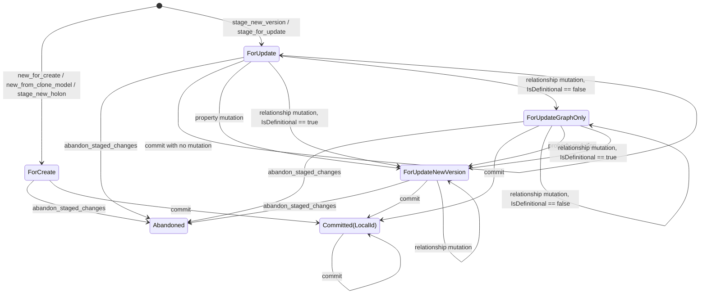

# Holons Shared Objects Layer Design Spec (v0.1)

## Status

Proposed

## Purpose

The Holons Shared Objects Layer defines the runtime object model that is shared
across MAP host, guest, command, dance, query, loader, and SDK-facing execution
surfaces. It is the home for in-memory holon lifecycle semantics, transaction
staging semantics, relationship mutation intent, and commit-facing runtime
contracts.

This spec is intentionally scoped to the shared runtime objects that determine
how holons move through transient, staged, saved, abandoned, and committed
states. It does not define persistence storage formats, descriptor schema
structure, command routing, or user-facing SDK ergonomics except where those
surfaces depend on shared object semantics.

## Layer Boundary

The Holons Shared Objects Layer owns:

- runtime holon variants such as `TransientHolon`, `StagedHolon`, and `SavedHolon`
- references to those runtime objects
- `HolonState`, `StagedState`, `SavedState`, and `ValidationState`
- `HolonCollection` and relationship map phase semantics
- nursery-held staged object state
- mutation-time classification of staged changes
- the commit-facing meaning of staged actions and relationship anchors

It does not own:

- Holochain entry or link storage mechanics
- descriptor schema definitions
- descriptor-owned semantic metadata such as `IsDefinitional`
- command, dance, query, or SDK-specific public API shape
- issue-specific implementation sequencing

Descriptors remain the semantic source of truth for relationship metadata. The
shared objects layer consumes descriptor metadata to classify runtime mutation
intent.

## Core Concepts

### HolonState

`HolonState` is an access-control state for a runtime holon object.

- `Mutable` means the object may accept write operations permitted by its phase.
- `Immutable` means the object may be read, cloned, committed where applicable,
  or abandoned where applicable, but may not accept ordinary writes.

`HolonState` is orthogonal to `StagedState`. A staged holon can be mutable while
it is being edited and immutable after it is committed or abandoned.

### ValidationState

`ValidationState` records whether the runtime holon has descriptor-backed
validation work outstanding or completed. It does not determine whether commit
creates a new holon node, updates an existing holon node, or performs graph-only
relationship persistence.

### StagedHolon

A `StagedHolon` is a transaction-scoped runtime object held by the Nursery. It
can represent:

- a new holon that has never been persisted
- an existing holon cloned for possible update
- an existing holon used only as a graph mutation context
- a version-producing update to an existing holon
- a completed or abandoned staged object

Staging an existing holon is not itself a persistence obligation. It is a
statement of intent and a place to collect possible mutation intent. Commit work
is created only when an accepted mutation changes the staged action.

## StagedState Contract

`StagedState` is the action state machine for staged holons. It is not merely a
flag that a holon is in the Nursery. It tells commit what kind of action, if
any, is required.

Canonical staged action states:

| State | Meaning |
| --- | --- |
| `ForCreate` | A new holon will create a new persisted holon node during commit. |
| `ForUpdate` | An existing holon has been staged for possible update, but no commit-relevant mutation has occurred. |
| `ForUpdateGraphOnly` | An existing holon has only non-definitional relationship mutations. Commit performs graph writes without creating a new holon node version. |
| `ForUpdateNewVersion` | An existing holon has a version-producing mutation. Commit creates a new persisted holon node version. |
| `Committed(LocalId)` | Commit has completed for this staged holon and resolved the local relationship anchor. |
| `Abandoned` | The staged holon has been intentionally abandoned and will not be committed. |

If an implementation currently exposes a legacy `ForUpdateChanged` name, that
name denotes the same semantic role as `ForUpdateNewVersion`: an existing holon
has been changed in a way that requires a new persisted version. Runtime
contracts should converge on the semantic state names above.

## Mutation Triggers

State transitions should be labeled and implemented by trigger, not by effect.
The target state expresses the effect.

### Property Mutation

A property mutation means any accepted operation that adds, changes, or removes
a property value on an existing staged holon.

Property mutations are always version-producing for existing holons.

### Relationship Mutation

A relationship mutation means any accepted operation that adds or removes a
relationship occurrence on an existing staged holon.

Relationship mutations must be classified by the relationship descriptor's
schema-backed `IsDefinitional` value:

- `IsDefinitional == true` means the relationship mutation is version-producing.
- `IsDefinitional == false` means the relationship mutation is graph-only.

Mutation APIs must resolve the relevant relationship descriptor before accepting
a relationship mutation that affects staged action. If the descriptor cannot be
resolved, or if `IsDefinitional` cannot be read, the mutation must fail loudly.
The shared objects layer must not silently default either to graph-only or to
version-producing behavior.

For `ForCreate`, `IsDefinitional` does not decide whether a node is created. A
new holon creates a new node by construction. Descriptor metadata may still
matter for validation and relationship legality.

## StagedHolon State Machine

## Transition Semantics

### ForCreate

`ForCreate` is entered when a new staged holon is created from a transient holon
or clone model whose result is intended to be a new holon rather than an update
to an existing persisted holon.

Commit creates a new holon node and resolves `Committed(LocalId)` to the new
node's local id.

### ForUpdate

`ForUpdate` is entered when a caller stages an existing holon for possible
update. This usually requires cloning the previous version into a transaction
editing context.

`ForUpdate` is only a statement of intent. If the caller does not make a
property mutation or relationship mutation, there is nothing to persist. Commit
must perform no node write and no graph write for that staged holon.

### ForUpdateGraphOnly

`ForUpdateGraphOnly` is entered when an existing staged holon receives at least
one relationship mutation whose descriptor has `IsDefinitional == false`, and no
version-producing mutation has occurred.

Commit must not create a new holon node version for this state. It must persist
only the relevant graph relationship changes and resolve `Committed(LocalId)` to
the existing source holon's local id.

### ForUpdateNewVersion

`ForUpdateNewVersion` is entered when an existing staged holon receives either:

- a property mutation
- a relationship mutation whose descriptor has `IsDefinitional == true`

Commit creates a new persisted holon node version and resolves
`Committed(LocalId)` to the new version's local id.

Once an existing staged holon reaches `ForUpdateNewVersion`, later
non-definitional relationship mutations must not downgrade it to
`ForUpdateGraphOnly`. Definitional mutations dominate graph-only mutations.

### Committed(LocalId)

`Committed(LocalId)` records that commit has completed the staged action and
resolved the source local id to use for relationship persistence.

The `LocalId` means:

| Source state before commit | `Committed(LocalId)` value |
| --- | --- |
| `ForCreate` | the new holon node id |
| `ForUpdateGraphOnly` | the existing/original holon node id |
| `ForUpdateNewVersion` | the new holon node version id |

Because `Committed(LocalId)` is the relationship anchor result, all relationship
persistence paths must consume a single resolved anchor rather than duplicating
source-selection logic.

### Abandoned

`Abandoned` is terminal for ordinary mutation. Commit skips abandoned staged
holons. Abandoning a staged holon makes it immutable.

## Relationship Mutation and Baseline Content

A staged clone may contain baseline properties and baseline relationship content
copied from a previous version so the caller can inspect and edit the holon
inside the transaction.

Baseline content is not itself write intent.

For update states, relationship persistence must be based on accepted staged
relationship mutations, not merely on every relationship collection present in
the editing snapshot. Otherwise a no-op update or graph-only update could
accidentally duplicate existing relationship writes or create a new version
without an accepted version-producing trigger.

## Relationship Anchoring

Commit must expose exactly one resolved source `LocalId` for relationship
persistence for each staged holon that has relationship work to perform.

The anchoring rule is:

| Staged action | Node persistence | Relationship anchor |
| --- | --- | --- |
| `ForCreate` | create new node | new node `LocalId` |
| `ForUpdate` | none | none |
| `ForUpdateGraphOnly` | none | existing/original `LocalId` |
| `ForUpdateNewVersion` | create new version | new version `LocalId` |
| `Abandoned` | none | none |
| `Committed(LocalId)` | already resolved | contained `LocalId` |

Forward and inverse `SmartLink` persistence must use the same resolved
relationship anchor. Inverse persistence must not independently infer a source
from stale staged state.

## Invariants

- `ForUpdate` represents intent to update, not a persistence obligation.
- Property mutations on existing holons are always version-producing.
- Relationship mutations on existing holons are classified by descriptor-backed
  `IsDefinitional`.
- `IsDefinitional == true` relationship mutations are version-producing.
- `IsDefinitional == false` relationship mutations are graph-only unless the
  staged holon has already become version-producing.
- Version-producing mutations dominate graph-only mutations.
- A staged holon must never downgrade from `ForUpdateNewVersion` to
  `ForUpdateGraphOnly`.
- Descriptor lookup failure during relationship mutation classification is an
  explicit error.
- Commit source anchoring must be centralized and shared by all relationship
  persistence paths.
- Baseline relationships copied into a staged update context are not themselves
  relationship write intent.

## Related Specs

- [MAP Transaction Model](transaction-model-v1.1.md)
- [Descriptors Design Spec](descriptors/descriptors-design-spec.md)
- [Relationship Constraints Design Spec](descriptors/relationship-constraints-design-spec.md)
- [MAP Type Definition Semantics](type-system/type-definition-semantics.md)
