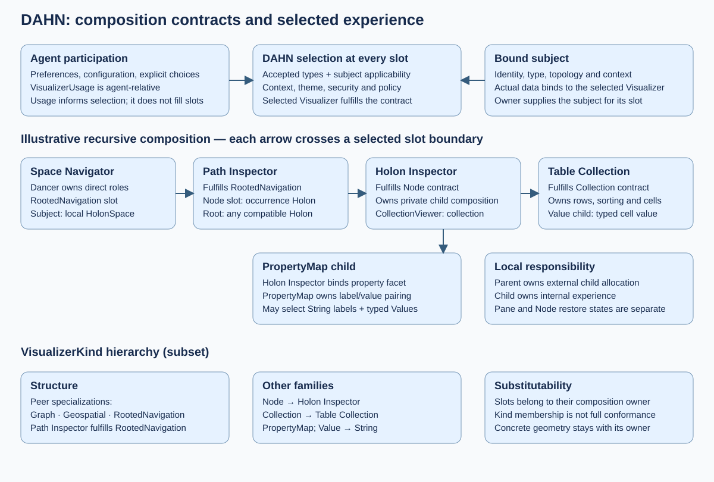
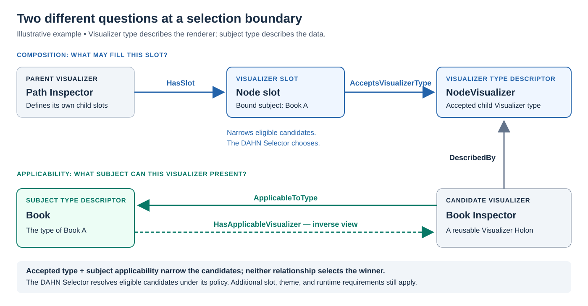
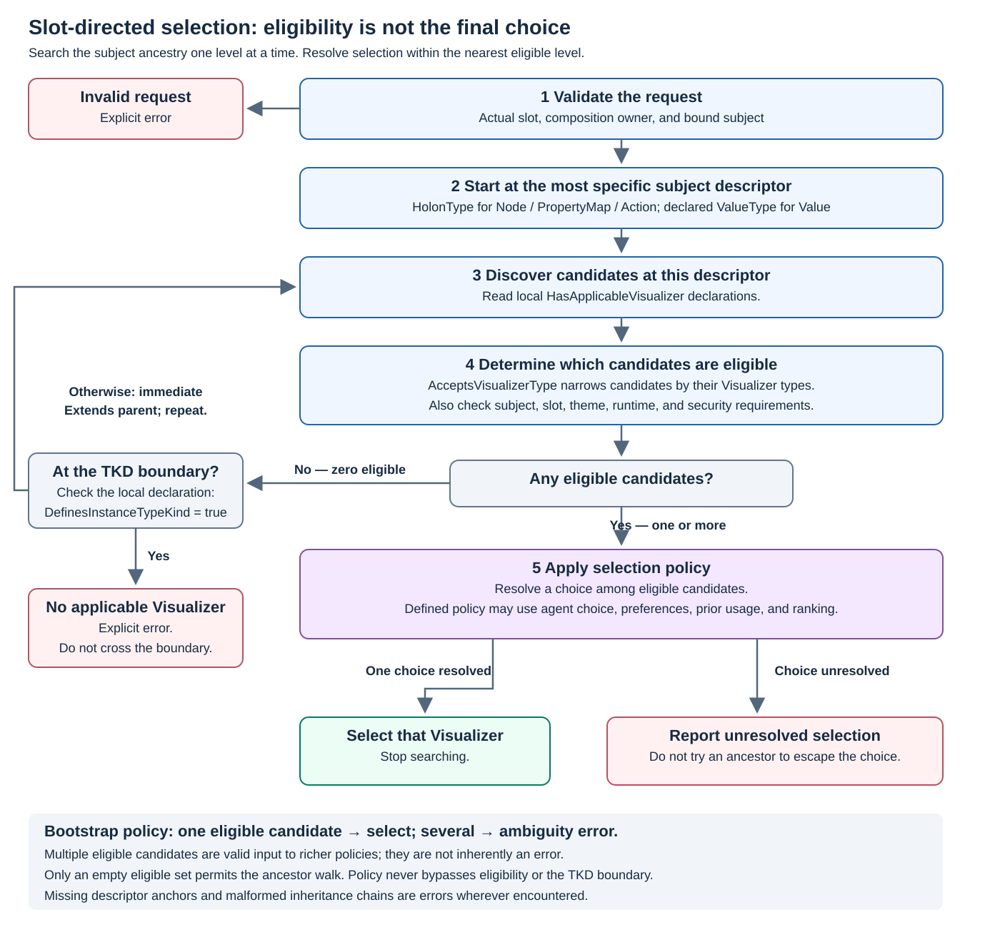

# DAHN Design Specification v2.4

## Status

Draft replacement for `dahn-phase-0-design-spec.md` v1.4.

This version re-baselines the DAHN design around the architecture that has emerged through the Space Navigator, Dancer, Visualizer Selection Service, self-describing Active Holon, and dynamic Visualizer work.

It supersedes the Phase-0-specific visualizer selection, canvas, affordance hierarchy, and dynamic-loading models in v1.4 while preserving still-valid MAP/DAHN boundary decisions.

## Change Log

### v2.4

- aligns owner-defined slots and agent-relative usage with the Design Concept;
- removes the intervening Property VisualizerKind and selection layer;
- delegates kind semantics to the family specifications;
- consolidates shared allocation, surface/view, state-survival, and selection contracts;
- distinguishes Visualizer Holon identity from executable artifact identity;
- scopes navigation-axis invariants to Path Inspector.

### v2.3

- makes child selection slot-directed, using the specific slot's `AcceptsVisualizerType` targets;
- bounds nearest-applicable selection at the subject's nearest local TypeKind definer;
- distinguishes PropertyMapSlot/PropertyMapVisualizer from single-property PropertySlot/PropertyVisualizer;
- names the default property-map renderer DefaultPropertyMapVisualizer;
- makes AcceptsVisualizerType definitional.

### v2.2

- defines `VisualizerKind` by the invariant semantic shape of its subject,
  rather than by geometry, placement, or a current realization strategy;
- introduces `Structure` as the kind for multiple semantic subjects unified by
  an organizing topology, distinct from a homogeneous Collection;
- treats Rooted Navigation as a generic Structure Visualizer rooted at any
  Holon, with the current 2D grammar as one realization strategy;
- distinguishes Dancer experience composition from recursive Visualizer
  composition; and
- clarifies that Slots declare semantic roles and remain orthogonal to spatial
  realization and recursive allocation.

### v2.1

- replaces the singular DAHN Selector Function with the DAHN Visualizer
  Selection Service: a Rust-owned family of typed selectors sharing candidate,
  compatibility, preference, and explicit-error policy;
- establishes Human Agent Theme selection before Canvas selection;
- establishes Canvas selection as a launch outcome: a Theme-compatible Canvas
  Holon is selected from bootstrap-loaded candidates and exposed through a
  runtime `CanvasVisualizer` wrapper; and
- prohibits hard-coded Visualizer fallbacks. A selector returns an explicit
  no-applicable-candidate error when it cannot make a selection.

### v2.0

Major architectural re-baseline of the DAHN design specification.

This version supersedes the Phase-0-specific visualizer, selector, canvas, affordance, and dynamic-loading model in v1.4 while preserving the still-valid MAP/DAHN boundary decisions.

Key changes:

- moves final Visualizer selection authority fully into Rust;
- removes the prior split between Rust-side semantic recommendation and TypeScript-side final resolution;
- replaces selector output as a Canvas mount plan with recursive per-request Visualizer selection;
- introduces `VisualizerKind` as the DAHN-wide categorization used for discovery, selection, compatibility, stewardship, and eventual Commons organization;
- introduces `VisualizerSlot` as a Visualizer-local composition contract;
- distinguishes Visualizer kinds from local visualizer Slots;
- establishes recursive-but-centralized selection: Visualizers may create child visualization requests, but concrete child implementations are always selected by the DAHN Visualizer Selection Service;
- generalizes selector input beyond `Holon` subjects so Node, Collection, Property, Value, Action, Canvas, and future Visualizer kinds can participate in the same selection architecture;
- establishes self-describing Active Holons as the semantic input to Visualizers through effective Properties, Relationships, and Dances;
- removes the preconstructed DAHN-global `AffordanceNode[]` presentation model as the primary Active Holon abstraction;
- makes descriptor-to-presentation projection the responsibility of the selected Visualizer;
- renames the current Node presentation strategy from `HolonNodeVisualizer` to `HolonInspectorVisualizer`;
- defines the six current `HolonInspectorVisualizer` Slots:
    - `NodeTitleBarSlot`
    - `ActionBarSlot`
    - `VerticalRailSlot`
    - `PropertyMapSlot`
    - `CollectionTabsSlot`
    - `CollectionViewerSlot`
- defines the `HolonInspectorVisualizer` projection grammar:
    - scalar Properties -> Properties Viewer
    - `ValueArray` Properties -> Collection Tabs
    - singular Relationships -> Vertical Rail
    - plural Relationships -> Collection Tabs
    - singular navigational Dances -> Vertical Rail
    - plural navigational Dances -> Collection Tabs
    - other applicable Dances -> Action Bar
- establishes structural cardinality, rather than runtime result count, as the basis for singular versus plural navigation semantics;
- aligns singular and plural navigation with the Space Navigator Interaction Grammar:
    - singular navigation -> horizontal lineage
    - plural Holon navigation -> collection-mediated vertical lineage
- introduces Property visualization as a first-class selection boundary;
- establishes `PropertyMapVisualizer` selection separately from `ValueVisualizer` selection;
- introduces `ValueViewerSlot` as a typical child Slot of a Property Visualizer;
- makes `ValueType` a selector input rather than a direct renderer mapping;
- introduces Action visualization as a first-class selection boundary;
- allows each projected action/Dance affordance to select an `ActionVisualizer`;
- formalizes Collection visualization as a first-class Visualizer kind and selector boundary;
- replaces the prior minimal one-region scrolling Canvas model with a Dancer-hosting workspace model and a generic rooted-navigation projection model;
- clarifies the division between:
    - Canvas-owned cross-Dancer hosting and external allocation;
    - Dancer-owned experience-role composition;
    - Visualizer-owned internal semantic topology, composition, and layout;
- establishes that compression, overflow, scanning, maximization, and restore ordinarily preserve selected Visualizer identity rather than trigger reselection;
- preserves parent-owned external allocation and child-owned internal composition;
- incorporates the dynamic Visualizer artifact architecture:
    - content-addressed executable identity;
    - separation of artifact stewardship from artifact transport;
    - Rust-side implementation resolution;
    - Rust-side digest/signature verification;
    - immutable local caching;
    - DAHN-controlled module materialization;
    - TypeScript-side instantiation only after authorization;
- removes browser URL/origin as the conceptual identity of a Visualizer implementation;
- aligns Visualizer executable artifacts with the broader MAP executable-artifact model also used for dynamic Dance WASM;
- distinguishes executable provenance from runtime safety;
- introduces the Visualizer Runtime Protocol as both an interoperability contract and a future capability/security boundary;
- preserves Web Components and dynamic import as possible implementation mechanisms without making them the architectural source of Visualizer identity or authority;
- preserves the public MAP SDK as the sole TypeScript-facing MAP boundary;
- preserves Rust as the authoritative holder of Holon/model semantic state;
- preserves reference-centered TypeScript access and avoids establishing a second authoritative TypeScript Holon model;
- preserves Rust-side effective descriptor flattening rather than TypeScript-side inheritance reconstruction;
- adds explicit architectural invariants covering Selector authority, Slots, recursive composition, navigation shape, artifact identity, verification, and bootstrap-selection behavior;
- treats deterministic bootstrap selection as ordinary policy rather than permanent one-Visualizer-per-kind mappings;
- adds explicit near-term design priorities for Selector requests, Slots, Dance semantics, Property/Value/Action visualization, dynamic artifact loading, and the Visualizer Runtime Protocol.

### v1.4

- aligned Phase 0 with the TypeScript MAP SDK implementation spec v1.3;
- recorded `BoundHolonCollection` as an abandoned design branch and removed it from the DAHN-facing target posture;
- treated public plural holon-backed traversal and relationship results as `HolonCollection`;
- treated query/navigation-like DAHN behavior as descriptor-afforded Dances invoked through the public SDK rather than through a command-owned query envelope;
- treated new-world Dance results as response-holon handles rather than standalone `DanceOutcome` objects;
- clarified that DAHN or other above-SDK caller layers own `RequestOptions` decisions such as `snapshot_after`, `gesture_id`, and `gesture_label`.

### v1.3

- captured an intermediate bound-first Dance/query contract posture;
- superseded by v1.4 for current `HolonCollection`, Dance-response, and query/navigation guidance.

---

# 1. Purpose

DAHN is the experiential layer through which people inspect, navigate, act upon, and eventually edit the self-describing active holons of the MAP.

This specification defines the DAHN runtime architecture required to support:

- self-describing Active Holons;
- Visualizers as open-ended, dynamically selectable presentation implementations;
- recursive Visualizer composition through Slots;
- Dancer composition of experience roles;
- centralized visualizer selection through the DAHN Visualizer Selection Service;
- descriptor-driven projection of Properties, Relationships, and Dances;
- Space Navigator topology and allocation semantics;
- dynamic loading of Visualizer implementation artifacts;
- the public MAP SDK as the sole TypeScript-facing MAP boundary;
- Rust as the authoritative holder of MAP semantic state and DAHN selection state.

The specification intentionally separates:

- semantic description from presentation;
- Visualizer composition from Visualizer selection;
- Visualizer selection from implementation loading;
- navigation topology from Visualizer layout;
- Dancer experience composition from visualizer composition;
- executable artifact identity from artifact transport;
- artifact provenance from runtime authority.

---

# 2. Relationship to Adjacent Specifications

[DAHN Architecture](dahn-arch.md) assigns subsystem responsibility and the
MAP/Rust versus TypeScript state boundary. This specification defines reusable
composition and runtime mechanisms through which those responsibilities are
realized. [Kind specifications](visualizers/index.md) define semantic subject
families; owner-defined slot contracts supply local participation requirements.

The [Space Navigator grammar](../space-navigator/space-navigator-interaction-grammar.md)
defines Dancer-level composition and interactions. The
[Path Inspector grammar](visualizers/structure/rooted-navigation/path-inspector/interaction-grammar.md) owns that
Visualizer's topology, lineage, grid, focus, and compression productions.
Concrete Node and Collection behavior belongs to its selected Visualizer.

Examples of a recursive hierarchy are illustrative, not a required composition.
Implementation plans sequence the design and do not create another authority.

---

# 3. Core Architectural Principles

## 3.1 MAP semantics remain authoritative

DAHN does not create a second semantic model of MAP data.

Authoritative Holon state, descriptors, relationships, Dances, transaction state, and other MAP semantics remain in Rust/MAP runtime layers.

TypeScript operates primarily through reference-backed public SDK objects and small derived presentation state.

---

## 3.2 Holons describe affordances, not UI

An Active Holon exposes what it is and what it affords through effective descriptors.

At minimum, DAHN must be able to discover:

    PropertyMap
    Relationships
    Dances

Those semantic affordances do not prescribe how they are rendered.

The selected Visualizer determines how those affordances are projected into presentation.

---

## 3.3 Visualizers define presentation grammar

A Visualizer defines:

- its internal layout;
- its Slots;
- how semantic affordances populate those Slots;
- what child visualization requests it creates;
- how it realizes itself within the allocation assigned by its parent.

Different Visualizers may project the same Active Holon differently.

---

## 3.4 Visualizer selection is centralized

Concrete Visualizer implementations are selected exclusively through the
DAHN Visualizer Selection Service.

A Visualizer may request another Visualizer for one of its Slots, but it must not directly choose that child implementation.

Therefore:

> Selection is recursive and compositional, but centralized.

---

## 3.5 Visualizer composition and selection are separate

A composition owner determines:

> This role binds this subject and requires this contract.

The Visualizer Selection Service determines:

> Which available, applicable Visualizer fulfills this slot contract?

A Slot expresses the first question.

The Visualizer Selection Service answers the second.

---

## 3.6 Navigation topology and Visualizer composition are separate

Canvas owns external allocation to a hosted Dancer experience. The Dancer
composes its experience roles, and its selected Rooted Navigation Visualizer
owns the interaction-derived navigation occurrence topology and its internal
realization within that allocation.

Compression, overflow, scanning, maximization, and other projection changes do not ordinarily cause Visualizer reselection.

---

# 4. Design Concept

DAHN realizes experiences through recursive, contract-based composition rather
than through a centrally prescribed presentation hierarchy.

> **DAHN specifies the grammar of composition. Visualizers specify the grammar
> of experience.**

This diagram is illustrative. Every slot is resolved through DAHN selection;
subject applicability, accepted types, context and policy jointly constrain that
selection. VisualizerUsage records agent-relative use/configuration, not slot
fulfillment or a running occurrence’s state. Exact holonic participation and
presentation-action representation remain open.

## 4.1 Experience Composition and Data Coupling

Dancers compose experiences. They determine which roles an experience requires
and couple those roles to the MAP subjects on which the experience operates.

For example, the Space Navigator Dancer establishes a rooted-navigation role
whose subject is the local `HolonSpace`. The selected Visualizer need not know
that it is participating in Space Navigator. It receives the subject and
context required by the slot it fulfills.

This distinction permits the same Visualizer to participate in many experiences
over different subjects. A Path Inspector, for example, may realize rooted
navigation over any compatible Holon; Space Navigator is responsible for
binding its rooted-navigation role specifically to the local `HolonSpace`.

## 4.2 VisualizerSlots as Composition Boundaries

A `VisualizerSlot` is a point of substitutability in the compositional
hierarchy.

A slot:

- identifies the visual role to be fulfilled;
- specifies the contract a Visualizer must fulfill;
- binds the subject or subjects to be visualized;
- carries applicable context, constraints, and configuration inputs; and
- establishes an interaction point with a DAHN Selector Function.

The owner of a slot is authoritative over the requirements at that boundary,
but not over the internal experiential grammar of the Visualizer selected to
fulfill it.

Dancers may define VisualizerSlots for visual roles within an experience.
Visualizers may recursively define child VisualizerSlots required to realize
their own experiential grammar.

Consequently, composition is recursive:

    Dancer
        -> VisualizerSlot
            -> selected Visualizer
                -> VisualizerSlot
                    -> selected Visualizer
                        -> ...

Every slot is independently substitutable.

## 4.3 Contracts and Visualizer Fulfillment

Conceptually:

    Visualizer
        |
        | defines child
        v
    VisualizerSlot
        |
        | specifies
        v
    VisualizerSlot Contract
        ^
        | fulfills
        |
    Visualizer
        ^
        | used through
        |
    VisualizerUsage
        ^
        | belongs to
        |
    Agent

A Visualizer fulfills a VisualizerSlot contract. `VisualizerUsage` does not
fulfill the slot; it captures an agent's use and configuration of a Visualizer
that does.

A Visualizer can therefore simultaneously:

1. fulfill the contract of the parent slot into which it was selected; and
2. define child slots through which it recursively composes its own experience.

This recursive contract boundary distributes design authority throughout the
composition rather than concentrating it in DAHN or in a top-level Dancer.

## 4.4 Subjects and MAP Data

Visualizer selection is not independent of data.

A slot binds a semantic subject drawn from MAP. The subject's identity, type,
descriptor-derived affordances, and relevant topology form part of the
selection context. The selected Visualizer is subsequently bound to the actual
subject data it realizes.

The distinction between **subject type** and **subject data** is important:

- subject type and topology help determine which Visualizers are applicable;
- the subject itself supplies the MAP data the selected Visualizer realizes.

For Space Navigator, the top-level subject is the local `HolonSpace`. A
RootedNavigation Visualizer such as Path Inspector may be capable of operating
over many Holon types; Space Navigator supplies the particular root subject
that makes this instance a Space-navigation experience.

## 4.5 Selector Functions

Every VisualizerSlot establishes a selection boundary.

A DAHN Selector Function resolves that boundary by selecting an available
Visualizer that fulfills the slot contract and is applicable to the bound
subject and current context.

Selection may consider, among other inputs:

- the required VisualizerSlot contract;
- subject identity, type, and topology;
- available Visualizers and their declared applicability;
- agent preferences;
- prior VisualizerUsage;
- environment and form factor;
- theme and Meta-Design-System compatibility;
- security and execution constraints.

The Selector determines **which** Visualizer fulfills the role. The selected
Visualizer determines **how** the experience is realized behind that boundary.

## 4.6 Agent Agency and Personalization

Agents are active participants in DAHN composition rather than passive
recipients of Selector decisions.

An agent may:

- establish preferences that influence selection;
- configure a selected Visualizer through its `VisualizerUsage`;
- override a Selector choice and choose another conforming Visualizer;
- save configurations or presets; and
- provide usage history from which subsequent preferences may be derived.

`VisualizerUsage` records this agent-relative relationship with a Visualizer,
including selection, configuration, state, and outcomes as appropriate.

Prior usage may influence subsequent selection both for the individual agent
and, subject to applicable governance and privacy constraints, through
aggregate preferences derived across agents.

## 4.7 Recursive Composition and Distributed Design Authority

The selected Visualizer owns the experiential grammar behind the slot contract.

If that Visualizer requires additional visual roles, it defines child
VisualizerSlots. Each child slot becomes another point of substitutability and
another interaction point with DAHN selection.

For example:

    Space Navigator Dancer
        -> RootedNavigation VisualizerSlot
            subject = local HolonSpace
            -> Path Inspector
                -> Node VisualizerSlot
                    subject = selected Holon
                    -> Holon Node Visualizer
                        -> Collection VisualizerSlot
                            subject = related Holons
                            -> Collection Visualizer

The example is illustrative, not prescriptive. Space Navigator does not own
Path Inspector's internal composition, Path Inspector does not own the selected
Node Visualizer's internal composition, and DAHN does not prescribe any of
their experiential grammars.

This yields the central authority rule:

> **A composition owner specifies the contract, subject, and constraints at its
> slot boundary. The selected Visualizer owns the experiential realization
> behind that boundary.**

---

# 5. Public MAP SDK Boundary

DAHN consumes MAP exclusively through the public TypeScript MAP SDK.

DAHN must not depend on:

- command-wire types;
- IPC envelopes;
- internal request metadata;
- private SDK command builders;
- transport implementation details;
- transitional bridge payloads;
- legacy query envelopes.

DAHN may consume public:

- `MapClient`;
- `MapTransaction`;
- `HolonReference`;
- `HolonCollection`;
- descriptor handles;
- Dance invocation handles;
- Dance response handles;
- public request-option surfaces.

The public SDK remains the semantic boundary between DAHN TypeScript and MAP runtime functionality.

---

# 6. State Ownership

## 6.1 Rust-owned state

The [architecture state boundary](dahn-arch.md#7-map-state-versus-experience-state)
owns the semantic/experiential distinction. Rust is authoritative for MAP state,
selection, implementation resolution, and artifact verification. TypeScript
consumes reference-backed semantics through the public SDK.

## 6.2 TypeScript-owned state

[Experience state](dahn-arch.md#72-experience-state) includes occurrence identity,
selected tabs/rows, expansion, layout, focus/hover, viewport, temporary render
projections, DOM, and animation state. It is not an independent MAP object graph.
The shared [state-survival contract](#311-independent-state-and-experiential-authority)
separates visual operations from semantic disposal.

---

# 7. Active Holon Model

For DAHN purposes, an Active Holon is a Holon together with its effective semantic affordances.

Conceptually:

    ActiveHolon
        identity
        effective descriptor
            PropertyMap
            Relationships
            Dances

The effective descriptor must already reflect the MAP descriptor semantics required for DAHN consumption.

TypeScript must not reconstruct descriptor inheritance independently.

---

# 8. Descriptor Requirements for DAHN

DAHN depends upon sufficiently expressive effective descriptors.

## 8.1 Property Descriptor

A Property Descriptor must provide enough information to determine at minimum:

- Property identity;
- Property label/description where available;
- associated ValueType;
- structural value semantics;
- constraints required for presentation;
- whether its value is scalar or collection-shaped.

---

## 8.2 Relationship Descriptor

A Relationship Descriptor must provide enough information to determine:

- relationship identity;
- target Holon Type;
- minimum cardinality;
- maximum cardinality;
- declared versus inverse relationship semantics;
- other presentation-relevant relationship metadata.

Structural cardinality is semantic input; it does not prescribe a navigation axis.

Runtime result count must not change whether the affordance is treated as singular or plural.

---

## 8.3 Dance Descriptor

A Dance Descriptor must expose sufficient declarative semantics for a Visualizer to classify the Dance without:

- inspecting its implementation;
- relying on naming conventions;
- hard-coding knowledge of individual Dances.

At minimum, DAHN requires information sufficient to distinguish:

- navigational behavior;
- non-navigational actions such as commands and mutators.

It must also expose the structural shape of the Dance response.

Relevant dimensions may eventually include concepts such as:

    interaction intent
        navigation
        command
        edit
        create
        delete
        invoke
        ...

    effect semantics
        read-only
        mutating
        ...

    response shape
        none
        scalar
        0..1 Holon
        1 Holon
        0..* Holon
        1..* Holon
        structured result
        ...

These dimensions should remain declarative and should not dictate presentation.

---

# 9. Visualizer Model

## 9.1 AbstractVisualizer

`AbstractVisualizer` is the common semantic base for DAHN Visualizers.

A Visualizer is a first-class MAP Holon representing a semantic visualization
capability. Its executable implementation is a separate realization. See
[semantic identity](dahn-arch.md#92-semantic-identity-and-executable-realization).

An Abstract Visualizer may define zero or more Slots.

Conceptually:

    AbstractVisualizer
        Slots -> VisualizerSlot [0..*]

Visualizers are ultimately intended to be MAP-stewarded holons rather than permanently hard-coded application metadata.

---

# 10. VisualizerKind

`VisualizerKind` is a DAHN-wide classification.

It identifies the invariant semantic shape of the subject a Visualizer knows
how to realize. It is not defined by a visual arrangement, placement, current
geometry, or layout strategy.

The defining test is:

> What can a Visualizer of this kind assume about its subject without knowing
> the application-specific domain?

Initial kinds include:

    Canvas
    Node
    Collection
    Structure
    PropertyMap
    Value
    Action

Additional kinds may emerge as DAHN evolves.

The current kinds carry these core assumptions:

| Kind | Subject invariant |
| --- | --- |
| Canvas | A visual workspace/composition that owns top-level spatial resources. |
| Node | Exactly one Holon. |
| Collection | Multiple Holons or values sharing an effective element shape. |
| Structure | Multiple semantic subjects unified by an organizing semantic topology. |
| PropertyMap | The property facet exposed by one Holon's effective descriptor. |
| Value | Exactly one value governed by one value-type contract. |
| Action | One executable affordance together with required input and context. |

`Structure` is not an arbitrary heterogeneous bag of Holons. Its topology is
the semantic invariant that makes the multiple subjects one visual subject.
Graph, Rooted Navigation, and Geospatial visualizers are candidate Structure
specializations because each understands a different organizing topology.

`VisualizerKind` is expected eventually to participate in:

- Visualizer discovery;
- Visualizer Commons;
- stewardship;
- candidate filtering;
- compatibility constraints;
- Visualizer Selection Service policy.

`VisualizerKind` must not be confused with the internal Slots of a particular Visualizer.

For example:

    PropertyMapSlot

is not automatically a DAHN-wide VisualizerKind.

---

## 10.1 Kind authority and slot authority

The [family index](visualizers/index.md) links the authoritative kind contracts.
[Structure](visualizers/structure/kind-spec.md),
[RootedNavigation](visualizers/structure/rooted-navigation/kind-spec.md),
[Node](visualizers/node/kind-spec.md),
[Collection](visualizers/collection/kind-spec.md),
[PropertyMap](visualizers/property-map/kind-spec.md), and
[Value](visualizers/value/kind-spec.md) define subject semantics independently
of particular layouts. [String](visualizers/value/string/kind-spec.md)
specializes Value. Graph and Geospatial are Structure specializations alongside
RootedNavigation, not its parents.

A slot can constrain accepted Visualizer types and additional participation
requirements. Kind membership alone does not establish conformance to that
slot. PropertyDescriptor metadata remains meaningful, but Property is not a
separate VisualizerKind. New kind directories are created on demand only.

---

# 11. VisualizerSlot

A `VisualizerSlot` is a local composition and substitutability boundary defined
by a Dancer or Visualizer. It declares a semantic role, required contract,
subject binding, applicable context, and participation constraints. It is not
merely a region, layout coordinate, or a kind name.

The slot owner supplies the requirements at that boundary. The selected
Visualizer fulfills them and owns its internal realization, including any child
slots. The owner must not reach through the boundary to prescribe those internals.

The diagram uses an exact type match for clarity; selection also considers
accepted subtypes under the slot-directed policy. The two green arrows show
the same applicability relationship in opposite directions.

These relationships answer different questions:

- **`Visualizer —HasSlot→ VisualizerSlot`: “What child slots does this
  Visualizer define?”** A Visualizer uses this relationship to declare the
  sub-slots through which it composes its experience. It does not choose the
  concrete Visualizers that will fill them.
- **`VisualizerSlot —AcceptsVisualizerType→ Visualizer type descriptor`:
  “What types of Visualizer may fill this slot?”** The target describes the
  child Visualizer, not the data being visualized. For example, a Node slot
  may accept Visualizers described by `NodeVisualizer` or an accepted subtype.
  This relationship is **definitional**: the accepted types are part of what
  the slot requires, rather than a preference for a particular implementation. It
  narrows the candidates the DAHN Selector may choose from; it does not name
  the winner or select a concrete Visualizer. Multiple Visualizers can have
  accepted types and remain eligible for the same slot.
- **`Visualizer —ApplicableToType→ TypeDescriptor`: “What types of subject
  can this Visualizer present?”** The target describes the data subject. For
  example, a specialized Book Inspector might declare applicability to the
  `Book` type. This says nothing about which parent defines a slot or where
  that Visualizer will appear.
- **`TypeDescriptor —HasApplicableVisualizer→ Visualizer`: “Which
  Visualizers declare applicability to this subject type?”** This is the
  inverse view of `ApplicableToType`, not a separate compatibility rule. From
  the `Book` descriptor, it lets selection discover applicable candidates
  such as the Book Inspector.

The DAHN Selector brings these requirements together. `AcceptsVisualizerType`
filters candidates by their Visualizer type; subject applicability further
limits which candidates can present the bound subject. Neither relationship
chooses the winner. The Selector resolves the remaining candidates under its
selection policy, including applicable preferences and explicit agent choice.
If none qualifies, selection returns an explicit error; if several qualify and
no ranking or choice policy resolves them, it reports ambiguity rather than
choosing arbitrarily.

A candidate must therefore have a Visualizer type accepted by the slot **and**
be applicable to the bound subject under the selection policy. A Book Inspector could be applicable to a Book but
still be unsuitable for a slot that requires a Collection Visualizer. Conversely,
a Visualizer could have an accepted Node type but be applicable only to a
subject type other than Book. Other slot, theme, runtime, and policy requirements
still apply; these relationships alone do not guarantee selection.

Dancer-owned slots have the same conceptual authority; their exact schema
representation must preserve that ownership rather than inventing an implicit
parent Visualizer.

Every actual slot identifies its owner, accepted role/contract, bound subject,
and context. A selector request carries that specific slot; the selector does
not infer it by searching a parent's roles after choosing an implementation.
Shared participation and allocation mechanisms are defined in
[Parent-Owned Allocation](#30-parent-owned-allocation).

## 11.1 VisualizerUsage

`VisualizerUsage` captures an agent's use and configuration of a Visualizer,
including circumstance, state, selection history, and outcomes as applicable.
The selected Visualizer fulfills the slot contract; usage does not fulfill it.

Usage belongs in the agent's applicable context, such as an I-Space or We-Space,
so configuration and history do not mutate the shared Visualizer stewarded by
its provider or Commons. A usage may record the slot and selected Visualizer
for that circumstance without owning the slot or the Visualizer's private layout.

Conceptually:

    owner -> defines slot -> specifies contract and binds subject
    selected Visualizer -> fulfills contract
    agent -> VisualizerUsage -> uses/configures selected Visualizer

Persistent usage, runtime occurrence identity, and semantic Visualizer identity
are distinct. One shared Visualizer may participate in many usages and occurrences.

## 11.2 Dancer Roles and Visualizer Slots

A Dancer composes experience roles and binds their semantic subjects. It need
not itself be a Visualizer, and nonvisual roles need not be modeled as visual
slots. A Dancer may directly define VisualizerSlots for its visual roles.
Selected Visualizers recursively define their own child slots; these descendants
are not thereby direct Dancer roles.

Space Navigator's RootedNavigation role binds the local HolonSpace as its initial
subject. That binding is Dancer authority; the selected Visualizer's internal
navigation grammar is not.

---

# 12. Visualization Requests

The Visualizer Selection Service operates on typed visualization requests rather
than a simple category lookup.

Conceptually:

    VisualizerSelectionRequest
        subject
        requested_visualizer_kind
        slot / semantic role
        visualization context
        agent and preference / usage context
        selected Theme and its effective MetaDesignSystem
        applicable runtime constraints
        explicit conforming choice, when supplied

The exact implementation types may evolve.

The contract must support richer selection than:

    select_visualizer(category)

---

# 13. Visualization Subject

The subject of a visualization request varies by VisualizerKind.

Examples:

    Node
        -> Active Holon

    Collection
        -> Collection or plural affordance result

    PropertyMap
        -> set of Property Descriptors in the context of a bound Holon

    Value
        -> actual value + declared ValueType + applicable role/property context

    Action
        -> Dance Descriptor / active action affordance

    Canvas
        -> navigation or experiential context

    Structure
        -> multiple semantic subjects plus their organizing topology

The selector must therefore not assume that every visualization subject is simply a Holon.
Subject identity, type, descriptor-derived affordances, and relevant topology
inform applicability; the actual bound subject supplies the data realized after
selection. A descriptor used for candidate discovery is not a replacement for
that data binding.

---

# 14. DAHN Visualizer Selection Service

## 14.1 Responsibility

The DAHN Visualizer Selection Service is a Rust-owned family of selector
functions. Each function has a typed subject and result, but all share
candidate discovery, Theme/MDS compatibility, human and collective preference
policy, implementation eligibility, and explicit no-selection errors.

The Service does not construct executable UI. It selects a semantic Visualizer
Holon. Rust implementation resolution/materialization supplies its authorized
runtime realization; TypeScript caches, loads, and instantiates that result.

It may eventually consider:

- subject semantics;
- VisualizerKind;
- Slot role;
- Holon Type;
- Property semantics;
- ValueType;
- Dance semantics;
- current visualization context;
- the MetaDesignSystem established by the selected Theme;
- human-agent preferences;
- collective preferences;
- prior interaction usefulness;
- trusted stewardship;
- available Visualizers;
- runtime compatibility;
- device/context constraints.

## 14.2 Selector signatures

The following conceptual signatures define the initial Service surface. Exact
Rust and SDK types may evolve, but the ownership, input, and result boundaries
must be preserved. The conceptual signatures inherit the common agent, usage,
preference, and explicit-choice context of §12; omitted fields do not remove
those inputs from the contract.

    ThemeSelector.select(
        ThemeSelectionRequest {
            human_agent,
            active_holon_space,
            preference_context,
            runtime_context,
        },
    ) -> Result<SelectedTheme, ThemeSelectionError>

`SelectedTheme` is the Human Agent's selected compatible Theme. The Service
may present, rank, or validate candidates, but it does not silently substitute
a different Theme for an explicit Human Agent choice. The one-Theme bootstrap
case is deterministic only because the candidate set has one member.

    CanvasSelector.select(
        CanvasSelectionRequest {
            selected_theme,
            launch_context,
            active_holon_space,
            runtime_context,
        },
    ) -> Result<RuntimeCanvasVisualizer, CanvasSelectionError>

The initial Canvas Holon is loaded with bootstrap schema resources. The result
is a runtime `CanvasVisualizer` holonic wrapper bound to the selected Canvas
Holon. Canvas candidates must be compatible with the effective MDS established
by the selected Theme, including their declared token dependencies. The result
is not a Space Navigator Dancer.

    NodeVisualizerSelector.select(
        NodeVisualizerSelectionRequest {
            slot,
            subject_holon,
            dancer_context,
            parent_allocation,
            selected_theme,
            runtime_context,
        },
    ) -> Result<SelectedVisualizer, VisualizerSelectionError>

    CollectionVisualizerSelector.select(
        CollectionVisualizerSelectionRequest {
            slot,
            collection_subject,
            collection_context,
            parent_allocation,
            selected_theme,
            runtime_context,
        },
    ) -> Result<SelectedVisualizer, VisualizerSelectionError>

    PropertyMapVisualizerSelector.select(
        PropertyMapVisualizerSelectionRequest {
            slot,
            subject_holon,
            property_descriptors,
            parent_allocation,
            selected_theme,
            runtime_context,
        },
    ) -> Result<SelectedVisualizer, VisualizerSelectionError>

    ValueVisualizerSelector.select(
        ValueVisualizerSelectionRequest {
            slot,
            value,
            value_type,
            role_context,
            property_context, // optional for values not belonging to a property
            parent_allocation,
            selected_theme,
            runtime_context,
        },
    ) -> Result<SelectedVisualizer, VisualizerSelectionError>

    ActionVisualizerSelector.select(
        ActionVisualizerSelectionRequest {
            slot,
            action_affordance,
            subject_holon,
            parent_allocation,
            selected_theme,
            runtime_context,
        },
    ) -> Result<SelectedVisualizer, VisualizerSelectionError>

`SelectedVisualizer` identifies the selected Visualizer Holon; implementation
resolution/materialization identifies its authorized executable realization.
A result may also expose the selected type, applicable capability context,
alternative availability, and diagnostics without exposing the internal ranking
state. A registry key, filesystem path, or executable payload must not substitute
for the selected semantic identity. Every
selector returns an explicit error when no applicable candidate exists; no
selector, Dancer, application, or TypeScript runtime may apply a hard-coded
fallback.

---

### 14.2.1 Slot-directed descriptor selection

The Selector starts with two things: **the particular slot to fill** and
**the subject to present**. It looks first for a suitable Visualizer associated
with the subject's most specific type. Only if none qualifies does it look at
more general types, stopping at the subject family's defined boundary.

The loop follows the **subject type's ancestry**. Checking a candidate's
Visualizer type against the slot is a separate filter inside that loop.

**Identify the slot before looking for candidates.**

The request names the actual `VisualizerSlot`, not just a role such as “Node.”
Its `AcceptsVisualizerType` relationships say which Visualizer types are allowed.
They narrow the candidate set; they do not choose a concrete Visualizer.
A separate role-name lookup must not supply a competing list of accepted types.

The Selector also checks that the slot belongs to the stated composition owner.
For a Visualizer, `HasSlot` identifies its child slots; for a Dancer, its explicit
role ownership supplies that check. The Selector must not choose a Visualizer
first and then search the parent's slots for somewhere to put it.

**Search from the subject's most specific type toward more general types.**

At each level:

1. **Discover candidates.** Read the Visualizers declared applicable **at that
   descriptor**, through its local `HasApplicableVisualizer` relationships.
   Do not combine all ancestors' candidates into one list; where a candidate
   is declared matters.
2. **Determine eligibility.** Filter against `AcceptsVisualizerType`: a
   candidate's `DescribedBy` type must equal or extend an accepted type. Apply
   the remaining subject, slot, theme, runtime, and security requirements.
   This establishes who may be selected, not who wins.
3. **If no candidates are eligible, consider the parent descriptor.** Continue
   to the immediate `Extends` parent only if the TypeKind boundary has not
   been reached. This is the only route to a more general descriptor.
4. **Apply selection policy to the eligible candidates.** Resolve a choice
   using the defined policy, which may consider explicit agent choice,
   preferences, prior usage, and ranking. These inputs distinguish otherwise
   eligible candidates; they do not waive eligibility requirements.
5. **Return the policy outcome.** Select the one candidate the policy resolves.
   If it cannot resolve a choice, report an explicit unresolved-selection
   outcome. Do not choose by storage order or search an ancestor merely to
   escape an unresolved choice at this level.

**The bootstrap policy is deliberately limited:** it selects a sole eligible
candidate and reports an ambiguity error if several remain. Multiple eligible
candidates are not inherently an error in DAHN; a richer, defined selection
policy can resolve them. No ranking algorithm is implied by this specification.

For example, suppose a Node slot is presenting a Book. Two Book Inspectors may
both pass the slot and compatibility filters. A policy supporting an explicit
conforming agent choice can select one; the bootstrap policy instead reports
ambiguity. If neither Inspector is eligible, the Selector can try Book's
immediate parent type, subject to the boundary below.

**Stop at the subject's TypeKind definer.**

The search is bounded. Its final permitted level is the nearest descriptor in
the subject's ancestry that locally declares `DefinesInstanceTypeKind = true`.
This is the **TypeKind definer (TKD)**: the descriptor establishing that subject
family's TypeKind. It is not a VisualizerKind or a slot's accepted Visualizer type.

The Selector checks candidates at the TKD itself. If none qualifies there, it
returns an explicit no-applicable-visualizer error; it must not continue above
that boundary. A missing starting descriptor or an invalid inheritance chain
is also an error.

Supported subject families must declare their default candidates at the TKD or
on more specific descriptors within that boundary. A “default” is still an
ordinary candidate that must satisfy the slot and compatibility requirements.
It is not a hard-coded implementation used when selection fails.

**Use the descriptor appropriate to the subject.**

The starting descriptor depends on what is being presented:

| Request | Where descriptor selection starts |
| --- | --- |
| Node, PropertyMap, or Action | The bound owner Holon's HolonType. |
| Value | The bound value's declared ValueType. |

The request may carry a subject-category tag so the receiving code can obtain
the correct starting descriptor. That tag identifies the kind of input; it
does not replace the slot's accepted-type requirements.

A PropertyMap can therefore request a String Visualizer for a PropertyName label
and a separately typed Visualizer for the property's value. The
PropertyDescriptor supplies metadata, without introducing a Property selector.
Determining an array member's TypeKind is a separate lookup; it does not decide
where a concrete Visualizer places array properties.

This descriptor walk governs descriptor-based child selection. Canvas launch
and collection-subject selection retain their dedicated contracts.

## 14.3 Rust ownership

Visualizer selection belongs in Rust.

TypeScript must not independently resolve:

    HolonType -> NodeVisualizer

or:

    Properties -> PropertyMapVisualizer

or:

    ValueType -> ValueVisualizer

or:

    Dance -> ActionVisualizer

Before applying ordinary candidate policy, the Selector MUST exclude every
Visualizer whose declared DesignToken dependencies are not all defined by the
MetaDesignSystem established by the selected Theme. Selection consequently
creates the runtime binding between a visualization request and a compatible
Visualizer; neither a Dancer nor an application owns that binding.

TypeScript submits or triggers visualization requests and instantiates the implementation selected by Rust.

There must not be separate Rust and TypeScript selection authorities.

---

## 14.4 Initial deterministic bootstrap policy

Early implementation may deterministically select the sole compatible
currently bundled applicable Visualizer. Multiple candidates are an explicit
ambiguity until a ranking policy is defined, as specified in §14.2.1. It is ordinary candidate selection,
not a fallback or a separate exceptional mechanism.

For example:

    Node
        -> HolonInspectorVisualizer

    Collection
        -> TableVisualizer

If no applicable Visualizer exists, selection fails explicitly because the
visualization environment is incomplete.

The bootstrap policy must not be encoded as a permanent one-Visualizer-per-kind
ontology.

---

## 14.5 Recursive selection

An illustrative composition is:

    Active Holon -> Node slot -> selected Holon Inspector
        -> PropertyMap slot -> selected PropertyMap Visualizer
            -> label slot -> selected String Visualizer (PropertyName)
            -> value slot -> selected Value Visualizer (typed property value)

Each actual slot is independently resolved through the applicable service
function. This example does not prescribe the child hierarchy of every Node
or PropertyMap Visualizer. Requests need not cause one synchronous IPC round
trip each: batching or reuse of still-valid Rust-authorized resolutions are
execution strategies, not independent client-side selection authority.

## 14.6 Agent choice and selection policy

Agents may establish preferences, configure VisualizerUsage, choose another
conforming candidate, save presets, and contribute usage history. An explicit
choice is submitted to the Rust-owned selection authority and validated against
the same slot, subject, theme, runtime, and security requirements. It does not
authorize a parent or TypeScript client to bypass conformance or execution policy.

Personal ordering and Visualizer preferences, prior usage, governed aggregate
salience/preferences, trend, maturity, release stability, novelty, and an
explore/exploit policy may inform selection. Exploration or controlled randomness
belongs to an explicitly defined future policy; it does not override the initial
ambiguity error. Geometry capability may inform participation but does not make
transient pixel allocation a renderer lookup table.

Persistent adaptive interpretation belongs to Rust as described in
[architecture adaptation](dahn-arch.md#19-personal-and-collective-adaptation).
Immediate presentation adjustments remain local to the authorized owner.

---

# 15. Visualizer Composition

A selected Visualizer determines its internal composition.

Its responsibilities include:

- defining Slots;
- assigning internal geometry;
- determining which semantic affordances populate each Slot;
- creating child visualization requests;
- responding to parent allocation changes.

The parent Visualizer determines its visual composition and allocates its
received spatial budget among the roles it realizes.

The Visualizer Selection Service selects the child semantic Visualizer;
Rust implementation resolution supplies its authorized executable realization.

A visualizer is therefore both a part, receiving an external allocation from
its enclosing visual context, and a whole, allocating that budget among its own
fulfilled visual roles. Persisted layout is separate future semantic data when a
person's arrangement itself becomes meaningful.

---

# 16. HolonInspectorVisualizer

The [Holon Inspector specification](visualizers/node/holon-inspector/design-spec.md#purpose-and-authority)
owns this concrete behavior. It does not constrain other Node Visualizers or
establish a universal DAHN presentation grammar.

---

# 17. HolonInspectorVisualizer Slots

The [Holon Inspector specification](visualizers/node/holon-inspector/design-spec.md#direct-child-roles-and-subject-bindings)
owns this concrete behavior. It does not constrain other Node Visualizers or
establish a universal DAHN presentation grammar.

---

# 18. HolonInspectorVisualizer Descriptor Projection

The [Holon Inspector specification](visualizers/node/holon-inspector/design-spec.md#effective-descriptor-projection)
owns this concrete behavior. It does not constrain other Node Visualizers or
establish a universal DAHN presentation grammar.

---

# 19. Structural Cardinality Invariant

These axis-specific rules belong to [Path Inspector](visualizers/structure/rooted-navigation/path-inspector/design-spec.md#structural-cardinality-and-traversal).
DAHN supplies semantic cardinality and composition mechanisms without imposing
a universal navigation axis. The Holon Inspector realization owns its affordance
placement; the selected RootedNavigation Visualizer owns the navigation effect.

---

# 20. PropertyMapSlot

A Holon Inspector PropertyMapSlot binds its owner Holon's property facet. Its
selector uses that Holon's type and effective descriptors; the child realizes
the actual bound data. The [PropertyMap kind](visualizers/property-map/kind-spec.md)
defines the set-level semantic boundary. Concrete child layout belongs to the
selected PropertyMap Visualizer.

---

# 21. PropertyMapVisualizer

[PropertyMap](visualizers/property-map/kind-spec.md) owns set-level presentation.
`DefaultPropertyMapVisualizer.PropertyMapVisualizer` names the current default
candidate; default applicability is ordinary selection policy, not a fixed
layout, column count, or hard-coded fallback.

---

# 22. Property Label and Value Slots

A PropertyMap Visualizer may compose a String label for PropertyName alongside
a ValueType-specific value Visualizer. These are separate bindings and selection
boundaries, described by the [PropertyMap kind](visualizers/property-map/kind-spec.md).
The PropertyMap owns pairing, layout, label placement, and applicable typography
constraints. The children own their rendering and permitted interaction.

PropertyDescriptor metadata remains selection/binding context. There is no
intervening Property VisualizerKind or Property selector. A property row may
remain an internal layout construct; its name/value pairing alone does not
require a separately selected renderer.

---

# 23. ValueVisualizer

The [Value kind](visualizers/value/kind-spec.md) defines value visualization;
[String](visualizers/value/string/kind-spec.md) is a specialization. ValueType,
actual value, role, optional PropertyDescriptor and Holon context, view/edit
mode, and agent preferences inform selection. They do not dictate one renderer.

For example, a publicationDate value can be bound to an appropriate temporal
Value Visualizer through its PropertyMap owner's value slot. Its PropertyName
label is a different String subject and does not become editable merely because
its renderer also supports editing string values.

---

# 24. Action Bar and ActionVisualizer

The [Holon Inspector specification](visualizers/node/holon-inspector/design-spec.md#action-child-selection)
owns this concrete behavior. It does not constrain other Node Visualizers or
establish a universal DAHN presentation grammar.

---

# 25. Collection Tabs

The [Holon Inspector specification](visualizers/node/holon-inspector/design-spec.md#collection-child-activation-and-allocation)
owns this concrete behavior. It does not constrain other Node Visualizers or
establish a universal DAHN presentation grammar.

---

# 26. Collection Viewer

The [Holon Inspector specification](visualizers/node/holon-inspector/design-spec.md#collection-child-activation-and-allocation)
owns this concrete behavior. It does not constrain other Node Visualizers or
establish a universal DAHN presentation grammar.

---

# 27. Collection and Structure Visualizers

The [Collection kind](visualizers/collection/kind-spec.md) owns homogeneous
Holon or value collections. The [Structure kind](visualizers/structure/kind-spec.md)
owns subjects unified by semantic topology. Rendering something as a graph,
table, or map does not alone establish its semantic kind.

## 27.1 Rooted Navigation Visualizer

[RootedNavigation](visualizers/structure/rooted-navigation/kind-spec.md) is a
Structure specialization alongside Graph and Geospatial. The kind contract is
independent of HolonSpace; [Path Inspector](visualizers/structure/rooted-navigation/path-inspector/design-spec.md)
is one concrete realization with its own grammar.

---

# 28. Node Navigation Semantics

These axis-specific rules belong to [Path Inspector](visualizers/structure/rooted-navigation/path-inspector/design-spec.md#applying-the-interaction-grammar).
DAHN supplies semantic cardinality and composition mechanisms without imposing
a universal navigation axis. The Holon Inspector realization owns its affordance
placement; the selected RootedNavigation Visualizer owns the navigation effect.

---

# 29. Canvas, Dancer, and Rooted-Navigation Responsibilities

## 29.1 DAHN Composition Authorities

The conceptual experience stack is:

    DAHN Experience
        -> Window Manager
        -> Window / Viewport (top-level experiential context)
        -> Canvas
        -> Composition / Navigation Surface
        -> Visualizer Occurrences
        -> Visualizer Slots
        -> Child Visualizers

These are authority and contract boundaries, not a requirement for one UI component per level. A Dancer composes experience roles hosted within this stack; selected visualizers may recursively own composition surfaces.

The **Window Manager** owns top-level experiential-context creation/destruction, finite display allocation, context placement and switching, and maximize/restore/minimize where supported. A conventional window is only one realization: tabs, tiles, single-context switching, multiple displays, spatial volumes, rooms, or immersive contexts MAY implement the same authority. It grants each Canvas a bounded viewport/allocation.

A **Canvas** owns composition inside its granted context: hosted-role placement, child allocations, composition-surface extent, view transformation, focus projection, and recovery of off-viewport content. It MUST NOT assume ownership of the whole DAHN display. Expansion beyond its grant is a request to the Window Manager. A selected RootedNavigation visualizer may own a nested navigation surface and its layout/view operations; Canvas authority does not permit reaching through that boundary to manipulate its geometry.

## 29.2 Surface, Layout, and View

The spatial model is:

    Navigation Topology
        -> Navigation Layout
        -> Navigation Surface
        <-> View Transform
        -> Viewport
        -> Human-visible projection

A **Composition Surface** contains a spatial realization; a **Navigation Surface** is its rooted-navigation specialization. A **Viewport** is the finite view onto that potentially larger surface. Layout determines placement and allocation. The **View Transform** determines view position and scale. Panning/scrolling and zooming MUST NOT inherently recompute layout or change allocation, compression, or topology.

**A Visualizer at 50% zoom is not a compressed Visualizer.** Compression reduces allocation and may invoke a different responsive realization; zoom preserves layout and allocation. Surface growth beyond the viewport is permitted. An uncompressed Visualizer MAY declare or negotiate its minimum useful extent. As an illustration, the Path Inspector application of this contract protects an open Holon Inspector from being forced below that extent solely by viewport exhaustion ([Path Inspector §4.6](visualizers/structure/rooted-navigation/path-inspector/interaction-grammar.md#46-minimum-useful-extent-and-surface-growth)). Exact dimensions remain presentation decisions.

Canvas-level `zoom-to-fit` changes only view scale and, as needed, position to fit the relevant surface extent. It MUST preserve topology, occurrence budgets, compression, and layout geometry. `focus/actual-size` returns to the normal useful scale and centers the active/open occurrence; other occurrences may then be off-viewport and reachable by pan or Zoom to Fit. For nested surfaces these requests are handled by the composition owner of that surface.

---

# 30. Parent-Owned Allocation

Every composition host owns external allocation and placement of its immediate children and grants a budget/context through a slot. Children own internal realization, MAY report minimum/preferred extents and supported presentations, and MUST respect their granted allocation.

Three operations have distinct authority:

| Operation | Authority and effect |
| --- | --- |
| `maximize-region(occurrence, region)` / local restore | The Visualizer redistributes only its existing allocation among internal regions; restore returns its prior local composition. |
| Canvas focus / occurrence maximize | The composition host gives an occurrence dominant attention in its viewport, preserving surrounding topology; any allocation change is explicit and distinct from a view-only focus/actual-size operation. |
| Window/context maximize / restore | The Window Manager changes the context's share of the DAHN display where supported. |

A participant MAY redistribute resources it owns; expansion beyond that boundary MUST be requested from its parent authority. Requests may propagate through hosts without bypassing them. Local maximization MUST NOT silently become global maximization or topology removal.

## Independent restoration and request outcomes

Each authority MUST retain its own restore information: the Visualizer owns
local region composition; Canvas and hosted composition owners own their
attention projection and view; the Context Host / Window Manager owns the prior
host grant. Sequential operations at different levels MUST retain independent
restore state rather than one global restore snapshot.

Local maximize/restore MUST preserve occurrence identity and mounted child
state. Restore recovers the prior internal arrangement within the **current**
parent grant; it MUST NOT reinstate a stale larger allocation. Local maximize
invokes neither Canvas attention nor context maximize.

Canvas attention MUST preserve retained branches, occurrence identities, and
semantic state, and remain within its finite grant even when that grant covers
only part of the display. Prior active-occurrence, view-transform, and any
Canvas-owned temporary projection state MUST remain recoverable. Allocation
changes, if any, MUST be explicit. Requests affecting a nested surface pass
through its owning composition contract; Canvas does not edit that owner's
private geometry. Attention does not implicitly maximize the context.

Context maximize/restore uses an explicit parent request. A granted request
revises the finite allocation delivered to Canvas; the host does not directly
edit descendant composition, topology, or semantic state. Unsupported or refused
requests preserve the last valid grant, usable presentation, and local restore
information. They MUST NOT trigger speculative layout or silently substitute a
different operation. Requests crossing authority boundaries return explicit
results and never bypass an intermediate owner.

View-only focus/actual-size is separate from allocation-changing restoration:
it centers the active/open occurrence through position and scale, with actual
size using scale `1.0`. It MUST NOT inherently recompute navigation layout or
compression, change occurrence allocation/topology, or invoke context maximize.
All these presentation operations preserve semantic and staged state; none
implies mutation, commit, abandon, or revert.

## 30.1 Layout Budgets and Participation

A Visualizer Slot is an experiential participation contract, not merely a structural placeholder or a HolonType match. Its requirements can combine semantic role, required capabilities, supplied experiential context, allocation, and interaction obligations. Independently authored Visualizers from federated Commons must satisfy the slot/context in which they participate.

Possible contract dimensions include budget responsiveness, minimum/preferred or intrinsic sizing, compact and focus capabilities, inherited theme/design tokens, accessibility, input conventions, and state-survival obligations. This list is illustrative, not a finalized schema. Semantic capability requirements and subsequent real-estate negotiation remain distinct from selecting a Visualizer by transient pixel dimensions. The contract MUST leave room for future formalization without prescribing child internals.

A conceptual allocation budget may include width, height, minimum/maximum
bounds, orientation, density, and overflow constraints. Visualizers may declare
minimum useful and preferred extents, preferred aspect ratio, supported density,
compact/compression/scrolling capabilities, and alternate action presentation.
These are possible participation dimensions, not a finalized universal schema.
The parent uses applicable capabilities to allocate; the child determines its
internal responsive composition. Kind and semantic eligibility remain distinct
from transient pixel allocation. These responsibilities recur at every level.

---

# 31. Compression and Visualizer Identity

The selected Visualizer identity survives:

- partial compression;
- full compression;
- scanning;
- overflow;
- maximization;
- restore.

The Visualizer Selection Service should not ordinarily select separate Visualizers such as:

    FullNodeVisualizer
    RailOnlyNodeVisualizer
    CollectionsOnlyNodeVisualizer
    CompressedNodeVisualizer

for projection-state changes.

Instead:

    HolonInspectorVisualizer
        +
    current allocation
        ->
    appropriate internal realization

Another Node Visualizer may realize the same allocation states differently.

## 31.1 Independent State and Experiential Authority

Topology, layout/allocation, and view are independent state dimensions. Inspect/traverse/branch/close affect topology; placement, compression, minimum and surface extents affect layout; pan, zoom, viewport and attention affect view. A semantic interaction may explicitly coordinate dimensions, but they MUST NOT be collapsed into one enumerated state machine.

Compression, focus, local maximization, off-viewport placement, or zoom MUST NOT implicitly discard occurrence/navigation state or semantic/staged state. Closing an occurrence follows its owner's interaction grammar; it does not dispose of externally owned Nursery/transaction state. Context destruction likewise is not implicit transaction abandonment; any semantic disposal follows its owner's explicit contract.

These boundaries preserve experiential sovereignty: no Visualizer seizes global space, no Canvas commandeers its Window Manager, and inherited experiential policies remain under person/context control. **Standardize the seams, not the implementations.** This is not a universal visual design system. Infinite 2D, grid, tiling, radial, focus+context, timeline, 3D, and immersive Canvases and alternative Window Managers remain valid if they preserve these obligations.

---

# 32. HolonInspectorVisualizer Extent Realization

The [Holon Inspector specification](visualizers/node/holon-inspector/design-spec.md#responsive-realization-under-path-inspector)
owns this concrete behavior. It does not constrain other Node Visualizers or
establish a universal DAHN presentation grammar.

---

# 33. Visualizer Runtime Contract

A dynamically instantiated Visualizer requires a stable DAHN runtime contract.

The exact TypeScript API may evolve, but it should provide only the capabilities required by the Visualizer.

Possible capabilities include:

    read descriptor
    read value
    traverse relationship
    invoke Dance
    request navigation
    stage edit
    request child visualization
    report interaction
    request local layout change

The runtime protocol should avoid exposing unrestricted host capabilities.
Client execution responsibilities include cache lookup, module loading,
protocol compatibility checks, and execution isolation. Failure to load an
authorized realization is reported explicitly; the runtime does not substitute
another Visualizer or implementation.

---

# 34. Visualizer Runtime Security Boundary

Artifact provenance establishes what code is executing.

It does not establish that the code is safe.

Therefore contributed Visualizers should eventually execute through constrained DAHN capabilities rather than automatically receiving unrestricted access to:

- filesystem;
- shell;
- arbitrary networking;
- arbitrary Tauri commands;
- conductor internals;
- unrestricted MAP APIs.

Trust and compatibility concerns include provenance, signing/code integrity,
version compatibility, sandboxing and runtime permissions, dependency isolation,
and controlled acquisition. Semantic applicability alone does not establish
runtime executability. Bootstrap limitations do not waive the verification or
execution-authorization boundary.

The Visualizer Runtime Protocol is therefore both:

- an interoperability contract;
- an execution-authority boundary.

---

# 35. Visualizer Definition and Stewardship

Visualizer definitions should be treated as semantic MAP resources rather than permanently as compile-time TypeScript objects.

A Visualizer definition may eventually include:

    identity
    version
    VisualizerKind
    Slots
    applicability
    Visualizer protocol version
    implementation artifact
    steward
    signatures
    compatibility metadata

Early implementations may bootstrap these definitions locally.

That bootstrap representation must not become the permanent architecture.

---

# 36. Visualizer Commons

Visualizers are expected eventually to be stewarded in federated Commons.

Commons can provide:

- independently contributed MetaDesignSystems and Themes;
- Theme availability for Human Agent selection in applicable HolonSpaces;
- Visualizer discovery;
- descriptions;
- versions;
- VisualizerKind;
- applicability;
- stewardship;
- provenance;
- endorsements;
- implementation metadata;
- artifact locations.

The Visualizer Selection Service may use such information when choosing among candidate
Visualizers. A Commons-provided Theme establishes the effective MDS whose
guaranteed DesignToken set constrains that selection; neither contribution is
owned by an application or Dancer.

---

# 37. Visualizer Implementation Artifacts

A Visualizer implementation should be treated as an immutable executable artifact.

Its executable artifact identity should be content-based, not URL-based.
The Visualizer Holon retains its distinct MAP identity across implementations
and artifact revisions; digest identity is not semantic Visualizer identity.

Conceptually:

    Visualizer
        implementation
            artifact digest
            artifact format
            entry point
            protocol version
            signer
            signature
            artifact locations

A URL answers:

> Where might these bytes currently be obtained?

It does not answer:

> What executable artifact is this?

---

# 38. Content-Addressed Identity

Visualizer implementation artifacts should be identified by digest.

For example:

    SHA-256 = abc123...

Any source returning bytes matching that digest has supplied the same immutable artifact.

Changing the executable produces a new artifact identity.

This allows:

- deterministic caching;
- mirroring;
- distributed acquisition;
- offline reuse;
- transport independence.

---

# 39. Distribution Does Not Imply Authority

Artifact stewardship and artifact transport are separate concerns.

A Visualizer artifact may be available from:

- local cache;
- MAP artifact provider;
- steward-hosted service;
- mirror;
- HTTPS;
- content-addressed storage;
- other future transports.

An untrusted mirror can safely distribute an artifact if the runtime verifies that the bytes match the selected digest.

Authority comes from MAP identity, stewardship, signatures, and policy.

Transport supplies bytes.

---

# 40. Visualizer Artifact Loading

The intended loading flow is:

    visualization request
        |
        v
    Rust Visualizer Selection Service
        |
        v
    selected Visualizer
        |
        v
    implementation resolution
        |
        v
    artifact acquisition
        |
        v
    digest/signature verification
        |
        v
    immutable local cache
        |
        v
    DAHN-controlled runtime module handle
        |
        v
    TypeScript dynamic import / activation
        |
        v
    Visualizer Protocol validation
        |
        v
    Visualizer instantiation

TypeScript does not independently discover or authorize implementation artifacts.

---

## 40.1 Materialization and Client Caching

Materialization is distinct from selection. A Visualizer-afforded
`Materialize` Dance asks Rust/MAP to retrieve the executable realization for
one already-selected Visualizer Holon and the current supported runtime.

The materialization result is a typed realization payload. It MAY contain
JavaScript code, module format, and entry-point information in the initial
local-artifact implementation. It SHOULD remain extensible for immutable
artifact identity, provenance, trust, and storage-location information.

Rust owns retrieval and materialization policy. TypeScript MAY cache a
successfully materialized module by the selected Visualizer's semantic identity
and may use a valid authorized cache entry before requesting Materialize again. The cache is not a
semantic registry: it MUST NOT choose a different Visualizer, implementation,
or fallback, and client cache bookkeeping does not confer semantic selection authority.

The first materializer MAY read local filesystem artifacts. That is an
implementation backend, not the long-term semantic or storage model. MAP-space
stewardship, IPFS or other artifact stores, provenance verification, and
sandboxing remain independently evolvable behind this Dance boundary.

A semantic-identity lookup must resolve to the authorized implementation/version
and verified artifact, not treat a mutable Holon identity as an immutable code
identity. Digest/signature and protocol checks precede execution as specified
here. A local artifact backend does not waive these trust boundaries.

---

# 41. DAHN-Controlled Module Materialization

A verified Visualizer artifact may be exposed to the WebView through a DAHN-controlled local or custom protocol.

Conceptually:

    map-visualizer://sha256/abc123/index.js

Such a URL is a runtime handle, not the Visualizer's semantic identity.

Its meaning is approximately:

> DAHN has resolved and verified the artifact having this content identity and made it available for frontend execution.

---

# 42. Visualizer Protocol Compatibility

A dynamically loaded Visualizer must declare the Visualizer Protocol version it implements.

The DAHN runtime must reject incompatible implementations.

A standard module entry point should be defined.

Conceptually:

    createVisualizer(context)

The exact contract belongs to implementation-level refinement.

---

# 43. Relationship to Dynamic Dance Implementations

Dynamic Dance implementations and Visualizer implementations share a common higher-level executable-artifact model.

    MAP executable artifact semantics
                |
        +-------+-------+
        |               |
      Dance          Visualizer
      WASM               JS
        |               |
    sandbox         UI runtime
        |               |
    Dance Protocol  Visualizer Protocol

Common principles include:

- immutable artifact identity;
- content addressing;
- agent stewardship;
- digital signatures;
- provenance;
- runtime policy;
- constrained execution protocols.

The runtime technologies differ, but the MAP trust and artifact model can remain coherent.

---

# 44. Initial Bootstrap Visualizers

The initial DAHN implementation should provide deterministic bootstrap
Visualizers sufficient to prove the architecture. The current Node strategy is
`HolonInspectorVisualizer`; the current Collection strategy is
`TableVisualizer`. Future candidates participate in the same selection space,
with increasingly general applicability considered only as selection policy.

Exact implementation sequencing belongs in implementation plans. If no
applicable and runnable Visualizer remains after policy evaluates the available
candidates, selection fails explicitly.

---

# 45. Design Tokens, Meta Design Systems, and Theme Ownership

DAHN presentation is grounded in a three-part model:

    DesignToken
        -> reusable named semantic presentation decision
    MetaDesignSystem
        -> versioned contract defining a complete token vocabulary
    Theme
        -> user-selectable complete typed value assignment for one MDS

DAHN stewards the DesignToken language and the schema contracts for all three
concepts. It does not own every MDS or Theme instance: those are independently
contributed presentation artifacts, including artifacts published through
Visualizer Commons.

## 45.1 Design Tokens

A DesignToken names what presentation decision is requested, not how a
component implements it. Examples include `Surface`, `Text`, `Focus`, and
`Space`; its identity is neither a CSS property nor a Theme value.

Every DesignToken has exactly one `DesignTokenType`. The initial types are
`Color`, `Dimension`, `FontFamily`, `FontWeight`, and `StrokeStyle`. They are
narrowly aligned with the equivalent DTCG token-type concepts. `DesignTokenType`
is MAP's first-class value classification, not a claim of complete DTCG
vocabulary or DTCG serialization conformance.

Design Tokens belong to a reusable vocabulary package with no dependency on
Themes or Meta Design Systems. A token may consequently be defined by many
MDSs; MDS membership does not establish token ownership.

## 45.2 Meta Design System Contract

A MetaDesignSystem (MDS) is a versioned semantic presentation contract. Its
`DefinesDesignToken` relationships identify the full set of token roles
available to its Canvases, Themes, and supporting Visualizers. A change in the
meaning of an existing role requires a new MDS version rather than a silent
reinterpretation.

MDS is MAP-native composition vocabulary. DTCG standardizes design-token
concepts and interchange formats, but does not standardize a MetaDesignSystem
entity.

The effective MDS for a Canvas is established at runtime by its selected Theme's
`ForMetaDesignSystem` relationship. `UsesMetaDesignSystem`, where materialized
on a Canvas, records that effective runtime contract rather than a static
application configuration. A Visualizer declares dependencies on the specific
DesignTokens it consumes; it does not depend on an MDS identity. A Visualizer
is compatible with an effective MDS exactly when every declared token
dependency is among that MDS's `DefinesDesignToken` targets. The MDS therefore
states the complete token subset guaranteed to have values in a compatible
Theme, while `ConsumesDesignToken` makes each Visualizer dependency explicit.

Normatively:

    selected Theme --ForMetaDesignSystem--> one effective MDS
    effective MDS --DefinesDesignToken--> its guaranteed DesignToken set
    Visualizer --ConsumesDesignToken--> its required DesignToken set

The Selector may select a Visualizer only when the Visualizer's complete
required DesignToken set is a subset of the effective MDS's guaranteed set.

## 45.3 Themes and Complete Assignment

A Theme realizes exactly one MDS through `ForMetaDesignSystem`. It owns
`ThemeTokenAssignment` intersection holons, each of which binds exactly one
Theme, one DesignToken, and a concrete `PresentationValue`. The assignment's
semantic identity is the ordered `(Theme, DesignToken)` pair.

A Theme is valid for its MDS when, and only when, it has exactly one assignment
for every DesignToken defined by that MDS, and no assignments for other tokens.
Each assigned value must conform to that token's DesignTokenType. These are
schema validation rules, not optional runtime fallbacks.

This direct Theme-to-MDS dependency is intentional: it states the compatibility
contract explicitly and permits independent evolution of token vocabulary,
MDSs, and Themes without binding a Theme to a Dancer.

MDS and Theme instances are contributed presentation content. Their identities,
values, and availability are not application-owned and are not Core bootstrap
instances merely because DAHN supplies their schema contracts.

## 45.4 Theme Selection and Runtime Projection

Theme selection is person- and space-driven, orthogonal to Dancer choice. A
HolonSpace may `OffersTheme` to make Themes available; Themes are not supplied
by Dancers and do not have their own synthetic HolonSpace. The Human Agent
selects one offered Theme. That Theme's `ForMetaDesignSystem` target establishes
the effective MDS passed to the DAHN Selector with every visualization request.

The initial POC uses the sole Theme offered by the active HolonSpace. A future
space with several offered Themes presents a choice to the person;
personal-preference persistence is deliberately outside this initial model.
Locally bundled presentation contributions may supply the initial MDS and Theme
before Commons discovery exists, but their loading and `OfferedByHolonSpace`
lifecycle are presentation concerns, not Dancer or application policy. The
offer edge is staged in its normal transaction and persists through that
transaction's normal commit.

On Canvas initialization, the runtime resolves the applicable Theme and invokes
the Theme wrapper's single projection operation to generate the fixed CSS
custom-property representation. That Theme graph is resolved once, not on every
Visualizer render. It refreshes only after an explicit Theme change or version
refresh. Visualizers consume these semantic token values and may derive their
internal presentation from them, preserving compatibility with independently
developed Visualizers.

---

## 45.5 Theme and Composition Boundaries

Each Dancer declares the DesignTokens on which its experience depends so Canvas
can evaluate hosting compatibility. Visualizers declare the tokens required by
their own realizations; the compatibility rule above applies to all such
requirements. Theme values may influence typography, spacing, density, icons,
control sizes, colors, borders, elevation, and interaction-state presentation.
Visualizers consume semantic tokens rather than hard-coded stylistic constants.

Theme changes do not redefine semantic roles or cardinality. Layout and
experiential grammar remain with the relevant composition owner; the theme
provides compatible presentation values.

---

# 46. DAHN Runtime Orchestration

The DAHN runtime coordinates:

1. obtaining a semantic subject;
2. creating a visualization request;
3. invoking the applicable DAHN Visualizer Selection Service function;
4. resolving the selected Visualizer;
5. ensuring its implementation is available and verified;
6. instantiating the Visualizer;
7. binding the semantic subject and runtime context;
8. assigning external allocation;
9. allowing the Visualizer to recursively request child Visualizers.

A Visualizer should not independently recreate these host responsibilities.

---

# 47. Holon Access

DAHN should remain reference-centered.

The default posture is:

- authoritative Holon state in Rust;
- transaction-bound public `HolonReference` objects in TypeScript;
- plural results represented through `HolonCollection`;
- functional reads when required;
- small derived TypeScript presentation state;
- no eager full-Holon snapshot as the primary DAHN model.

Descriptor access should likewise remain reference-backed or use deliberately bounded presentational projections.

---

# 48. Lazy Semantic Expansion

Rendering an Active Holon's descriptor must not require eagerly traversing all semantic affordances.

For example:

- discovering a plural Relationship may create a Collection Tab without loading its members;
- discovering a plural navigational Dance may create a Collection Tab without invoking the Dance;
- Collection contents are resolved when the user activates the affordance.

This preserves scalability and aligns with the Space Navigator's inspect-then-navigate interaction model.

---

# 49. Commands and Dances

DAHN should treat active behavior primarily through descriptor-afforded Dances.

Legacy or separate command abstractions should not force the presentation layer into a permanent split if command behavior is represented through the Dance model.

Where Commands remain exposed as distinct MAP concepts, DAHN should normalize presentation through declarative affordance semantics rather than maintain independent hard-coded UI paths.

The design goal is that the Holon Inspector Visualizer can classify behavior from descriptors without understanding implementation dispatch.

---

# 50. Editing and Staged State

Editing is not fully specified here, but the architecture must preserve the established ownership model:

- authoritative staged mutation state belongs in Rust;
- Visualizers expose edit affordances through MAP operations;
- multiple Holons may participate in a transaction;
- undo/redo and snapshot semantics are host/runtime concerns;
- TypeScript Visualizers do not become authoritative mutable Holon stores.

Property and Value Visualizer separation should support future view/edit-specific Visualizer selection.

---

# 51. Interaction Reporting and Future Selection-Service Learning

The Visualizer Selection Service is expected eventually to evolve beyond deterministic bootstrap selection.

DAHN should therefore preserve a path for reporting interaction outcomes such as:

- Visualizer selected;
- context;
- user choice;
- dwell/use;
- explicit preference;
- repeated substitutions;
- task success;
- decision usefulness.

Such signals may later contribute to:

- individual preferences;
- collective preferences;
- affinity models;
- adaptive Visualizer Selection Service behavior.

This learning architecture is outside the initial implementation scope but should not require changing the fundamental visualization-request model.

---

# 52. Architectural Invariants

The following are normative design constraints.

## INV-1 — Public SDK boundary

DAHN TypeScript depends only on the public MAP SDK.

## INV-2 — Rust model authority

Authoritative Holon and MAP semantic state remains in Rust.

## INV-3 — Active Holons describe semantics, not UI

Properties, Relationships, Dances, cardinalities, ValueTypes, and response shapes form semantic affordances.

## INV-4 — Visualizers own presentation grammar

The selected Visualizer determines how semantic affordances map into its Slots.

## INV-5 — VisualizerKind is DAHN-wide

Kinds classify Visualizers for discovery, selection, and eventual Commons
stewardship by the invariant semantic shape of their subjects, not by geometry
or realization strategy.

## INV-6 — Slots are owner-local

A Slot is local to its defining Dancer or Visualizer. It specifies a role,
contract, subject binding, and constraints, not the selected child's internal layout.

## INV-7 — Slots do not choose implementations

Child implementation selection always goes through the DAHN Visualizer Selection Service.

## INV-8 — Selection is recursive and centralized

Visualizers may create additional visualization requests, but only the Visualizer Selection Service chooses concrete Visualizers.

## INV-9 — Selector authority resides in Rust

TypeScript does not independently perform final Visualizer selection.

## INV-10 — Selection is richer than category lookup

Selection operates on semantic subject, requested kind, role/context, agent, and other relevant inputs.

## INV-11 — Properties and Value visualization are distinct

PropertyMap and Value are independent kind/selection boundaries. PropertyMap
may compose String labels and typed values directly; Property is not an
intervening VisualizerKind.

## INV-12 — Actions are independently visualizable

Dance affordances may be rendered through selected ActionVisualizers.

## INV-13 — Structural cardinality is semantic input

Structural cardinality and runtime population remain distinct semantic inputs.
Neither prescribes a DAHN-wide spatial axis; each selected Visualizer interprets
them under its contract.

## INV-14 — Singular navigation is horizontal (Path Inspector scope)

This is a [Path Inspector grammar rule](visualizers/structure/rooted-navigation/path-inspector/interaction-grammar.md#10-grammar-invariants),
not a DAHN-wide invariant. The identifier is retained for reference continuity;
alternative conforming Visualizers may realize navigation differently.

## INV-15 — Plural Holon navigation is collection-mediated vertical (Path Inspector scope)

This is a [Path Inspector grammar rule](visualizers/structure/rooted-navigation/path-inspector/interaction-grammar.md#10-grammar-invariants),
not a DAHN-wide invariant. The identifier is retained for reference continuity;
alternative conforming Visualizers may realize navigation differently.

## INV-16 — Allocation does not ordinarily cause reselection

Compression, overflow, and local layout changes alter Visualizer realization rather than Visualizer identity.

## INV-17 — Parents own external allocation

Children compose only within the space assigned by their parent.

## INV-18 — Visualizer identity is independent of artifact location

A Visualizer has durable MAP Holon identity. Its executable implementation
artifact has content-based identity independent of transport location. Neither
a URL nor a digest replaces the selected Visualizer's semantic identity.

## INV-19 — Verification precedes execution

External implementation artifacts must be verified before frontend execution.

## INV-20 — Distribution does not imply authority

Artifact transport and artifact stewardship are independent.

## INV-21 — Provenance does not imply safety

Signed code still requires constrained runtime authority.

## INV-22 — Visualizer loading is origin-agnostic

The architecture must not depend on browser URL/DNS semantics as the permanent delivery model.

## INV-23 — Bootstrap selection is policy, not ontology

Initial deterministic bootstrap selection must not encode permanent
one-Visualizer-per-kind assumptions.

---

# 53. Initial Holon Inspector Rendering Example

The [Holon Inspector specification](visualizers/node/holon-inspector/design-spec.md#initial-rendering-example)
owns this concrete behavior. It does not constrain other Node Visualizers or
establish a universal DAHN presentation grammar.

---

# 54. Implementation Posture

The implementation should evolve toward this architecture incrementally.

Early PRs may use:

- deterministic bootstrap Visualizer selection;
- local Visualizer descriptors;
- bundled implementations;
- local fixture artifacts;
- deterministic selector rules.

Those simplifications are acceptable only when clearly treated as bootstrap policy.

They must not establish incompatible architectural assumptions such as:

- TypeScript final selection;
- one Visualizer per VisualizerKind;
- direct child Visualizer selection by parent Visualizers;
- ValueType-to-renderer mappings outside the Selector;
- URL-as-Visualizer-identity;
- eager relationship traversal;
- monolithic Holon Inspector rendering of all child semantics.

---

# 55. Near-Term Design Priorities

The next design and implementation work should converge on:

1. formal `VisualizerKind` representation;
2. owner-defined slots, Visualizer contract fulfillment, and agent-relative VisualizerUsage;
3. visualization-request / Visualizer Selection Service contract;
4. Rust-owned Visualizer Selection Service API;
5. HolonInspectorVisualizer Slot model;
6. effective Active Holon descriptor surface required by Node projection;
7. Dance Descriptor interaction semantics;
8. PropertyMapVisualizer contract;
9. direct PropertyMap label/value slots and ValueVisualizer contract;
10. ActionVisualizer contract;
11. Collection Visualizer selection;
12. Structure Visualizer schema and specialization criteria;
13. Dancer-role composition and its relationship to Visualizer Slots;
14. verified dynamic Visualizer implementation loading;
15. constrained Visualizer Runtime Protocol.

---

# 56. Superseded v1.4 Concepts

The following v1.4 concepts are explicitly superseded.

## TS-owned final Visualizer resolution

Superseded by:

> Rust owns final Visualizer selection.

---

## SelectorOutput as a Canvas mount plan

Superseded by:

> The Visualizer Selection Service resolves individual visualization requests recursively; Canvas orchestration and Visualizer composition are separate concerns.

---

## One default Node Visualizer plus one default Action Menu as the selector model

Superseded by:

> Node, Collection, PropertyMap, Value, Action, Canvas, and future Visualizer kinds all participate in the same recursive Visualizer Selection Service architecture.

---

## Property visualization directly driven by ValueType

Superseded by:

    Holon property facet
        ->
    PropertyMapVisualizer selection
        ->
    value slot
        ->
    ValueVisualizer selection

ValueType remains a selector input. PropertyMap owns set-level composition and
directly selects label/value children; no intermediate Property renderer is required.

---

## Generic preconstructed `AffordanceNode[]` as the Active Holon presentation model

Superseded by:

> The Active Holon exposes effective Properties, Relationships, and Dances; the selected Visualizer applies its own descriptor-to-presentation projection grammar.

Presentation grouping should not be prematurely imposed upstream of the selected Visualizer.

---

## Minimal one-region scrolling Canvas as the DAHN Canvas model

Superseded by the [composition-host contract](#29-canvas-dancer-and-rooted-navigation-responsibilities):
a Window Manager grants a context, Canvas hosts Dancer experiences, and selected
Visualizers own nested realization. Path Inspector's topology and projection
are one example, not a DAHN-wide Canvas requirement.

---

# 57. Result

This design establishes DAHN as a recursively compositional, self-describing visualization environment for the MAP.

The central runtime pattern is:

    semantic subject
        |
        v
    visualization request
        |
        v
    DAHN Visualizer Selection Service
        |
        v
    selected Visualizer
        |
        +-- owns layout
        +-- owns Slots
        +-- interprets semantic affordances
        |
        +-- creates child visualization requests
                |
                v
            DAHN Visualizer Selection Service
                |
                v
            selected child Visualizers

For Holons specifically:

    Active Holon
        |
        | effective descriptors
        v
    selected Node Visualizer
        |
        | Visualizer-specific projection grammar
        v
    Properties / Relationships / Dances
        |
        +-- PropertyMap Visualizers
        |       |
        |       +-- String labels and typed Value Visualizers
        |
        +-- Collection Visualizers
        |
        +-- Action Visualizers
        |
        +-- navigational continuation

The MAP provides semantic self-description.

Visualizers provide open-ended presentation strategies.

The Visualizer Selection Service mediates between them.

The selected RootedNavigation Visualizer supplies its experiential topology.
Space Navigator supplies its local HolonSpace binding and Dancer coordination.

Together, these mechanisms allow DAHN to remain generic enough to visualize Holon Types and behaviors that did not exist when DAHN itself was compiled, while preserving centralized selection, MAP stewardship, recursive composition, and runtime trust boundaries.
