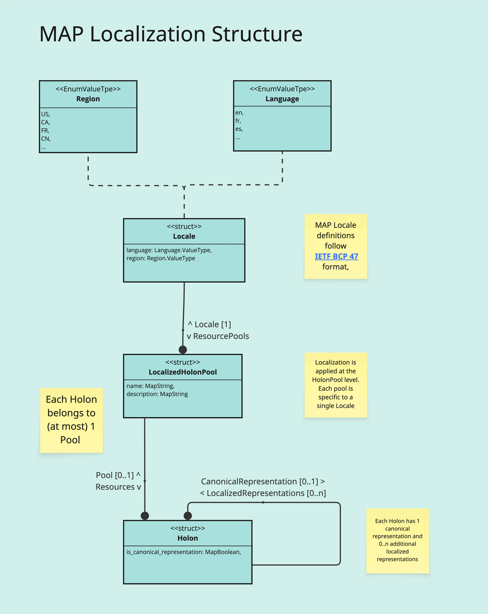

### 🌍 MAP Internationalization & Localized Holons Design
**Version:** August 2025  
**Status:** Rough Consensus Architecture

---


## 1. Overview

MAP’s internationalization (i18n) model uses **fully localized holons** to support multilingual content and context-specific knowledge representation. Rather than extracting localized strings into separate holons or defining a specialized type, each holon is **a complete locale-specific instance** of a `HolonType`.

Localization is modeled via relationships and properties **directly on the core `HolonType`**, enabling consistent treatment of localized holons as first-class data entities.

### 🧭 Terminology: Internationalization vs. Localization

#### **Internationalization (i18n)**
Internationalization is the process of designing software and data models in a way that makes them adaptable to multiple languages, regions, and cultures **without requiring engineering changes** for each new locale.

In the context of MAP:
- Internationalization enables holons to be stored, queried, and presented in multiple languages.
- It introduces structural support for locale-specific resource pools, canonical representations, and fallback logic.
- It ensures that holons, their properties, and relationships can vary by locale without breaking semantic or identity integrity.

> **Mnemonic**: “Design once, localize many times.”

---

#### **Localization (l10n)**
Localization is the process of adapting data or interface elements for a specific **language, region, or cultural context**. This includes translating human-readable strings and may involve restructuring or adapting content to fit local norms.

In the context of MAP:
- A **localized holon** is a full instance of a holon whose values and relationships are resolved in the context of a particular locale.
- One holon per group is designated the **canonical representation**, and others reference it via a `CanonicalRepresentation` relationship.
- Localization includes translated display names, descriptions, and possibly locale-specific relationships (e.g. tags, categorizations).

> **Mnemonic**: “Localization is applying the design to a specific place and language combination.”

---

These two processes are complementary:
- **Internationalization** is an architectural concern.
- **Localization** is a content and presentation concern.


---

## 2. Key Design Decisions

- ✅ Each localized representation is a full holon of the same `HolonType`, scoped to a specific locale
- ✅ One representation per locale, grouped via `CanonicalRepresentation` relationship
- ✅ One holon is designated as the **canonical representation** using `is_canonical_representation = true`
- ✅ All other localized holons declare a `CanonicalRepresentation` link to that canonical holon
- ✅ All properties and relationships are resolved relative to locale context
- ✅ Locale affiliation is modeled via a `LocalPool` relationship to a `LocalizedResourcePool`
- ✅ No `LocalizedString` holons or derived `LocalizedHolonType` subtype

---


## 3. MAP Internationalization Structure

A `LocalizedResourcePool` groups holons by a shared `locale` (e.g., `en`, `fr`, `fr-CA`).

Each pool is associated with a single Locale (language/region combination)

Each localized holon **must belong** to one such pool via `Pool`.



One localized holon is designated as the canonical representation, all others are designated LocalizedRepresentations of the canonical representation and have a relationship to it.

---

## 3. Holon Localization Semantics

### 3.1 Localized Holons

Each localized holon is a complete instance of its type (e.g., `Book`, `Person`, `Organization`) with values and links tailored to a specific locale. While **string properties** are typically the only materialized locale-specific values, all properties and relationships are conceptually **locale-relative**.

Localized holons contain:

- `Pool` relationship to their (single) locale-specific `LocalizedResourcePool`
- `is_canonical_representation` boolean property (true only for one holon per group)
- Fully materialized string values are expressed in the regional variant of their language (e.g., French Canadian)
- Relationships are resolved by the most appropriate representation of the target holon(s), given the source holon's locale.

Consider the following example:


**Le Petit Prince** is the canonical representation of the Livre (fr:FR) and Antoine de Saint-Exupéry is the canonical representation of a Personne. Both belong to the **Un dépôt de ressources en français** pool (as does the Livre and Personne Type Descriptors)
- Optional `CanonicalRepresentation` → reference to the canonical version (required for non-canonical variants)

### 3.2 Canonical Representation

- Exactly one localized holon per group should be flagged with `is_canonical_representation = true`
- Updates should always be made to the canonical holon
- Other localized holons must eventually be kept in sync via explicit update/translation flows
- Each localized holon (except the canonical one) **must declare** a `CanonicalRepresentation` relationship

---

## 4. Locale Affiliation

All holons are scoped to a specific locale by including:

```json
"relationships": {
  "LocalPool": { "$ref": "LocalizedResourcePool:fr-CA" }
}
```

This enables:
- Organized partitioning of holons by language/culture
- Locale-sensitive fallback resolution
- Query and navigation behaviors that adapt to user preferences


---

## 6. Cross-Locale Equivalence

Localized holons are grouped semantically via:

- Shared Type and conceptual identity
- One **canonical representation** identified via `is_canonical_representation = true`
- All others linking back to that canonical holon via `CanonicalRepresentation`

This design supports:
- Consistent object identity across languages
- Round-trip translation and editing workflows
- Clean integration with fallback logic and search resolution

---

## 7. Locale Precedence and Fallback

Queries and navigation are executed with a contextual `locale_precedence` stack, e.g.:

```json
{
  "requested_locale": "fr-CA",
  "fallback_locales": ["fr-CA", "fr", "en-CA", "en"]
}
```

Used for:
- Holon resolution
- Property display and value substitution
- Ranking search results

---

## 8. Heterogeneous Text Search

### 8.1 Motivation

Text-based search is the first step in many MAP workflows (including AI-RAG). Users should be able to query across **all types** of holons, e.g. "Tom Hanks" → `Person`, `Film`, `Author`, etc.

### 8.2 Indexing Scope

Each localized holon is indexed based on:
- Locale-tagged `display_name`, `description`, `type_name`, etc.
- Any string-bearing property
- Relationship labels (for guidance/navigation)

### 8.3 Search Behavior

- Query is matched against all localized holons
- Locale context guides scoring and fallback
- Results are enriched with type metadata and `DanceLink`s for structured navigation

---

## 9. Dance & Query Integration

### 9.1 Locale Context

All queries execute with a `locale_context`, which influences:
- Holon resolution
- Relationship traversal
- Search indexing and scoring

### 9.2 Dance Integration

- `DANCE("viewBook")` resolves to the localized holon variant matching the context
- `DANCE("editBook")` may route to the canonical version for source-of-truth editing
- Queries do not need to manually specify locale — fallback is automatic

---

## 10. Example

| Locale    | Holon Key         | `display_name` | `is_canonical_representation` | Pool                    | Canonical Ref           |
|-----------|-------------------|----------------|-------------------------------|-------------------------|--------------------------|
| en-US     | Book:1@en-US      | "Book"         | true                          | `LocalizedResourcePool:en-US` | —                   |
| fr        | Book:1@fr         | "Livre"        | false                         | `LocalizedResourcePool:fr`    | → Book:1@en-US        |
| fr-CA     | Book:1@fr-CA      | "Livre"        | false                         | `LocalizedResourcePool:fr-CA` | → Book:1@en-US        |

---

## 11. Implementation Roadmap

| Phase | Features |
|-------|----------|
| ✅ MVP   | Canonical holons, embedded string props |
| ⏳ v1    | Localized holons + `LocalPool` relationships |
| ⏳ v2    | Canonical representation logic (`is_canonical_representation`, `CanonicalRepresentation`) |
| ⏳ v3    | Locale-aware fallback resolution |
| ⏳ v4    | Indexed multilingual search |
| ⏳ v5    | Dance integration + canonical update tooling |

---

## 12. Open Design Questions

- Should canonical holons be excluded from a `LocalizedResourcePool`, or have a special `canonical` pool? **NO**
- Should properties like `is_canonical_representation` be enforced at the type level? **NO**
- How are canonical updates tracked and propagated (e.g. via translation queues)? **TBD**
- How should locale-specific validation be applied to ensure completeness and fidelity? **TBD**

---

## 13. Summary

MAP’s localized holon design enables a powerful, consistent, and high-performance internationalization strategy that:

- Keeps all holons in a uniform representation
- Avoids fragmentary or per-property lookup logic
- Fully supports multilingual search and navigation
- Integrates seamlessly with canonical edit flows and localization workflows

This architecture is designed to scale with complexity while remaining intuitive and developer-friendly across all layers of the MAP platform.