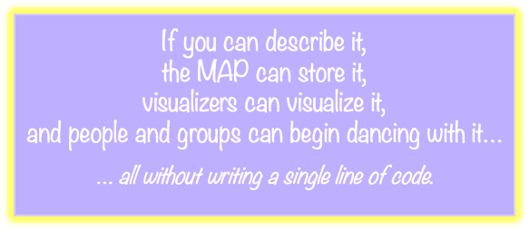

# MAP Type System (v2.0)

## ChangeLog

### v2.0

- replaces the former `TypeDescriptor` / `MetaTypeDescriptor` recursion model with the `DescriptorRoot` model
- introduces `DescriptorRoot` as the unique abstract root of the descriptor inheritance hierarchy
- distinguishes three independent axes of the type system:
  - description via `DescribedBy`
  - inheritance via `Extends`
  - instantiation via `Instances`
- clarifies that diagram stereotypes such as `<<MetaHolonType>>` are shorthand for `DescribedBy`
- clarifies that the JSON `type` field is shorthand for the `DescribedBy` relationship
- makes TypeKind-specific meta-types extend `DescriptorRoot`
- clarifies that abstract type descriptors are described by meta-types; they do not extend meta-types
- clarifies that concrete type descriptors extend the abstract type descriptor appropriate to their TypeKind
- removes the former rule that concrete descriptors extend both `TypeDescriptor` and their TypeKind-specific abstract type
- preserves MAP’s single-inheritance rule: each type may extend at most one other type
- preserves monotonic inheritance: inherited obligations may be added to, but not removed or weakened
- clarifies that only concrete type descriptors describe ordinary runtime instances

### v1.1

- distinguishes three major MAP type categories:
  - descriptors
  - runtime shared types
  - runtime envelopes
- introduces `runtime-shared-types.md` as the canonical home for cross-surface runtime shared types
- clarifies that `BaseValue`, rather than a separate `Value` layer, is the canonical scalar runtime shared type
- clarifies that runtime envelopes remain documented in their owning surface directories

### v1.0

- established the baseline overview of MAP as a self-describing holonic type system

---

The **MAP Type System** provides a holonic, self-describing, and extensible foundation for representing knowledge in an agent-centric world. MAP types are represented as structured, versioned, queryable units of meaning. Holons are typed by descriptors, and descriptors are themselves represented in the MAP type graph.

This holonic approach means:

- Types can describe runtime holons.
- Types can inherit obligations from other types.
- Types can be extended, queried, versioned, and governed as data.
- Schemas can evolve without requiring every new domain type to be compiled into the core codebase.

The MAP Type System enables agents to:

- define their own schemas and vocabularies
- share and evolve types collaboratively
- validate, introspect, and visualize holons at runtime
- build interoperable semantic structures across HolonSpaces

This document introduces the architecture of the MAP Type System, structured around the v2.0 meta-schema model, TypeKinds, schemas, HolonSpaces, key rules, introspection semantics, and the small family of runtime shared types reused across higher-level surfaces.

---

## 1. Introduction: What Is the MAP Type System?

The MAP Type System is:

- **Self-describing** — Holons are typed by descriptors, and descriptors are represented in the type graph.
- **Compositional** — Holons can be connected through typed relationships to build meaningful semantic graphs.
- **Introspectable** — Any holon can answer:
  - What kind of holon am I?
  - What properties do I have?
  - What relationships do I participate in?
- **Extensible** — Agents can define new types without altering the core codebase.
- **Governable** — Types belong to schemas, and schemas are stewarded within HolonSpaces.

### MAP’s Ontology-as-Data Meta-Modeling Approach

The Memetic Activation Platform (MAP) models its ontology as **data**: not as code, not as syntax-bound models, but as a declarative, introspectable system of holons and relationships.

Every type, property, relationship, and rule in the MAP ecosystem is represented as structured data. This creates a self-describing semantic graph in which schemas can be queried, validated, transformed, and evolved using the same mechanisms used for ordinary MAP data.

#### What It Is

- **Ontology-as-data**: Type system elements such as `Book.HolonType`, `Description.Property`, `MetaValueType`, and `MapStringValueType` are modeled as structured data.
- **Declarative architecture**: Relationships, constraints, inheritance, and key rules are declared explicitly rather than implied by code or syntax.
- **Syntax-independent**: The MAP type system is not coupled to OWL, LinkML, JSON Schema, Ecore, or any other concrete modeling syntax.
- **Portable and generative**: Because the ontology is represented as data, it can be transformed into other modeling formats, schemas, documentation, forms, validators, or APIs.

#### Why This Matters

- **Interoperability**: MAP avoids vendor lock-in and can interoperate across tooling ecosystems.
- **Transparency and introspection**: Every visible type system element can be queried, inspected, and reasoned about.
- **Extensibility**: New domain schemas can be introduced declaratively.
- **Automation**: The data-native model supports generation of schemas, forms, validators, visualizers, and adapters.
- **Evolvability**: The underlying semantics can remain stable while external representations evolve.

#### A Foundation for Federated Semantics

This architecture positions MAP as a semantic engine for decentralized systems, federated knowledge graphs, and commons-oriented technology. Semantic clarity, flexibility, and sovereignty are preserved because schemas are represented as data and stewarded within HolonSpaces.

---

## 2. Organizing the MAP Type System

At the heart of MAP is a self-describing type system built from data. The foundational building blocks of this system are **type descriptors**: holons that define the structure, semantics, and constraints of MAP types.

A relatively small number of descriptor types are built into MAP. These provide the foundation from which an open-ended set of domain types can be derived.

Type descriptors are grouped into **schemas**, which are cohesive collections of related type definitions. Each schema defines its own conceptual namespace and boundary of meaning. Every schema is stewarded within a single **HolonSpace**, anchoring it in a governance and trust context. A schema belongs to exactly one HolonSpace, but it may be referenced by types or instances across other spaces.

This layered organization follows a clear pattern:

- Type descriptors define types.
- Schemas group type descriptors.
- HolonSpaces steward schemas.

This structure allows types to evolve in well-bounded contexts while participating in broader federated semantics.

### Three Practical Type Categories

In current MAP architecture, it is useful to distinguish three major practical categories of types:

- **Descriptors**
  - schema-defining and meaning-defining types such as `HolonType`, `PropertyType`, `RelationshipType`, and `ValueType`
- **Runtime Shared Types**
  - the small set of cross-surface runtime-carried types reused inside commands, dances, queries, and related pathways
- **Runtime Envelopes**
  - surface-owned containers such as command, dance, query, and trust-channel request and result wrappers

This document focuses primarily on the descriptor side of the type system.

The canonical definitions for MAP runtime shared types live in `runtime-shared-types.md`.

Runtime envelopes remain documented in their owning surface directories rather than here.

---

## 3. TypeKind: A Semantic Organizing Principle

Every MAP type descriptor declares a **TypeKind**. A TypeKind identifies what kind of type is being described.

TypeKind serves two roles:

1. **Organizational**: It groups descriptors that share structural expectations and validation behavior.
2. **Semantic**: It identifies the ontological kind of thing being defined in the MAP worldview.

Examples:

- `Holon` identifies descriptors that classify data-bearing holons.
- `Property` identifies descriptors that define scalar properties.
- `Relationship` identifies descriptors that define typed links between holons.
- `Value(String)` identifies descriptors for string-like scalar values.
- `EnumVariant` identifies descriptors for enum variants.

TypeKind is not itself the inheritance mechanism. Structural obligations are carried through the descriptor hierarchy using `DescribedBy` and `Extends`.

### Complete List of TypeKinds

The current set of supported TypeKinds is listed below. This set will evolve as MAP matures. Adding a new TypeKind requires a MAP release. Adding new type descriptors within an existing TypeKind does not.

| TypeKind              | Group        | Description                                              |
|-----------------------|--------------|----------------------------------------------------------|
| `Holon`               | Structural   | Describes a type that classifies data-bearing holons     |
| `Property`            | Structural   | Describes a scalar property of a holon                   |
| `Relationship`        | Structural   | Describes a directed link between holons                 |
| `EnumVariant`         | Structural   | Describes a variant in a defined enum                    |
| `Collection`          | Structural   | Describes a named group or set of holons                 |
| `Dance`               | Behavioral   | Describes an interactive protocol or workflow            |
| `Value(String)`       | Scalar Value | A scalar value based on a string                         |
| `Value(Integer)`      | Scalar Value | A scalar value based on an integer                       |
| `Value(Boolean)`      | Scalar Value | A scalar value based on a boolean                        |
| `Value(Enum)`         | Scalar Value | A scalar value selected from a known enumeration         |
| `Value(Bytes)`        | Scalar Value | A binary value serialized as base64                      |
| `ValueArray(String)`  | Scalar Array | An array of strings                                      |
| `ValueArray(Integer)` | Scalar Array | An array of integers                                     |
| `ValueArray(Boolean)` | Scalar Array | An array of booleans                                     |
| `ValueArray(Enum)`    | Scalar Array | An array of enum values                                  |
| `ValueArray(Bytes)`   | Scalar Array | An array of binary values                                |

---

## 4. MAP Meta-Schema v2.0 Model

MAP v2.0 organizes descriptor semantics using four principal levels, plus a unique inheritance root.

### Architectural Summary

- `DescriptorRoot` defines the obligations shared by all descriptor TypeKinds.
- Meta-types extend `DescriptorRoot` and define descriptor obligations for a specific TypeKind.
- Abstract type descriptors are described by meta-types and anchor inheritance hierarchies for their TypeKind.
- Concrete type descriptors extend abstract type descriptors and describe runtime instances.
- Inheritance is single, additive, and monotonic.

### Architectural Pattern

This pattern applies across TypeKinds:

| Level                      | Role                                | Primary Relationship                      |
|----------------------------|-------------------------------------|-------------------------------------------|
| `DescriptorRoot`           | shared descriptor semantics         | root                                      |
| `Meta<TypeKind>`           | defines descriptor obligations      | extends `DescriptorRoot`                  |
| `Abstract<TypeKind>`       | defines reusable TypeKind semantics | described by `Meta<TypeKind>`             |
| `Concrete<TypeDescriptor>` | defines a specific type             | extends `Abstract<TypeKind>`              |
| Runtime instance           | realizes that type                  | described by its concrete type descriptor |

This pattern depends on keeping three axes distinct:

- `DescribedBy` identifies the descriptor that defines a holon or type.
- `Extends` inherits obligations from a more general type.
- `Instances` relates a type descriptor to the holons it describes.

In diagrams, stereotype notation such as `<<MetaHolonType>>` is shorthand for `DescribedBy`.

In JSON import files, the `type` field is shorthand for `DescribedBy`.

For example:

    {
      "key": "Schema.HolonType",
      "type": "#MetaHolonType",
      "properties": {
        "type_name": "Schema",
        "type_kind": "Holon",
        "is_abstract_type": false
      },
      "relationships": [
        {
          "name": "Extends",
          "target": { "$ref": "#HolonType" }
        }
      ]
    }

This means:

- `Schema.HolonType` is `DescribedBy` `MetaHolonType`.
- `Schema.HolonType` extends `HolonType`.
- `Schema.HolonType` is a concrete holon type descriptor.
- Runtime schema holons may be `DescribedBy` `Schema.HolonType`.

---

## 5. DescriptorRoot

`DescriptorRoot` is the unique abstract root of the descriptor inheritance hierarchy.

It declares the descriptor obligations shared by all descriptor TypeKinds, such as:

- `TypeName`
- `TypeNamePlural`
- `DisplayName`
- `DisplayNamePlural`
- `Description`
- `TypeKind`
- `UsesKeyRule`
- `ComponentOf`

`DescriptorRoot` has special bootstrap semantics:

- It has no `DescribedBy`.
- It has no `Extends`.
- It has no instances.
- It exists only as the root of descriptor inheritance.
- It is the target of `Extends` from top-level meta-types.

`DescriptorRoot` replaces the former role played by `TypeDescriptor` and `MetaTypeDescriptor` in earlier models. Unlike the former `TypeDescriptor`, it does not attempt to be both an abstract type and a concrete type. It is simply the root of descriptor inheritance.

---

## 6. Meta-Types

Meta-types define the obligations for descriptors of a given TypeKind.

Top-level meta-types extend `DescriptorRoot`:

- `MetaHolonType`
- `MetaPropertyType`
- `MetaValueType`
- `MetaRelationshipType`

Sub-meta-types may extend other meta-types. For example:

- `MetaDeclaredRelationshipType` extends `MetaRelationshipType`
- `MetaInverseRelationshipType` extends `MetaRelationshipType`

### MetaHolonType

`MetaHolonType` defines the obligations of holon type descriptors.

It declares that holon type descriptors may define:

- `InstanceProperties`
- `InstanceRelationships`
- `OwnedBy`
- `DescribedBy`

A holon type descriptor describes data-bearing holons. Concrete examples include:

- `Schema.HolonType`
- `HolonSpace.HolonType`
- `Book.HolonType`
- `Person.HolonType`

### MetaPropertyType

`MetaPropertyType` defines the obligations of property type descriptors.

It declares that property type descriptors specify:

- a property name
- a value type

The central relationship is:

- `ValueType`

Concrete examples include:

- `Description.Property`
- `DisplayName.Property`
- `TypeName.Property`

### MetaValueType

`MetaValueType` defines the obligations of value type descriptors.

Value types describe scalar or scalar-array value semantics. They do not declare instance properties or instance relationships because values are not holons and do not participate in relationships as holons.

Concrete examples include:

- `MapStringValueType`
- `MapIntegerValueType`
- `MapBooleanValueType`
- `MapBytesValueType`
- `MapEnumValueType`

### MetaRelationshipType

`MetaRelationshipType` defines the obligations of relationship type descriptors.

Relationship type descriptors may specify:

- `SourceType`
- `TargetType`
- `MinCardinality`
- `MaxCardinality`
- `DeletionSemantic`
- `IsDefinitional`
- `AllowsDuplicates`
- `IsOrdered`
- `InverseOf`

Sub-meta-types specialize this pattern for declared and inverse relationship types.

---

## 7. Abstract Type Descriptors

Abstract type descriptors are described by their corresponding meta-types and anchor inheritance hierarchies for their TypeKind.

Examples:

| Abstract Type Descriptor   | Described By                   |
|----------------------------|--------------------------------|
| `HolonType`                | `MetaHolonType`                |
| `PropertyType`             | `MetaPropertyType`             |
| `ValueType`                | `MetaValueType`                |
| `DeclaredRelationshipType` | `MetaDeclaredRelationshipType` |
| `InverseRelationshipType`  | `MetaInverseRelationshipType`  |

Abstract type descriptors are not instantiable. No ordinary runtime holon may be directly `DescribedBy` an abstract type descriptor.

Their purpose is to:

- define reusable TypeKind-specific semantics
- serve as inheritance anchors for concrete type descriptors
- provide stable source and target anchors for core relationship types
- allow validation to be expressed against abstract categories while runtime instances use concrete descriptors

For example:

- `Schema.HolonType` extends `HolonType`
- `Description.Property` extends `PropertyType`
- `MapStringValueType` extends `ValueType`
- `ComponentOf.RelationshipType` extends `DeclaredRelationshipType`

---

## 8. Concrete Type Descriptors

Concrete type descriptors define actual MAP types.

Each concrete type descriptor:

- is described by the meta-type appropriate to its TypeKind
- extends the abstract type descriptor appropriate to its TypeKind
- fulfills inherited descriptor obligations
- may describe runtime instances
- participates in schemas
- may be keyed or keyless depending on its key rule

Examples:

| Concrete Type Descriptor       | Described By                   | Extends                    |
|--------------------------------|--------------------------------|----------------------------|
| `Schema.HolonType`             | `MetaHolonType`                | `HolonType`                |
| `HolonSpace.HolonType`         | `MetaHolonType`                | `HolonType`                |
| `Description.Property`         | `MetaPropertyType`             | `PropertyType`             |
| `MapStringValueType`           | `MetaValueType`                | `ValueType`                |
| `ComponentOf.RelationshipType` | `MetaDeclaredRelationshipType` | `DeclaredRelationshipType` |

A concrete type descriptor may itself be represented as a holon while also defining a type for other holons. These are separate axes.

For example, `Schema.HolonType` is:

- described by `MetaHolonType`, because it is a holon type descriptor
- extended from `HolonType`, because it is a concrete specialization of the abstract holon type root
- used to describe schema holon instances, such as `MAP Metaschema`

This is not multiple inheritance. It is one `DescribedBy` relationship plus one `Extends` relationship.

---

## 9. Runtime Instances

Runtime instances are the ordinary holons that populate MAP HolonSpaces.

They:

- are described by concrete type descriptors
- include values for properties specified by their type
- participate in relationships specified by their type
- may be keyed or keyless depending on the `UsesKeyRule` of their type descriptor

Examples:

- `MAP Metaschema` is described by `Schema.HolonType`
- a specific HolonSpace is described by `HolonSpace.HolonType`
- a book holon may be described by `Book.HolonType`
- a person holon may be described by `Person.HolonType`

Runtime instances are never described by abstract type descriptors.

---

## 10. Compositional Inheritance via Extends

MAP uses `Extends` as its inheritance mechanism.

`Extends` means that a type inherits the obligations of a more general type. These obligations may include:

- required properties
- allowed properties
- required relationships
- allowed relationships
- validations
- key rule expectations
- semantic commitments

MAP supports only **single inheritance**:

- a type may extend at most one other type

MAP inheritance is **strictly additive and monotonic**:

- a subtype may add obligations
- a subtype may refine by adding constraints
- a subtype may not remove inherited obligations
- a subtype may not weaken inherited obligations

This keeps type evolution predictable and validation tractable.

### Examples

`MetaPropertyType` extends `DescriptorRoot`.

This means `MetaPropertyType` inherits the descriptor obligations shared by all TypeKinds and adds obligations specific to property type descriptors.

`Description.Property` extends `PropertyType`.

This means `Description.Property` inherits the general obligations of property type descriptors and specializes them for the `description` property.

`Schema.HolonType` extends `HolonType`.

This means `Schema.HolonType` inherits the general obligations of holon type descriptors and specializes them for schema holons.

---

## 11. Abstract Types as Relationship Anchors

In MAP, relationship type descriptors declare `SourceType` and `TargetType`. These define which kinds of holons a relationship may connect.

To support reusable relationships across schemas and domains, MAP anchors many core relationship types to abstract type descriptors.

Examples:

- `ValueType` has source `PropertyType` and target `ValueType`
- `InstanceProperties` has source `HolonType` and target `PropertyType`
- `InstanceRelationships` has source `HolonType` and target `DeclaredRelationshipType`
- `SourceType` has source `RelationshipType` and target `HolonType`
- `TargetType` has source `RelationshipType` and target `HolonType`

Although abstract type descriptors are not instantiable, they are valid reference anchors in the type graph.

### Validation Behavior

When validating a relationship instance:

- Let `R` be the relationship type descriptor.
- Let `S` be the source holon.
- Let `T` be the target holon.
- Let `R.SourceType` be the expected source type.
- Let `R.TargetType` be the expected target type.

The relationship instance is valid if:

- `S.DescribedBy` is equal to or extends `R.SourceType`
- `T.DescribedBy` is equal to or extends `R.TargetType`

This allows relationship types to be declared once against abstract anchors while remaining applicable to all concrete descriptors that extend those anchors.

---

## 12. Design Principles Recap

1. The MAP type system distinguishes three axes: **description** (`DescribedBy`), **inheritance** (`Extends`), and **instantiation** (`Instances`).

2. In diagrams, `<<TypeName>>` is shorthand for `DescribedBy`. In JSON, `type` is shorthand for `DescribedBy`.

3. Every ordinary holon must be self-describing: each holon is `DescribedBy` exactly one concrete holon type descriptor.

4. `DescriptorRoot` is the unique abstract root of the descriptor inheritance hierarchy. It has no `DescribedBy`, no `Extends`, and no instances.

5. `DescriptorRoot` declares shared descriptor obligations inherited by all descriptor meta-types.

6. The top-level meta-types extend `DescriptorRoot`: `MetaHolonType`, `MetaPropertyType`, `MetaValueType`, and `MetaRelationshipType`.

7. Meta-types define the obligations for descriptors of a given **TypeKind** through their instance properties and instance relationships.

8. `MetaHolonType` defines the obligations of holon type descriptors, including `InstanceProperties` and `InstanceRelationships`.

9. `MetaPropertyType` defines the obligations of property type descriptors, including `ValueType`.

10. `MetaValueType` defines the obligations of value type descriptors. Value types do not declare instance properties or instance relationships.

11. `MetaRelationshipType` defines the obligations of relationship type descriptors, including source type, target type, cardinality, deletion semantics, and inverse relationships.

12. Meta-types may have sub-meta-types that extend them, such as `MetaDeclaredRelationshipType` and `MetaInverseRelationshipType` extending `MetaRelationshipType`.

13. Each top-level abstract type is `DescribedBy` its corresponding meta-type: `HolonType` by `MetaHolonType`, `PropertyType` by `MetaPropertyType`, `ValueType` by `MetaValueType`, and relationship roots by the meta-types for their TypeKind.

14. Abstract type descriptors do not extend meta-types. They are described by meta-types and serve as inheritance anchors for concrete type descriptors.

15. Concrete type descriptors extend the abstract type appropriate to their TypeKind, such as `Schema.HolonType` extending `HolonType` or `Description.Property` extending `PropertyType`.

16. A concrete type descriptor may itself be a holon and therefore must be `DescribedBy` a meta-type while also extending an abstract type. These are separate axes and do not conflict.

17. A MAP type may extend at most one other type. The MAP supports single inheritance only.

18. Inheritance is strictly additive and monotonic. A subtype may add obligations but may not remove or weaken inherited obligations.

19. Only concrete type descriptors describe ordinary runtime instances.

20. `TypeDescriptor` and `MetaTypeDescriptor` are removed from the v2.0 model. Their former roles are replaced by `DescriptorRoot`, TypeKind-specific meta-types, abstract type anchors, and the `DescribedBy` / `Extends` distinction.

---

## 13. Key Rules, Keyed Types, and Keyless Types

MAP supports both keyed and keyless holon types.

A **keyed type** defines instances that have stable semantic identity within a HolonSpace. These instances can be referenced by key in import files and relationship targets.

A **keyless type** defines instances whose identity is contextual. Keyless holons are typically embedded and are not independently referenced.

Key behavior is specified through `UsesKeyRule`.

Examples:

- `TypeName.KeyRule` derives a key from a type name.
- `TypeKind.KeyRule` may derive a key from type name and TypeKind.
- `Relationship.KeyRuleType` derives keys for relationship descriptors from source type, relationship name, and target type.
- `None.KeyRuleType` marks a type as keyless.

The key rule system is part of the descriptor model because key derivation is a semantic obligation of a type.

---

## 14. Base Types and Base Values

Several TypeKinds, such as `Value(String)`, `Value(Boolean)`, or `ValueArray(Enum)`, correspond to scalar value types. These are backed by a fixed set of **Base Types** that define how values are represented, stored, and validated across environments.

### Base Types

Base Types are the foundational portable value types in MAP. A Base Type determines how a value is represented across programming environments such as Rust, TypeScript, and JSON.

The set of Base Types is fixed for a given MAP version. Adding or changing Base Types requires a MAP release because Base Types affect runtime representation and persistence.

### Principle: Preserve Type Identity Across Platforms

The Base Type name should be treated as a portable name, used consistently across environments and interpretable by the MAP type system.

In Rust, type identity is preserved through newtypes such as:

    pub struct MapString(pub String);

In TypeScript and JSON, similar identity can be preserved through type aliases, tagging, or enforced schema constraints.

### Current Base Types with Portable Name Bindings

| Base Type      | Rust Binding                          | TypeScript Binding                         | JSON Binding                                   |
|----------------|---------------------------------------|--------------------------------------------|------------------------------------------------|
| `MapString`    | `pub struct MapString(pub String)`    | `export type MapString = string;`          | `{ "type": "MapString", "value": "..." }`      |
| `MapBoolean`   | `pub struct MapBoolean(pub bool)`     | `export type MapBoolean = boolean;`        | `{ "type": "MapBoolean", "value": true }`      |
| `MapInteger`   | `pub struct MapInteger(pub i64)`      | `export type MapInteger = number;`         | `{ "type": "MapInteger", "value": 42 }`        |
| `MapEnumValue` | `pub struct MapEnumValue(pub String)` | `export type MapEnumValue = string;`       | `{ "type": "MapEnumValue", "value": "DRAFT" }` |
| `MapBytes`     | `pub struct MapBytes(pub Vec<u8>)`    | `export type MapBytes = string; // base64` | `{ "type": "MapBytes", "value": "aGVsbG8=" }`  |

### BaseValue

MAP represents scalar runtime values using the `BaseValue` enum.

    pub enum BaseValue {
        StringValue(MapString),
        BooleanValue(MapBoolean),
        IntegerValue(MapInteger),
        EnumValue(MapEnumValue),
        BytesValue(MapBytes),
    }

Each variant corresponds to a specific MAP Base Type. This allows property values to be stored and inspected uniformly while preserving type identity.

Only `BaseValue` variants may be used as `PropertyValue`s within a holon's `PropertyMap`:

    pub type PropertyValue = BaseValue;
    pub type PropertyMap = BTreeMap<PropertyName, Option<PropertyValue>>;

By wrapping all scalar values in a unified enum, MAP ensures that holon properties are portable, self-describing, and serializable across environments.

### Notes

- Rust bindings use the newtype pattern, such as `pub struct MapString(pub String)`, to distinguish each base type while still leveraging native Rust primitives.
- Base types can support custom trait implementations, typed serialization, deterministic hashing, and compile-time safety.
- `BaseValue` acts as the unified runtime representation of scalar values.
- `BaseValue` includes deterministic binary encoding support, display support, and conversion behavior.
- TypeScript bindings are currently simple aliases for interoperability with JSON and browser-based UIs.
- JSON bindings assume a tagged format for clarity and round-tripping.
- `ValueType` descriptors define the semantic value constraints that property descriptors reference.
- The previously defined `BaseType` enum has been removed. Its former responsibilities are handled by:
  - `TypeKind` for descriptor classification
  - `ValueType` descriptors for scalar semantics
  - `BaseValue` for runtime scalar representation

---

## 15. Summary

The MAP Type System v2.0 separates description, inheritance, and instantiation into distinct axes.

The former recursive `TypeDescriptor` model has been replaced by a cleaner pattern:

- `DescriptorRoot` roots descriptor inheritance.
- Meta-types define TypeKind-specific descriptor obligations.
- Abstract type descriptors anchor inheritance for each TypeKind.
- Concrete type descriptors define usable MAP types.
- Runtime instances are described by concrete type descriptors.

This preserves MAP’s self-describing, holonic architecture while avoiding the earlier ambiguity in which `TypeDescriptor` acted as both an abstract and concrete type.

The result is a type system that is:

- introspectable
- extensible
- schema-governed
- TypeKind-aware
- single-inheritance
- monotonic
- suitable for open-ended, agent-defined semantics