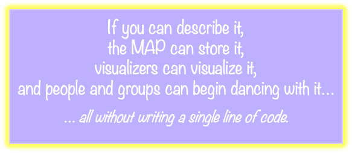

# MAP Type System (v2.0)

## ChangeLog

### v2.0

- aligns the overview with the Schema 2.0 type-descriptor and meta-type model
- separates the meta-type hierarchy rooted at `MetaTypeDescriptor` from the descriptor-type hierarchy rooted at abstract `TypeDescriptor`
- makes kind-specific meta-types the direct describing types of descriptor holons
- defines `DescribedBy` conformance separately from `Extends` classification and instance-contract inheritance
- adds `InheritanceMode` semantics for `None`, `Additive`, and `Override`
- adds required-property defaults, effective-value cardinality, provenance, and two-root describing-type admissibility
- aligns key-rule resolution with `InheritanceMode Override` and explicit `NoneKeyRule`

### v1.3

- clarifies that concrete `HolonCollectionType` makes persisted collections first-class holons that may be targeted by `HolonReference`
- clarifies that this document records only the schema-level consequence of `HolonCollectionType`, while runtime representation guidance remains in `runtime-shared-types.md`

### v1.2

- clarifies the MAP meta-schema around the `TypeDescriptor` and `MetaTypeDescriptor` model
- preserves MAP's single-inheritance rule: each type may extend at most one other type
- gives explicit architectural priority to the distinction between `DescribedBy` and `Extends`
- clarifies that the JSON `type` field is shorthand for the `DescribedBy` relationship
- clarifies that diagram stereotypes such as `<<MetaHolonType>>` are shorthand for `DescribedBy`
- clarifies that `TypeDescriptor` is self-describing and serves as the concrete bootstrap descriptor for descriptor holons
- clarifies that `MetaTypeDescriptor` defines the shared descriptor obligations inherited across descriptor lineages
- clarifies that concrete descriptors are single holons; MAP does not instantiate a second companion `TypeDescriptor` holon for each descriptor definition
- clarifies that effective descriptor obligations arise from both:
  - descriptor-wide semantics propagated through `DescribedBy -> TypeDescriptor`
  - TypeKind-specific semantics inherited through `Extends`
- clarifies that `InstanceProperties` and `InstanceRelationships` are interpreted differently depending on where they appear in the descriptor hierarchy
- formalizes that `Extends` preserves descriptor structure while `DescribedBy` interprets populated instance-surface declarations from the effective describing type
- clarifies that only concrete type descriptors describe ordinary runtime instances
- clarifies that abstract type descriptors serve as inheritance anchors and relationship anchors

### v1.1

- distinguishes three major MAP type categories:
  - descriptors
  - runtime shared types
  - runtime envelopes
- introduces `runtime-shared-types.md` as the canonical home for cross-surface runtime shared types
- clarifies that `BaseValue`, rather than a separate `Value` layer, is the canonical scalar runtime shared type
- clarifies that runtime envelopes remain documented in their owning surface directories

### v1.0

- established the baseline overview of MAP as a self-describing holonic type system

---

The **MAP Type System** provides a holonic, self-describing, and extensible foundation for representing knowledge in an agent-centric world. MAP types are represented as structured, versioned, queryable units of meaning. Holons are typed by descriptors, and descriptors are themselves represented in the MAP type graph.

This holonic approach means:

- Types can describe runtime holons.
- Types can inherit obligations from other types.
- Types can be extended, queried, versioned, and governed as data.
- Schemas can evolve without requiring every new domain type to be compiled into the core codebase.

The MAP Type System enables agents to:

- define their own schemas and vocabularies
- share and evolve types collaboratively
- validate, introspect, and visualize holons at runtime
- build interoperable semantic structures across HolonSpaces

This document introduces the architecture of the MAP Type System, structured around the Schema 2.0 meta-schema model, TypeKinds, schemas, HolonSpaces, key rules, introspection semantics, and the relationship between schema descriptors and the runtime shared types reused across higher-level surfaces.

For the cross-cutting runtime architecture that carries these self-describing
holons across persistence, shared runtime state, references, and typed core
structs, see `../holon-layered-representation-design-spec.md`.

For a concrete design-validation discipline that pressure-tests this model, see `schema-v2-pressure-test-checklist.md`.

---

## 1. Introduction: What Is the MAP Type System?

The MAP Type System is:

- **Self-describing**: Holons are typed by descriptors, and descriptors are represented in the type graph.
- **Compositional**: Holons can be connected through typed relationships to build meaningful semantic graphs.
- **Introspectable**: Any holon can answer:
  - What kind of holon am I?
  - What properties do I have?
  - What relationships do I participate in?
- **Extensible**: Agents can define new types without altering the core codebase.
- **Governable**: Types belong to schemas, and schemas are stewarded within HolonSpaces.

### MAP's Ontology-as-Data Meta-Modeling Approach

The Memetic Activation Platform (MAP) models its ontology as **data**: not as code, not as syntax-bound models, but as a declarative, introspectable system of holons and relationships.

Every type, property, relationship, and rule in the MAP ecosystem is represented as structured data. This creates a self-describing semantic graph in which schemas can be queried, validated, transformed, and evolved using the same mechanisms used for ordinary MAP data.

#### What It Is

- **Ontology-as-data**: Type system elements such as `Book.HolonType`, `Description.PropertyType`, `MetaHolonType`, and `MapStringValueType` are modeled as structured data.
- **Declarative architecture**: Relationships, constraints, inheritance, and key rules are declared explicitly rather than implied by code or syntax.
- **Syntax-independent**: The MAP type system is not coupled to OWL, LinkML, JSON Schema, Ecore, or any other concrete modeling syntax.
- **Portable and generative**: Because the ontology is represented as data, it can be transformed into other modeling formats, schemas, documentation, forms, validators, or APIs.

#### Why This Matters

- **Interoperability**: MAP avoids vendor lock-in and can interoperate across tooling ecosystems.
- **Transparency and introspection**: Every visible type system element can be queried, inspected, and reasoned about.
- **Extensibility**: New domain schemas can be introduced declaratively.
- **Automation**: The data-native model supports generation of schemas, forms, validators, visualizers, and adapters.
- **Evolvability**: The underlying semantics can remain stable while external representations evolve.

#### A Foundation for Federated Semantics

This architecture positions MAP as a semantic engine for decentralized systems, federated knowledge graphs, and commons-oriented technology. Semantic clarity, flexibility, and sovereignty are preserved because schemas are represented as data and stewarded within HolonSpaces.

---

## 2. Organizing the MAP Type System

At the heart of MAP is a self-describing type system built from data. The foundational building blocks of this system are **type descriptors**: holons that define the structure, semantics, and constraints of MAP types.

A relatively small number of descriptor types are built into MAP. These provide the foundation from which an open-ended set of domain types can be derived.

Type descriptors are grouped into **schemas**, which are cohesive collections of related type definitions. Each schema defines its own conceptual namespace and boundary of meaning. Every schema is stewarded within a single **HolonSpace**, anchoring it in a governance and trust context. A schema belongs to exactly one HolonSpace, but it may be referenced by types or instances across other spaces.

This layered organization follows a clear pattern:

- Type descriptors define types.
- Schemas group type descriptors.
- HolonSpaces steward schemas.

This structure allows types to evolve in well-bounded contexts while participating in broader federated semantics.

### Three Practical Type Categories

In current MAP architecture, it is useful to distinguish three major practical categories of types:

- **Descriptors**
  - schema-defining and meaning-defining types such as `HolonType`, `PropertyType`, `DeclaredRelationshipType`, `InverseRelationshipType`, and `ValueType`
- **Runtime Shared Types**
  - the small set of cross-surface runtime-carried types reused inside commands, dances, queries, and related pathways
- **Runtime Envelopes**
  - surface-owned containers such as command, dance, query, and trust-channel request and result wrappers

This document focuses primarily on the descriptor side of the type system. The authoritative definitions are maintained in the `host/import_files/map-schema` folder within the `map-holons` repo.

The canonical definitions for MAP runtime shared types live in `runtime-shared-types.md`.

The cross-layer architectural frame that connects descriptor-backed
self-description to integrity, shared-object, reference, and typed core struct
representations lives in `../holon-layered-representation-design-spec.md`.

Runtime envelopes remain documented in their owning surface directories rather than here.

---

## 3. TypeKind: A Semantic Organizing Principle

Every MAP type descriptor declares a **TypeKind**. A TypeKind identifies what kind of type is being described.

TypeKind serves two roles:

1. **Organizational**: It groups descriptors that share structural expectations and validation behavior.
2. **Semantic**: It identifies the ontological kind of thing being defined in the MAP worldview.

Examples:

- `Holon` identifies descriptors that classify data-bearing holons.
- `Property` identifies descriptors that define scalar properties.
- `Relationship` identifies descriptors that define typed links between holons.
- `Value(String)` identifies descriptors for string-like scalar values.
- `EnumVariant` identifies descriptors for enum variants.

TypeKind is not itself an inheritance, conformance, or admissibility mechanism. Subtype classification follows transitive `Extends`, while the current holon's conformance obligations come from `DescribedBy`. No general `TypeKind` compatibility rule is applied to an `Extends` edge.

### Complete List of TypeKinds

The current set of supported TypeKinds is listed below. This set will evolve as MAP matures. Adding a new TypeKind requires a MAP release. Adding new type descriptors within an existing TypeKind does not.

| TypeKind              | Group        | Description                                              |
|-----------------------|--------------|----------------------------------------------------------|
| `Holon`               | Structural   | Describes a type that classifies data-bearing holons     |
| `Property`            | Structural   | Describes a scalar property of a holon                   |
| `Relationship`        | Structural   | Describes a directed link between holons                 |
| `EnumVariant`         | Structural   | Describes a variant in a defined enum                    |
| `Collection`          | Structural   | Describes a named group or set of holons                 |
| `Dance`               | Behavioral   | Describes an interactive protocol or workflow            |
| `Value(String)`       | Scalar Value | A scalar value based on a string                         |
| `Value(Integer)`      | Scalar Value | A scalar value based on an integer                       |
| `Value(Boolean)`      | Scalar Value | A scalar value based on a boolean                        |
| `Value(Enum)`         | Scalar Value | A scalar value selected from a known enumeration         |
| `Value(Bytes)`        | Scalar Value | A binary value serialized as base64                      |
| `ValueArray(String)`  | Scalar Array | An array of strings                                      |
| `ValueArray(Integer)` | Scalar Array | An array of integers                                     |
| `ValueArray(Boolean)` | Scalar Array | An array of booleans                                     |
| `ValueArray(Enum)`    | Scalar Array | An array of enum values                                  |
| `ValueArray(Bytes)`   | Scalar Array | An array of binary values                                |

---

## 4. MAP Meta-Schema v2.0 Model

Schema 2.0 organizes the type system around two separate `Extends` hierarchies and the `DescribedBy` relationships that connect them.

### Architectural Summary

- The meta-type hierarchy is rooted at `MetaTypeDescriptor`.
- Meta-types extend only meta-types.
- All meta-types are themselves holon-type descriptors and are `DescribedBy MetaHolonType`.
- `MetaHolonType` is self-describing, establishing the reflective bootstrap fixed point.
- The descriptor-type hierarchy is rooted at abstract `TypeDescriptor`.
- Descriptor types extend only descriptor types.
- Every descriptor holon is directly described by its kind-specific meta-type.
- Ordinary runtime holons are described by concrete descriptor types.
- Each type may extend at most one parent, and each `Extends` hierarchy is acyclic.

### The Three Independent Axes

The MAP type system depends on keeping description, specialization, and instantiation distinct.

#### `DescribedBy`

`DescribedBy` identifies the type whose effective instance contract the current holon must satisfy.

Formally:

    ConformanceContract(H)
        =
    EffectiveInstanceContract(DescribingType(H))

Examples:

- `MAP Metaschema` is `DescribedBy Schema.HolonType`.
- `Schema.HolonType` is `DescribedBy MetaHolonType`.
- `TypeName.PropertyType` is `DescribedBy MetaPropertyType`.
- `MetaPropertyType` is `DescribedBy MetaHolonType`.
- `MetaHolonType` is `DescribedBy MetaHolonType`.

`DescribedBy` governs the current holon's own conformance. It does not determine the contract that a descriptor passes on to the instances it describes.

#### `Extends`

`Extends` is a relationship between types. It has three roles:

- it establishes subtype classification and substitutability within one hierarchy;
- it additively inherits instance-contract declarations; and
- it supplies the lineage over which explicitly declared semantic-inheritance behavior is resolved.

Examples:

- `MetaPropertyType` extends `MetaTypeDescriptor`.
- `MetaDeclaredRelationshipType` extends `MetaRelationshipType`.
- `HolonType` extends `TypeDescriptor`.
- `PropertyType` extends `TypeDescriptor`.
- `Schema.HolonType` extends `HolonType`.
- `TypeName.PropertyType` extends `PropertyType`.

An `Extends` edge never crosses between the meta-type and descriptor-type hierarchies.

#### `Instances`

`Instances` is the inverse of `DescribedBy`.

    T ──Instances──> H

means:

> `H` must conform to the effective instance contract of `T`.

The normative relationship is `H DescribedBy T`. Conformance does not depend on the inverse `Instances` relationship being physically materialized.

### Why the Distinction Matters

A descriptor holon participates in both description and specialization, but for different purposes.

For example:

    TypeName.PropertyType
        DescribedBy MetaPropertyType
        Extends PropertyType

means:

- `EffectiveInstanceContract(MetaPropertyType)` governs what `TypeName.PropertyType` itself must populate; and
- `EffectiveInstanceContract(TypeName.PropertyType)` governs the property contract that `TypeName.PropertyType` passes on where it is used as an instance-property declaration.

The meta-type lineage never leaks into the ordinary instance contract inherited through the descriptor-type lineage.

### Diagram and JSON Shorthand

In diagrams, stereotype notation such as `<<MetaHolonType>>` is shorthand for `DescribedBy`.

In JSON import files, the `type` field is shorthand for `DescribedBy`.

For example:

    {
      "key": "Schema.HolonType",
      "type": "#MetaHolonType",
      "properties": {
        "type_name": "Schema",
        "type_kind": "Holon",
        "is_abstract_type": false
      },
      "relationships": [
        {
          "name": "Extends",
          "target": { "$ref": "#HolonType" }
        }
      ]
    }

This means:

- `Schema.HolonType` is `DescribedBy MetaHolonType`;
- `Schema.HolonType` extends `HolonType`;
- `Schema.HolonType` is a concrete holon type descriptor; and
- runtime schema holons may be `DescribedBy Schema.HolonType`.

---

## 5. MetaTypeDescriptor

`MetaTypeDescriptor` is the root of the meta-type hierarchy.

It defines the common instance contract inherited by the kind-specific meta-types. That contract describes the properties and relationships that type-descriptor holons share.

Kind-specific meta-types add declarations to this common contract. They do not redefine or remove inherited declarations.

### Bootstrap Role

Meta-types are themselves holon-type descriptors:

    MetaTypeDescriptor
        DescribedBy MetaHolonType

    MetaPropertyType
        DescribedBy MetaHolonType
        Extends MetaTypeDescriptor

The bootstrap terminates at:

    MetaHolonType
        DescribedBy MetaHolonType

This deliberate reflective fixed point avoids an unbounded sequence of meta-meta-types.

### Special Bootstrap Note

The Schema 2.0 bootstrap does not use `TypeDescriptor` as the generic describing type for descriptor holons.

Instead:

- the meta-type hierarchy defines contracts for descriptor holons;
- each descriptor holon is directly described by its kind-specific meta-type; and
- the separate descriptor-type hierarchy classifies descriptor types and defines contracts for their described instances.

---

## 6. Meta-Types

Meta-types define the self-conformance obligations of descriptor holons.

Top-level meta-types extend `MetaTypeDescriptor`:

- `MetaHolonType`
- `MetaPropertyType`
- `MetaValueType`
- `MetaRelationshipType`

Relationship-specific meta-types extend `MetaRelationshipType`:

- `MetaDeclaredRelationshipType`
- `MetaInverseRelationshipType`

All of these meta-types are `DescribedBy MetaHolonType`.

### MetaHolonType

`MetaHolonType` defines the contract for holon-type descriptor holons, including declarations such as:

- `InstanceProperties`
- `InstanceRelationships`
- `DescribedBy`
- `OwnedBy`
- `UsesKeyRule`

It describes `TypeDescriptor`, `HolonType`, authored holon-type descriptors, and every meta-type.

### MetaPropertyType

`MetaPropertyType` defines the contract for property-type descriptor holons. Its effective contract includes:

- `IsValueRequired`
- `InheritanceMode`
- `DefaultValue`
- `ValueType`

A `DefaultValue` is valid only when `IsValueRequired` is true.

### MetaValueType

`MetaValueType` defines the contract for value-type descriptor holons.

Value-type descriptors define scalar or scalar-array value semantics and constraints. Their descriptor holons still conform to the common meta-type contract even when `MetaValueType` adds no local instance-property or instance-relationship declarations.

### MetaRelationshipType

`MetaRelationshipType` defines the common contract for relationship-type descriptor holons, including source and target constraints, cardinality, ordering, duplicate, definitional, and deletion semantics.

### MetaDeclaredRelationshipType

`MetaDeclaredRelationshipType` extends `MetaRelationshipType` and defines the additional contract for declared-relationship descriptors.

### MetaInverseRelationshipType

`MetaInverseRelationshipType` extends `MetaRelationshipType` and defines the additional contract for inverse-relationship descriptors.

The effective contracts of property, declared-relationship, and inverse-relationship descriptors include required `InheritanceMode`.

---

## 7. Abstract Type Descriptors

Abstract descriptor types belong to the descriptor-type hierarchy rooted at `TypeDescriptor`. Their kind-specific self-conformance comes from `DescribedBy`, not from `Extends`.

| Abstract Type Descriptor   | Described By                   | Extends          |
|----------------------------|--------------------------------|------------------|
| `HolonType`                | `MetaHolonType`                | `TypeDescriptor` |
| `PropertyType`             | `MetaPropertyType`             | `TypeDescriptor` |
| `ValueType`                | `MetaValueType`                | `TypeDescriptor` |
| `DeclaredRelationshipType` | `MetaDeclaredRelationshipType` | `TypeDescriptor` |
| `InverseRelationshipType`  | `MetaInverseRelationshipType`  | `TypeDescriptor` |

Abstract descriptor types:

- define reusable instance contracts;
- serve as inheritance anchors for concrete descriptor types;
- provide stable source and target anchors for relationships;
- participate in subtype classification; and
- do not directly describe concrete runtime holons.

Examples:

- `Schema.HolonType` extends `HolonType`.
- `Description.PropertyType` extends `PropertyType`.
- `MapStringValueType` extends `ValueType`.
- `ComponentOf.DeclaredRelationshipType` extends `DeclaredRelationshipType`.

---

## 8. TypeDescriptor

`TypeDescriptor` is the abstract root of the descriptor-type classification hierarchy.

    TypeDescriptor
        abstract
        DescribedBy MetaHolonType

It provides:

- a common classification root for descriptor types;
- a polymorphic relationship target;
- a query root for descriptor types; and
- a stable semantic category for schema components.

For example:

    Schema.Components -> TypeDescriptor

accepts any descriptor type that equals or transitively extends `TypeDescriptor`.

### What TypeDescriptor Does

`TypeDescriptor` does not describe all descriptor holons and is not self-describing.

It classifies descriptor types through `Extends`. A descriptor holon's own obligations instead come from its kind-specific meta-type:

    TypeName.PropertyType
        DescribedBy MetaPropertyType
        Extends PropertyType
        Extends* TypeDescriptor

This keeps classification separate from self-conformance.

### Effective Semantics of Descriptor Holons

For any descriptor holon `T`, two contracts must remain distinct:

1. `ConformanceContract(T)` governs the populated properties and relationships that `T` itself must contain.
2. `EffectiveInstanceContract(T)` governs the contract that `T` passes on to the instances it describes.

For `TypeName.PropertyType`:

- self-conformance is determined by `EffectiveInstanceContract(MetaPropertyType)`; and
- descriptor classification is determined by `TypeName.PropertyType Extends* TypeDescriptor`.

These surfaces are not flattened together.

---

## 9. Concrete Type Descriptors

Concrete descriptor types define usable MAP types.

Each concrete descriptor type:

- is directly `DescribedBy` its kind-specific meta-type;
- extends the appropriate abstract descriptor type;
- conforms to its describing meta-type's effective instance contract;
- defines an effective instance contract for its described instances;
- participates in schemas; and
- may be keyed or keyless according to its effective key rule.

Examples:

| Concrete Type Descriptor                    | Described By                   | Extends                    |
|---------------------------------------------|--------------------------------|----------------------------|
| `Schema.HolonType`                          | `MetaHolonType`                | `HolonType`                |
| `HolonSpace.HolonType`                      | `MetaHolonType`                | `HolonType`                |
| `Description.PropertyType`                  | `MetaPropertyType`             | `PropertyType`             |
| `MapStringValueType`                        | `MetaValueType`                | `ValueType`                |
| `ComponentOf.DeclaredRelationshipType`      | `MetaDeclaredRelationshipType` | `DeclaredRelationshipType` |
| `Components.InverseRelationshipType`        | `MetaInverseRelationshipType`  | `InverseRelationshipType`  |

For example, `Schema.HolonType` is:

- described by `MetaHolonType`, which determines its own descriptor obligations;
- extended from `HolonType`, which determines its classification and inherited instance-contract declarations; and
- used to describe schema holons such as `MAP Metaschema`.

This is one `DescribedBy` relationship plus one `Extends` relationship, not multiple inheritance.

---

## 10. Runtime Instances

Runtime instances are the ordinary holons that populate MAP HolonSpaces.

They:

- are described by concrete type descriptors
- include values for properties specified by their type
- participate in relationships specified by their type
- may be keyed or keyless depending on the `UsesKeyRule` of their type descriptor

Examples:

- `MAP Metaschema` is described by `Schema.HolonType`
- a specific HolonSpace is described by `HolonSpace.HolonType`
- a book holon may be described by `Book.HolonType`
- a person holon may be described by `Person.HolonType`

Runtime instances are never described by abstract type descriptors.

For an ordinary runtime holon `H`:

    ConformanceContract(H)
        =
    EffectiveInstanceContract(DescribingType(H))

Its describing type normally belongs to the descriptor-type hierarchy rooted at `TypeDescriptor`.

---

## 11. Compositional Inheritance via Extends

MAP uses `Extends` for subtype classification, instance-contract declaration inheritance, and the lineage over which explicitly declared semantic inheritance is resolved.

MAP supports only single, acyclic inheritance:

- a type may extend at most one parent;
- meta-types may extend only meta-types;
- descriptor types may extend only descriptor types; and
- no type may transitively extend itself.

Schema 2.0 distinguishes declaration inheritance from inheritance of populated descriptor values.

### Examples

`MetaPropertyType` extends `MetaTypeDescriptor`.

This means its instance contract includes the common descriptor-holon contract declared by `MetaTypeDescriptor`.

`Description.PropertyType` extends `PropertyType`.

This classifies `Description.PropertyType` as a property descriptor and gives it the instance-contract declarations inherited from `PropertyType`.

`Schema.HolonType` extends `HolonType`.

This classifies `Schema.HolonType` as a holon type and gives it the instance-contract declarations inherited from `HolonType`.

### Extends Is Not DescribedBy

This must remain explicit:

- `DescribedBy` identifies what descriptor directly types a holon
- `Extends` identifies what more general type a type inherits from

For example:

    Schema.HolonType
        DescribedBy MetaHolonType
        Extends HolonType
        Extends* TypeDescriptor

`DescribedBy MetaHolonType` determines what `Schema.HolonType` itself must populate. `Extends HolonType` determines its classification and the contract it passes on to schema holons.

This distinction is foundational for reading every MAP schema correctly.

### Declaration Inheritance

`InstanceProperties` and `InstanceRelationships` are declarations in the contract a type imposes on the instances it describes.

Define:

    LocalInstanceContract(T)

as the declarations populated directly by `T`.

If `T` extends `P`:

    EffectiveInstanceContract(T)
        =
    EffectiveInstanceContract(P)
        union
    LocalInstanceContract(T)

If `T` has no parent:

    EffectiveInstanceContract(T)
        =
    LocalInstanceContract(T)

Declaration inheritance is always additive. A subtype may add contract members but may not remove, override, shadow, or redeclare inherited members.

An instance-contract member is identified by its referenced `PropertyType` or relationship descriptor type.

If a local declaration has the same identity as an inherited declaration, contract resolution fails. Distinct declaration identities that claim the same semantic member name also fail contract resolution.

Contract declarations are not set-deduplicated.

### DescribedBy Conformance

`DescribedBy` is a relationship from an instance to a concrete type.

If:

`Instance DescribedBy Type`

then MAP evaluates the effective definition of `Type`.

Formally:

    ConformanceContract(Instance)
        =
    EffectiveInstanceContract(Type)

The instance must populate properties and relationships that satisfy this contract. Contract declarations do not become populated `InstanceProperties` or `InstanceRelationships` relationships on the instance.

For a descriptor holon, this same rule determines self-conformance through its kind-specific meta-type. It is separate from the descriptor's own effective instance contract.

### Semantic Inheritance of Populated Descriptor Values

Populated descriptor state remains local or contributes to effective subtype semantics according to the `InheritanceMode` declared by the applicable property or relationship descriptor.

The modes are:

- `None`: retain only locally populated values;
- `Additive`: combine inherited and local values by set union; and
- `Override`: use the complete value set supplied by the nearest type in the self-first `Extends` lineage that locally populates the member.

For a member `M`:

    EffectiveValues(T, M)
        =
    LocalValues(T, M)

when `InheritanceMode(M) = None`.

For `Additive`, if `T` extends `P`:

    EffectiveValues(T, M)
        =
    EffectiveValues(P, M)
        union
    LocalValues(T, M)

For `Override`, the first type in the self-first lineage of `T` that locally populates `M` supplies the complete effective value set.

Semantic inheritance applies only to effective descriptor semantics across `Extends`. It does not create general value inheritance among ordinary domain instances, and inherited values are not copied into local descriptor state.

### Cardinality, Duplicates, and Provenance

Cardinality and other value constraints are evaluated against `EffectiveValues(T, M)`.

Consequently:

- `None` requires local values to satisfy cardinality;
- `Additive` counts the union of inherited and local values; and
- `Override` counts only the nearest complete value set selected by override resolution.

Additive inheritance uses set union. Duplicate values collapse according to the identity or equality rule of the value kind, but every local and inherited contribution retains provenance.

Override also retains provenance for the selected contribution set and for shadowed contributions from more distant ancestors.

### Required Properties and Defaults

`DefaultValue` is permitted only for a required property:

    HasDefaultValue(P)
        implies
    IsValueRequired(P) = true

Defaults are creation-time completion rules, not read-time fallbacks.

Every authored, imported, migrated, bootstrap, programmatic, or runtime creation path must materialize applicable defaults before descriptor-kernel validation:

1. Retain an explicitly supplied value.
2. Otherwise materialize the effective property descriptor's `DefaultValue`, if one exists.
3. Otherwise report a missing-required-property violation.
4. Supply the completed explicit representation to the descriptor kernel for validation.

The descriptor kernel computes and validates semantics. It does not inject defaults or mutate the supplied representation.

`InheritanceMode` is itself required and has a materialized default of `None`.

### String-Length Constraints

String minimum-length and maximum-length constraints count Unicode grapheme clusters, representing user-perceived characters. They do not count Unicode scalar values or encoded bytes.

### Example: Ordinary Runtime Holon

If:

`Book.HolonType InstanceProperties -> Title.PropertyType`

and:

`Book.HolonType InstanceRelationships -> AuthorOf.DeclaredRelationshipType`

then:

`Emerging World DescribedBy Book.HolonType`

must conform to the effective declarations for `Title.PropertyType` and `AuthorOf.DeclaredRelationshipType`, including their requiredness, cardinality, and value or target constraints.

It does not receive `InstanceProperties` or `InstanceRelationships` as populated relationships.

### Example: Descriptor Holon

If:

`MetaPropertyType InstanceProperties -> TypeName.PropertyType`

and:

`MetaPropertyType InstanceRelationships -> ValueType.DeclaredRelationshipType`

then:

`Description.PropertyType DescribedBy MetaPropertyType`

must conform to those declarations.

The instance contract that `Description.PropertyType` passes on remains a separate semantic layer.

### Describing-Type Admissibility

Schema 2.0 recognizes valid describing types in both separate hierarchies:

    AdmissibleDescribingType(T)
        =
    SubtypeOf(T, TypeDescriptor)
        or
    SubtypeOf(T, MetaTypeDescriptor)

Every typed holon must be described by a non-abstract admissible describing type.

For ordinary domain holons, the describing type normally belongs to the descriptor-type hierarchy. For descriptor and meta-type holons, the describing type belongs to the meta-type hierarchy.

Admissibility follows transitive `Extends`, not semantic name or `TypeKind`.

---

## 12. Abstract Types as Relationship Anchors

In MAP, relationship type descriptors declare `SourceType` and `TargetType`. These define which kinds of holons a relationship may connect.

To support reusable relationships across schemas and domains, MAP anchors many core relationship types to abstract type descriptors.

Examples:

- `ValueType` has source `PropertyType` and target `ValueType`
- `InstanceProperties` has source `HolonType` and target `PropertyType`
- `InstanceRelationships` has source `HolonType` and target `DeclaredRelationshipType`
- `SourceType` has a relationship-descriptor source and a holon-type target
- `TargetType` has a relationship-descriptor source and a holon-type target

Although abstract type descriptors are not instantiable, they are valid reference anchors in the type graph.

### Validation Behavior

When validating a relationship instance:

- Let `R` be the relationship type descriptor.
- Let `S` be the source holon.
- Let `T` be the target holon.
- Let `R.SourceType` be the expected source type.
- Let `R.TargetType` be the expected target type.

For an ordinary holon `H`:

    InstanceConformsTo(H, requiredType)
        =
    SubtypeOf(DescribingType(H), requiredType)

For a type descriptor `D` used directly as a relationship endpoint:

    DescriptorConformsTo(D, requiredType)
        =
    SubtypeOf(D, requiredType)

The relationship instance is valid when both endpoints conform to their respective required types using the applicable rule.

This allows relationship types to be declared once against abstract anchors while remaining applicable to all concrete descriptors that extend those anchors.

The distinction between the two checks is essential. A descriptor holon used directly as a target is classified through its own `Extends` lineage, not through the meta-type that describes it.

---

## 13. Design Principles Recap

1. The MAP type system distinguishes three axes: **description** using `DescribedBy`, **inheritance** using `Extends`, and **instantiation** using `Instances`.

2. In diagrams, `<<TypeName>>` is shorthand for `DescribedBy`. In JSON, `type` is shorthand for `DescribedBy`.

3. Every typed holon has exactly one `DescribedBy` target and must conform to that type's effective instance contract.

4. `MetaTypeDescriptor` is the root of the meta-type hierarchy.

5. `TypeDescriptor` is the abstract root of the separate descriptor-type hierarchy.

6. Meta-types extend only meta-types, and descriptor types extend only descriptor types.

7. The two hierarchies are connected by `DescribedBy`, not by cross-hierarchy `Extends`.

8. All meta-types are `DescribedBy MetaHolonType`, and `MetaHolonType` is self-describing.

9. Descriptor holons are directly described by their kind-specific meta-types.

10. `TypeDescriptor` supplies descriptor classification, polymorphic targeting, and querying. It is not the generic describing type for descriptor holons.

11. A descriptor holon's self-conformance contract and the instance contract it passes on are separate semantic layers.

12. `InstanceProperties` and `InstanceRelationships` are instance-contract declarations.

13. Contract declarations inherit additively across `Extends`; inherited contract members may not be removed, overridden, shadowed, or redeclared.

14. `Extends` also establishes subtype classification and supplies the lineage for explicitly declared semantic inheritance.

15. Populated descriptor values follow the member descriptor's `InheritanceMode`: `None`, `Additive`, or `Override`.

16. Additive value inheritance uses set union and preserves contribution provenance.

17. Override inheritance selects the complete value set from the nearest type in the self-first lineage that locally populates the member.

18. Cardinality and value constraints are evaluated against effective values.

19. `InheritanceMode` is required, defaults to `None`, and is materialized before descriptor-kernel validation.

20. Defaults are permitted only for required properties and are materialized by every creation path before descriptor-kernel validation.

21. Each type may extend at most one parent, and `Extends` is acyclic.

22. Only non-abstract admissible describing types directly describe runtime holons.

23. Abstract descriptor types remain valid relationship anchors and subtype-classification targets.

24. Ordinary holons are classified through their describing type. Descriptor holons used directly as relationship targets are classified through their own `Extends` lineage.

25. `TypeKind` does not replace `Extends`-based classification or `DescribedBy`-based conformance.

---

## 14. Key Rules, Keyed Types, and Keyless Types

MAP supports both keyed and keyless holon types.

A **keyed type** defines instances that have stable semantic identity within a HolonSpace. These instances can be referenced by key in import files and relationship targets.

A **keyless type** defines instances whose identity is contextual. Keyless holons are typically embedded and are not independently referenced.

Key behavior is specified through `UsesKeyRule`.

Examples:

- `TypeName.KeyRule` derives a key from a type name.
- `TypeKind.KeyRule` may derive a key from type name and TypeKind.
- `Relationship.KeyRuleType` derives keys for relationship descriptors from source type, relationship name, and target type.
- `NoneKeyRule` explicitly marks a type as keyless.

The key rule system is part of the descriptor model because key derivation is a semantic obligation of a type.

### 14.1 `UsesKeyRule` Semantics and Effective Resolution

`UsesKeyRule` means that instances of the source type use the referenced key rule.
It does not mean that the source descriptor holon derives its own key directly from that relationship alone.

`UsesKeyRule.DeclaredRelationshipType` declares:

    InheritanceMode Override

For any type `T`:

    instance_key_rule(T)
        =
    the unique target in EffectiveValues(T, UsesKeyRule)

Resolution is self-first. The nearest type in the `Extends` lineage that locally populates `UsesKeyRule` supplies the complete effective target set.

The root `HolonType` establishes a baseline rule, normally:

    UsesKeyRule -> NoneKeyRule

For any holon `H`, including a descriptor holon:

    holon_key_rule(H)
        =
    instance_key_rule(DescribingType(H))

Thus a `UsesKeyRule` populated on `Book.HolonType` governs books described by that type. The key of the `Book.HolonType` descriptor holon itself is governed by the effective key rule of `MetaHolonType`.

Key-rule resolution does not fall back through `DescribedBy` after searching the current type's `Extends` lineage. Applying the describing type in `holon_key_rule(H)` and applying override inheritance within `instance_key_rule(T)` are separate steps.

Canonical key-rule descriptors include:

- `TypeNameRule.KeyRuleType`
- `SchemaNameRule.KeyRuleType`
- `TypeKindRule.KeyRuleType`
- `EnumVariantRule.KeyRuleType`
- `RelationshipRule.KeyRuleType`
- `ExtendedTypeRule.KeyRuleType`
- `NoneKeyRule`

`NoneKeyRule` represents keylessness as an explicit effective key-rule target, not as the absence of `UsesKeyRule`.

---

## 15. Base Types and Base Values

Several TypeKinds, such as `Value(String)`, `Value(Boolean)`, or `ValueArray(Enum)`, correspond to scalar value types. These are backed by a fixed set of **Base Types** that define how values are represented, stored, and validated across environments.

### Base Types

Base Types are the foundational portable value types in MAP. A Base Type determines how a value is represented across programming environments such as Rust, TypeScript, and JSON.

The set of Base Types is fixed for a given MAP version. Adding or changing Base Types requires a MAP release because Base Types affect runtime representation and persistence.

### Principle: Preserve Type Identity Across Platforms

The Base Type name should be treated as a portable name, used consistently across environments and interpretable by the MAP type system.

In Rust, type identity is preserved through newtypes such as:

    pub struct MapString(pub String);

In TypeScript and JSON, similar identity can be preserved through type aliases, tagging, or enforced schema constraints.

### Current Base Types with Portable Name Bindings

| Base Type      | Rust Binding                          | TypeScript Binding                         | JSON Binding                                   |
|----------------|---------------------------------------|--------------------------------------------|------------------------------------------------|
| `MapString`    | `pub struct MapString(pub String)`    | `export type MapString = string;`          | `{ "type": "MapString", "value": "..." }`      |
| `MapBoolean`   | `pub struct MapBoolean(pub bool)`     | `export type MapBoolean = boolean;`        | `{ "type": "MapBoolean", "value": true }`      |
| `MapInteger`   | `pub struct MapInteger(pub i64)`      | `export type MapInteger = number;`         | `{ "type": "MapInteger", "value": 42 }`        |
| `MapEnumValue` | `pub struct MapEnumValue(pub String)` | `export type MapEnumValue = string;`       | `{ "type": "MapEnumValue", "value": "DRAFT" }` |
| `MapBytes`     | `pub struct MapBytes(pub Vec<u8>)`    | `export type MapBytes = string; // base64` | `{ "type": "MapBytes", "value": "aGVsbG8=" }`  |

### BaseValue

MAP represents scalar runtime values using the `BaseValue` enum.

    pub enum BaseValue {
        StringValue(MapString),
        BooleanValue(MapBoolean),
        IntegerValue(MapInteger),
        EnumValue(MapEnumValue),
        BytesValue(MapBytes),
    }

Each variant corresponds to a specific MAP Base Type. This allows property values to be stored and inspected uniformly while preserving type identity.

Only `BaseValue` variants may be used as `PropertyValue`s within a holon's `PropertyMap`:

    pub type PropertyValue = BaseValue;
    pub type PropertyMap = BTreeMap<PropertyName, Option<PropertyValue>>;

By wrapping all scalar values in a unified enum, MAP ensures that holon properties are portable, self-describing, and serializable across environments.

### Notes

- Rust bindings use the newtype pattern, such as `pub struct MapString(pub String)`, to distinguish each base type while still leveraging native Rust primitives.
- Base types can support custom trait implementations, typed serialization, deterministic hashing, and compile-time safety.
- `BaseValue` acts as the unified runtime representation of scalar values.
- `BaseValue` includes deterministic binary encoding support, display support, and conversion behavior.
- TypeScript bindings are currently simple aliases for interoperability with JSON and browser-based UIs.
- JSON bindings assume a tagged format for clarity and round-tripping.
- `ValueType` descriptors define the semantic value constraints that property descriptors reference.
- The previously defined `BaseType` enum has been removed. Its former responsibilities are handled by:
  - `TypeKind` for descriptor classification
  - `ValueType` descriptors for scalar semantics
  - `BaseValue` for runtime scalar representation

---

## 16. HolonCollection as a First-Class Holon Type

The introduction of a concrete `HolonCollectionType` means a persisted collection is no longer only a runtime convenience shape. It is a schema-recognized holon type.

This has an important consequence:

- a `HolonReference` may refer to a `HolonCollection` holon in the same way it may refer to any other persisted holon

This matters most at the schema boundary:

- a collection may now have first-class persisted identity
- collection holons may participate in ordinary reference resolution
- schema-defined collection semantics can be authored on the collection descriptor itself

Questions about runtime representation, read-side accessors, or deferred write-side collection APIs belong to `runtime-shared-types.md` rather than this document.

## 17. Summary

The MAP Type System v2.0 separates description, specialization, and instantiation into distinct axes.

The meta-type hierarchy is rooted at `MetaTypeDescriptor`. It defines contracts for descriptor holons, and all meta-types are themselves `DescribedBy MetaHolonType`.

The separate descriptor-type hierarchy is rooted at abstract `TypeDescriptor`. It classifies descriptor types, supplies polymorphic relationship anchors, and defines contracts for described instances.

For every holon:

- `DescribedBy` determines the effective contract that the current holon must satisfy.
- `Extends` establishes subtype classification and additively inherits instance-contract declarations.
- `InheritanceMode` determines whether populated descriptor values remain local, accumulate, or override ancestor values.

Descriptor self-conformance and described-instance semantics remain separate. A descriptor's kind-specific meta-type governs the descriptor holon itself, while the descriptor's own effective instance contract governs the instances it describes.

Defaults are materialized by the pre-kernel creation pipeline, cardinality is evaluated against effective values, contribution provenance is retained, and the descriptor kernel computes and validates without mutating explicit representations.

The result is a type system that is:

- introspectable
- extensible
- schema-governed
- TypeKind-aware
- single-inheritance
- acyclic
- monotonic in instance-contract declaration inheritance
- suitable for open-ended, agent-defined semantics
