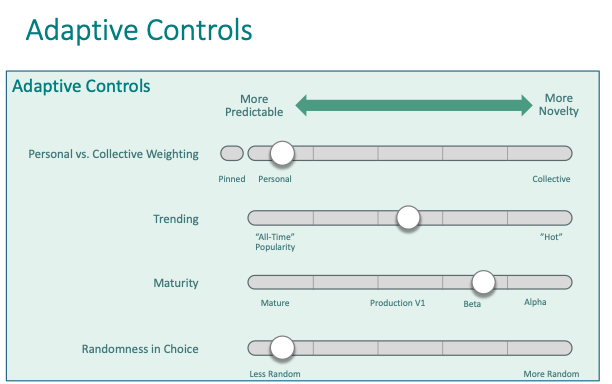

# **Dynamic Experience Composition in the Semantic Experience Architecture (SEA)**
### *How DAHN Generates Coherent Experience at Runtime*

DAHN (Dynamic Adaptive Holon Navigator) is the experience engine of the MAP.  Its essential task is to generate human experience **dynamically** and **adaptively** — not from pre-designed screens, but from **meaning**, **context**, and **personal and collective preferences**.

This is not a conventional UI problem — it is a runtime composition problem. 

In SEA, the micro-design decisions that HX designers normally make **before** software ships are made **at runtime**.

---

# **I. The Core Challenge: Runtime Experience Composition**

DAHN must generate coherent experience under four classes of unknowns:

1. **Unknown holons**  
   New types, new properties, new relationships, new behaviors — introduced continuously by MAP participants.

2. **Unknown behaviors**  
   Holons may expose new dances and affordances the system has never seen before.

3. **Unknown visualizers**  
   The Visualizer Commons is open-ended: anyone may contribute new representations.

4. **Unknown personal and collective preferences**  
   People express preferences through natural gestures — dragging, reordering, choosing visualizers — and DAHN learns from these.

Conventional apps hardcode choices like layout, grouping, and affordances.  
DAHN must **infer** them at runtime.

---

# **II. DAHN Architecture 2.0 (High-Level)**

~~~
          ┌────────────────────────────────────────────────────────┐
          │                     Human Person                       │
          └────────────────────────────────────────────────────────┘
                               ▲             ▲
                               │  Preferences│  Themes
                               │             │
     ┌─────────────────────────┴───────┬─────┴───────────────────────────┐
     │                         DAHN Runtime                              │
     │     (Dynamic Experience Composition Engine of the MAP)            │
     └─────────────────────────┬───────┴───────────────────────────┬─────┘
                               │                                   │
                               ▼                                   ▼
                ┌──────────────────────────┐       ┌──────────────────────────┐
                │          Canvas          │       │     Selector Function    │
                │ (Experience Host/Space)  │       │ (Chooses Visualizers &   │
                │                          │       │  Embedding Strategies)   │
                └──────────────────────────┘       └──────────────────────────┘
                               │                                             ▲
                               │                                             │
                               ▼                                             │
                ┌──────────────────────────┐     Inputs:                     │          
                │  Meta Design System      │       • holon type              │
                │    (Semantic Roles)      │       • device/context          │
                └──────────────────────────┘       • salience/affinity       │      
                               │                   • collective trends       │
                               │                   • visualizer availability │
                               ▼                                             │
                ┌──────────────────────────┐                                 │
                │          Dancer          │                                 │
                │ (Realizes an experience) │                                 │
                └──────────────────────────┘                                 │
                               │                                             │
                               ▼                                             │
                ┌──────────────────────────┐                                 │
                │          Themes          │                                 │
                │   (Personal Look & Feel) │                                 │
                └──────────────────────────┘                                 │
                               │                                             │
                               ▼                                             │
                ┌──────────────────────────┐                                 │
                │       Visualizers        │◄────────────────────────────────┘
                │   (Pluggable UI Modules) │
                └──────────────────────────┘
                               ▲
                               │
                               ▼
                ┌──────────────────────────┐
                │      MAP Uniform API     │
                │   (Holon Access Layer)   │
                └──────────────────────────┘
                               ▲
                               │
                               ▼
                ┌──────────────────────────┐
                │          Holons          │
                │   (Meaning & Behavior)   │
                └──────────────────────────┘

~~~

---

# **III. Design-Token Foundation and the Three Anchors of SEA**

## **1. Design Tokens, Meta Design Systems, and Themes**

A **Design Token** is a named semantic presentation decision — for example,
`Surface`, `Text`, `Focus`, or `Space`. It is not a component-specific style,
a CSS property, or a theme value. A Design Token declares one
**DesignTokenType** that constrains the shape of a value which a Theme may
assign. The initial vocabulary is narrowly aligned with the Design Tokens
Community Group (DTCG) token-type concepts: `color`, `dimension`,
`fontFamily`, `fontWeight`, and `strokeStyle`. MAP does not yet claim DTCG
file-format conformance or implement its full vocabulary.

A **Meta Design System (MDS)** is a versioned semantic contract that defines a
vocabulary of reusable Design Tokens. It tells Dancer, Visualizer, and Canvas
developers which presentation decisions they may depend on, and it tells Theme
developers the complete set of values they must supply. The same Design Token may be
defined by more than one MDS; MDS membership is not token ownership. MDS is a
MAP composition concept, rather than an entity standardized by DTCG.

A **Theme** is a user-selectable complete realization of one MDS. It contains
exactly one typed `ThemeTokenAssignment` for every Design Token that its MDS
defines. Each assignment is the intersection of a Theme and Design Token and
supplies the token's concrete presentation value. Therefore a Theme is valid
for an MDS precisely when their token sets are equal. This completeness rule
prevents a Visualizer from silently falling back when it consumes a token.

The relationships are:

~~~
MetaDesignSystem --DefinesDesignToken--> DesignToken
Theme --ForMetaDesignSystem--> MetaDesignSystem
Theme --HasThemeTokenAssignment--> ThemeTokenAssignment --ForDesignToken--> DesignToken
Visualizer --SupportsMetaDesignSystem--> MetaDesignSystem
Visualizer --ConsumesDesignToken--> DesignToken
Dancer --ConsumesDesignToken--> DesignToken
Canvas --UsesMetaDesignSystem--> MetaDesignSystem
HolonSpace --OffersTheme--> Theme
~~~

An MDS may have many Themes and a Visualizer may support many MDSs. A Dancer
declares the Design Tokens required by its experience; its Visualizers may
declare additional token dependencies for their own realizations. A Canvas is
bound to one MDS and may host only Dancers and Visualizers whose declared token
dependencies that MDS satisfies. A Theme is not statically bound to a Dancer or
application: Theme choice is person- and space-driven. In the initial POC, a Canvas resolves the sole Theme offered by
its active HolonSpace; later, when several themes are offered, the person is
given a choice. The Space Navigator package supplies no Theme.

At Canvas initialization, the resolved Theme is projected once into the
runtime's fixed CSS custom-property representation. A Theme is refreshed only
after an explicit Theme change or a version refresh. Visualizers consume the
resulting semantic token values, not Theme-specific component styling.

### **Activation-Time Theme Availability**

The Space Navigator semantic package is loaded only after Core Schema
bootstrap, during Dancer activation. Its Theme therefore must not carry a
static relationship to a Core-bootstrap space or introduce a synthetic Theme
space. The activation flow already carries a transaction context. From that
context, activation obtains the active HolonSpace reference from its
HolonSpaceManager and establishes the `OfferedByHolonSpace` relationship for
the package's declared Themes.

The package load and the availability write are activation lifecycle work. The
availability edge is staged in the existing activation transaction and is
persisted by that transaction's normal commit; neither a TransactionContext nor
a bound reference is serialized to the UI. Once activation completes, a Canvas
receives its active HolonSpace through its normal bound reference and uses
`OffersTheme` to resolve the available Theme.

## **2. The Canvas**

The Canvas is the experiential container and desktop manager. It owns the
available real estate and the higher-level interaction and composition
environment. It can make multiple Dancers available, switch among them, or
compose their experiences. It MAY launch a Dancer in an existing window, create
a new window for it, or tile Dancer windows through its own Canvas Visualizer.

The Canvas allocates a real-estate budget to each hosted Dancer experience's
root visualizer realization. It does not need to understand that Dancer's
internal experience or visualizer grammar. Canvas actions govern its hosted experience set and window
composition; they do not include a Dancer's transaction actions such as Undo
or Redo.

The [MAP Application Launcher](map-application-launcher-design-spec.md)
establishes the active `HolonSpace`, Core-bootstrap readiness, and normal
selection/materialization context that allow Canvas to mount. Once Canvas is
ready, the Launcher asks the Selection Service for that HolonSpace's home
Dancer; Canvas hosts the selected Dancer without naming or selecting it.

## **3. Dancers and Top-Level Visualizers**

A Dancer realizes one coherent experience within a Canvas. The Canvas hosts a
selected Dancer experience realization; the Dancer composes the semantic roles
of that experience and its visualizers recursively compose their subordinate
visualizers inside the allocation received from the Canvas.

“Top-level” names placement, not a distinct Visualizer category. Space
Navigator is a Dancer that composes a `HolonSpace` experience: the space Holon
itself, Dancers afforded by that space, and navigation rooted at that space.
It may fulfill the navigation role with a generic Rooted Navigation Visualizer.
The same Canvas can host or compose other Dancers. A future `AgentSpace` may
extend `HolonSpace` with social, governance, or related affordances and enable
additional Space Navigator roles without changing Rooted Navigation.

> **A Canvas hosts experiences realized by Dancers. A Dancer may realize its
> experience through one or more root visualizers, which compose subordinate
> Visualizers within the real estate made available by the Canvas.**

## **4. Visualizers**
Pluggable UI modules (framework-free Web Components) contributed by the community; each expresses holons in its own representational style.

Together, these establish the pipeline: **meaning → composition → expression**.

---

# **IV. Affinity and Salience: How DAHN Learns**

DAHN learns from interaction. People shape their experience through natural gestures—dragging, expanding, choosing, navigating. DAHN interprets these gestures in terms of two universal signals:

### **Salience**
“How important is this *to me*?”  
Affects ordering, visibility, expansion, and density.

### **Affinity**
“How closely do these things belong together?”  
DAHN tracks three types:

1. **Preference Affinity** – choosing among alternatives (e.g., visualizers, themes).
2. **Cohesion Affinity** – grouping elements that naturally belong together (e.g., Undo/Redo, address fields).
3. **Semantic Affinity** – the strength of a relationship between holons (e.g., embed vs. navigate).

Affinity is **not stored in RelationshipDescriptors**.  It *references* them, allowing variation across individuals, spaces, and the system as a whole.

---

# **V. Embedding vs. Navigation: Semantic Affinity in Action**

Every holon is structurally simple — scalar properties with no nested structure. Complexity emerges from relationships.

DAHN uses **semantic affinity** to decide:

- Should one holon be **embedded** inside another?
- Should it appear as a **collapsible section**?
- Should it be shown as an **inline preview**?
- Should it require **navigating** to a separate view?

RelationshipDescriptors define semantics. Affinity defines *contextual weight*, allowing different communities and individuals to develop different structural expectations.

---

# **VI. The Selector Function: DAHN’s Adaptive Intelligence**

The **_Selector Function_** chooses **how** to express a holon:

- which visualizer to use
- whether to embed or navigate
- which visual grouping to use
- how personal and collective preferences should be weighted
- whether stability or novelty is preferred

It uses:

- device characteristics
- Canvas layout
- personal salience and affinity
- collective preference patterns
- trending or all-time popularity
- visualizer maturity
- randomness (when desired)
- semantic meaning from holon descriptors

This function enables DAHN to **adapt to the person, the holon, the context, and the community.**

---

### **Adaptive Controls**

People do not have a single, fixed preference for predictability or novelty. They move between stability and exploration depending on task, context, and intent.

DAHN exposes a small set of **adaptive controls**. 

Each control adjusts how the Selector Function balances different influences when composing experience. Together, these controls allow a person to tune their current *mode* — anywhere along the spectrum from exploit to explore.

#### **1. Personal vs. Collective Weighting**
This control governs the relative influence of:

- the person’s own prior choices and gestures, and
- the aggregated preferences of other participants.

Moving the control toward **Personal** gives stronger precedence to the person’s established preferences. Moving it toward **Collective** increases sensitivity to shared patterns and emerging community norms. 

This makes the balance between personal agency and collective wisdom a *situational choice*, not a fixed rule.

#### **2. Trending vs. All-Time Patterns**
This control applies only to collective signals.

Moving it toward **All-Time** favors long-standing, widely adopted patterns.  
Moving it toward **Trending** favors what is gaining momentum more recently.

This allows newer visualizers or interaction patterns to surface without permanently displacing established ones.

#### **3. Maturity vs. Cutting-Edge Visualizers**
This control governs how DAHN weighs the release maturity of available visualizers.

Moving it toward **Mature** favors visualizers that have been stable and widely used.  
Moving it toward **Alpha / Beta** increases exposure to newer, less proven options.

This lets a person decide when they want reliability — and when they’re open to experimentation.

#### **4. Randomness in Selection**
This control introduces controlled variability across all other dimensions.

Lower randomness produces more predictable, repeatable selections.  
Higher randomness occasionally surfaces unexpected alternatives, even when other controls favor stability.

Randomness is never total — it is bounded by semantic applicability — but it allows surprise without chaos.

#### **Exploit ↔ Explore Modes**
Taken together, these controls express a person’s current mode:

- **Exploit mode**: predictable, stable, efficient
- **Explore mode**: novel, emergent, experimental

These are not identities or long-term settings.  They are *moment-to-moment stances* that can change as context changes. 

DAHN does not decide which mode is “better.”  It simply gives people the ability to choose — and to change their mind.

---

# **VIII. The Role of the Canvas in Adaptation**

The Canvas makes cross-Dancer adaptivity visible. Within an active Dancer, its
experience realization makes that Dancer's adaptivity visible. Together they:

- adjusts layout across form factors
- manages density based on available space
- clusters high-affinity elements
- handles expansion/collapse behavior
- allocates real-estate budgets to hosted Dancer experiences
- applies cross-Dancer composition rules
- resolves and applies the selected Theme for its Meta Design System
- integrates selector decisions into a coherent visual flow

**The Canvas establishes coherence across Dancer experiences; each Dancer
preserves coherence within its own visualizer composition.**

---

# **IX. Why DAHN Is Novel**

DAHN represents a novel class of systems that:

- generate experience directly from holon semantics
- adapt   continuously to personal and collective preferences
- learn through natural gestures
- separate semantic grammar (MDS), Canvas composition, and Dancer-internal visualizer composition
- support unlimited visual styles through Web Component visualizers
- treat UI as a **commons**, not a proprietary asset
- unify experience across every MAP application and holon
- compose experience dynamically—never pre-baked
- evolve with the MAP as it evolves

This is why SEA is not a UI framework. It is a **meaning-driven, adaptive, generative interface architecture**.

---

# **X. Summary**

DAHN dynamically composes experience using:

- **meaning** (holons)
- **preference signals** (salience & affinity)
- **community** (aggregate patterns)
- **semantics** (MDS roles)
- **space** (Canvas)
- **expression** (visualizers)
- **adaptation** (Selector Function)

The result is an interface that:

- follows the person
- evolves with the community
- reflects semantic reality
- adapts across contexts
- remains coherent
- grows as the MAP grows

DAHN turns holonic meaning into lived human experience — not through predefined screens, but through **dynamic, adaptive, semantic composition**.
