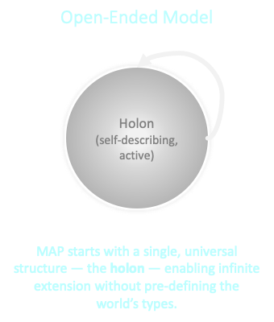

# MAP Extensibility Model

## Introduction

In the Memetic Activation Platform (MAP), we embrace a fundamentally different approach to extensibility than traditional software systems. Instead of a rigid set of predefined types and relationships, the MAP offers a flexible and open-ended ontology where all entities are represented as holons. This document explains how this extensibility model works and why it matters for developers adopting the MAP.

## The Problem with Fixed Ontologies

Most traditional software systems operate with a fixed schema. Each release defines a set of types, relationships, and behaviors that are controlled by the application provider.


Over time, as these providers add more functionality, they introduce more and more predefined types—sometimes ballooning into thousands of tightly coupled objects. While this might provide a broad feature set, it also leads to vendor lock-in due to high-switching costs. And no matter how large it gets, you are still limited by the app provider's imagination and release cadence. Got a need to manage different types of data? Novel behavior? A superior visual experience? Good luck! File your enhancement request and then... wait. 

## Emergent Complexity and the Need for Open-Ended Ontology

In contrast, the MAP is built on the idea that emergent complexity demands an open-ended ontology. 



By treating everything as a holon—a self-describing, active entity with properties, relationships, and behaviors (dances)—we allow developers to extend the platform in ways that we, as the platform creators, could never fully predict.

This means that instead of waiting for a central authority to add a new type, developers can create their own types and relationships as needed. They can share these extensions in a commons, fostering a rich ecosystem of visualizers, application behaviors, and more.

## How Extensibility Works

The design goal is to:
- Provide **strong guarantees** about structural compatibility.
- Enable **application-level innovation** without duplicating or rewriting core definitions.
- Preserve **semantic integrity** by constraining what “extension” means.

The MAP’s extensibility model is guided by clear, predictable rules that keep extensions simple, DRY (Don’t Repeat Yourself), and interoperable:

1. **Single Inheritance Only**  
   Each new type can extend exactly one other type. There is no multiple inheritance. You inherit all properties, relationships, and dances from that single parent type.

2. **Additive, Not Subtractive**  
   When you extend a type, you adopt all of its existing behaviors wholesale. You can add new behaviors, but you do not remove or override inherited ones. This keeps inheritance additive and predictable.

3. **Flattened Type Descriptors**  
   The system flattens all inherited properties, relationships, and dances into a single type descriptor for the child type. You only specify what’s unique about your new type; all common behavior is defined once and inherited automatically.

4. **Alternative for Variations**  
   If you need a different set of behaviors, you start from a different parent type or reintroduce only the behaviors you want via composition. You avoid erasing or modifying inherited features directly.

5. **Extending Across Type Kinds**  
   Extensibility is not limited to holon types. You can extend value types, property types, relationship types, and dance types. This allows you to evolve the ontology across all type kinds.

6. **Community and Self-Defined Extensions**  
   You can extend not just core types, but also types defined by yourself or other MAP adopters. This makes the ecosystem a living, collaborative space where new types can evolve organically.
7. **Leaf-Only Instantiation**
   Only the final (leaf) type in an Extends chain can be instantiated. All properties, relationships, and dances from parent types are flattened into the leaf type’s descriptor, ensuring there is a single, complete definition for every instance. Intermediate types serve only as templates for shared structure and behavior, never as instantiable entities.
8. **Single Implementation per Dance**
   Every dance type defined anywhere in an Extends chain can have only one implementation within that chain. Implementations are bound to the type level that defines the dance type and may reference only properties and relationships defined at that level or above. You cannot "override" the implementation of a dance defined higher in the extends chain. Thus, if you do not want a dance (or property or relationship) of a type, do not extend that type.

## Core Types as Your Starting Point

Although the MAP represents **everything** as a holon, you don’t have to start from a blank slate.  
The platform ships with a rich foundation of **Core Types** — fully-defined, concrete holon types like `Meme`, `Agent`, `Service`, `VitalCapital`, `MemeGroup`, and `Memeplex`. These types already encapsulate key MAP semantics and relationships, giving you a solid base to extend from.

When you extend a core type:
- You inherit its **properties**, **relationships**, and **dances**.
- You avoid re-defining the foundational semantics that MAP tools and visualizers expect.
- You stay aligned with the larger ecosystem, improving interoperability with other mapps.

Use of these core types is entirely **optional**. If your domain requires something fundamentally different, you can extend directly from `Holon` (the most general concrete type) or even create your own abstract type to serve as a base.

A common mental model looks like this:

```
       ┌──────────────────────────┐
       │       Meta Types         │  (abstract obligations: structure of types)
       └────────────▲─────────────┘
                    │
       ┌────────────┴─────────────┐
       │    Abstract Types        │  (conceptual categories, no instances)
       └────────────▲─────────────┘
                    │
       ┌────────────┴─────────────┐
       │     Core Types Layer     │  (instantiable MAP-provided bases: Meme, Agent...)
       └────────────▲─────────────┘
                    │
       ┌────────────┴─────────────┐
       │  Extension Types Layer   │  (your domain-specific types)
       └──────────────────────────┘
```

**A powerful feature:**  
You can extend **not only core types**, but also **types defined by other MAP developers**. This means the ontology can evolve in ever richer, more specialized ways — collaboratively and incrementally — without requiring changes to the core. The result is a living ecosystem of interoperable types, each building on the work of others.

**Pro tip for mapp developers:**  
If you find yourself removing or avoiding core behaviors from a parent type, it may be better to pick a different starting point — either another core type, a type from another developer, or `Holon` itself — so you keep your inheritance clean and predictable.

### An Example

Let's look at an example to see how these rules work in action.

#### 1. Leaf-Only Instances
If you have `A` **Extends** `B` **Extends** `Meme`, only **A** can have instances.
- Properties and relationships from all levels are **flattened** into `A`’s descriptor.
- Your instance is “an A” with one set of properties and relationships to populate.
- Intermediate types (`B`, `Meme`) serve as templates for shared structure and behavior, but are never instantiated directly.

#### 2. Separate the Contract from the Implementation
Every dance has two aspects:
- **DanceDescriptor** (*contract*): Name, arguments, result type, semantics, and required/optional status.
- **DanceImplementation** (*code*): The executable logic, bound to the type that defines it.

MAP preserves the **contract vs. implementation** distinction without introducing a separate “interface” construct. Obligations are explicit in the type descriptor; the code is provided at the defining type.

#### 3. Where Implementations May Live
A DanceImplementation can be declared in:
- The MAP Core Type you extended (e.g., `Meme`)
- An intermediate type in the chain (`B`)
- Your own leaf type (`A`)

Instances always dispatch to the **single implementation** allowed for that descriptor in the chain.

#### 4. Rules that Avoid Overrides
To keep things predictable, DRY, and override-free:

1. **Only the leaf instantiates** — No instances of intermediate types.
2. **Unique dance identity across the chain** — No two types in the chain may declare the same DanceDescriptor ID.
3. **Single implementation per dance per chain** — At most one implementation for a given descriptor in the chain.
   - If required and none found → validation fails.
   - If optional and none found → allowed.
   - If more than one found → validation fails.
4. **Bound to defining type** — Implementations may only reference properties and relationships defined at their own level or above.
5. **Different behavior without overrides** — If you need different logic, define a new (possibly versioned) DanceDescriptor or choose a different parent type.

#### 5. Effective Set Computation (Load/Validation Time)
At load or validation time, MAP precomputes the **EffectiveDanceSet** for your leaf type:

```
EffectiveDanceSet(A):
  let chain = [Meme, B, A]  // ancestor → leaf
  let seen = {}
  for each type T in chain:
    for each DanceImplementation impl in T:
      let id = impl.descriptor_id
      if id in seen: error "multiple implementations in chain"
      seen[id] = impl

  // Ensure all required descriptors in chain have an implementation
  for each required descriptor d in chain:
      if d.id not in seen: error "required dance missing"

  return seen
```

This means your mapp instances dispatch directly to the right implementation with **no runtime search and no ambiguity**.

### Benefits for Developers
- **Clarity**: No tangled multiple-inheritance chains or runtime delegation puzzles.
- **Predictability**: The full definition of a type is always visible in its flattened descriptor.
- **Reusability**: Shared behavior is defined once and reliably inherited.
- **Interoperability**: Extensions preserve all inherited relationships and obligations, ensuring they work seamlessly with existing MAP tooling.

## Comparison to Traditional Inheritance Models

The MAP’s model differs from common inheritance patterns found in mainstream programming languages:

- **Classical OOP Inheritance (Java, C++)**  
  These languages often allow single or multiple inheritance. Multiple inheritance can lead to the *diamond problem*, where it’s unclear which inherited method should be used. The MAP avoids this entirely by allowing only single inheritance and flattening all inherited elements into one unified type descriptor.
- **Interfaces and Mixins (Java Interfaces, Ruby Modules)**

- In languages like Java, interfaces separate the contract (what behaviors a type must provide) from the implementation (how those behaviors are carried out), to avoid the pitfalls of tying the two together in rigid inheritance chains. Mixins add reusable behavior across otherwise unrelated types.
  In the MAP, this separation is preserved but modeled explicitly through the type system: a holon’s type descriptor declares its obligations (its contract) via inherited properties, relationships, and required dances, while the actual implementation of those dances can be provided or overridden in the specific type or its runtime context. This makes contracts explicit without introducing a separate interface construct, and still allows behaviors to be composed or reused across types.

- **Delegation and Composition (Go Interfaces, “composition over inheritance”)**  
  Composition-based designs assemble objects from multiple components, often requiring explicit delegation. The MAP achieves similar modularity by letting you start from the most relevant parent type and additively extend it, while maintaining a single, flattened descriptor. You get the clarity of composition without the overhead of managing multiple internal objects.

By combining inheritance’s clarity with composition’s modularity, the MAP ensures that extensions are both powerful and easy to reason about.

## Conclusion

By combining a stable foundation of core concrete types with a disciplined, flattened, single-inheritance model, the MAP gives developers a robust but simple way to extend the platform. You inherit everything you need from your parent type, add only what’s unique, and know that your type will integrate cleanly into the larger ecosystem. This balance of openness and structure is what allows the MAP to evolve in step with the diverse needs of its community.  


